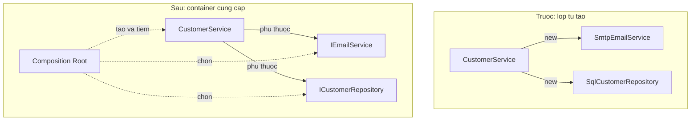

# 7.2 — Vấn đề DI giải quyết

> Nguồn: https://tiennhm.io.vn/docs/dotnet-backend-zero-to-senior/stage-02-csharp-professional/module-07-dependency-injection/7.2-di-problem-scope
> Vì sao tự new dependency trong constructor làm code không test được, không đổi được implementation và rò rỉ tài nguyên — và DI sửa chính xác điều gì.

> Dependency Injection không phải là "dùng interface cho sang". Nó giải quyết một vấn đề rất cụ thể: khi một lớp **tự tạo** thứ nó cần, lớp đó bị dính chặt vào một implementation, một cấu hình và một vòng đời — cả ba đều không thay đổi được từ bên ngoài. Hậu quả đo được: **unit test gửi email thật**, đổi SMTP sang SendGrid phải sửa mã nguồn của nghiệp vụ, và mỗi lớp tự mở một connection riêng. DI đảo chiều: lớp **khai báo** thứ nó cần qua constructor, còn việc tạo ra chúng thuộc về một nơi duy nhất — composition root.

## Mục tiêu bài học

Sau bài này bạn có thể:

- Chỉ ra đúng năm vấn đề của việc `new` dependency trong constructor.
- Phân biệt "phụ thuộc vào abstraction" với "phụ thuộc vào implementation".
- Giải thích vì sao thêm interface mà vẫn `new` bên trong thì chẳng giải quyết được gì.
- Nhận ra khi nào **không** cần DI.

## Nội dung bài học

### 7.2.1 — Code dính chặt

```csharp
public class CustomerService
{
    private readonly EmailService _email;
    private readonly SqlCustomerRepository _repository;
    private readonly ILogger _logger;

    public CustomerService()
    {
        _email      = new EmailService("smtp.company.com", 587);
        _repository = new SqlCustomerRepository("Server=.;Database=CRM");
        _logger     = new ConsoleLogger();
    }

    public async Task CreateAsync(Customer customer)
    {
        await _repository.AddAsync(customer);
        await _email.SendWelcomeAsync(customer.Email);
        _logger.Log($"Customer {customer.Id} created");
    }
}
```

Đoạn code này chạy được. Vấn đề chỉ lộ ra khi bạn cần **thay đổi** thứ gì đó.

### 7.2.2 — Năm vấn đề, theo thứ tự mức độ đau

**1. Không viết được unit test.**

```csharp
[Fact]
public async Task CreateAsync_ShouldAddCustomer()
{
    var service = new CustomerService();   // ket noi SQL that + gui email that
    await service.CreateAsync(new Customer("An", "an@example.com"));
}
```

Không có cách nào chen vào giữa. Test này cần một SQL Server đang chạy, cần SMTP thật, và nó **gửi email tới địa chỉ trong dữ liệu test**. Đây là lý do nhiều team nói "code cũ không test được" — không phải vì thiếu thời gian, mà vì kiến trúc chặn họ lại.

**2. Không đổi được implementation.**

Sếp quyết định chuyển từ SMTP sang SendGrid. Bạn phải sửa `CustomerService` — một lớp **nghiệp vụ** — vì lý do **hạ tầng**. Nếu có 40 lớp cùng `new EmailService(...)`, bạn sửa 40 chỗ, và chỉ cần sót một chỗ là production gửi email qua hai đường khác nhau.

**3. Cấu hình bị chôn trong mã nguồn.**

`"smtp.company.com"` và `"Server=.;Database=CRM"` nằm trong code đã biên dịch. Môi trường staging dùng gì? Bạn phải build lại. Và connection string có mật khẩu thì nó nằm trong Git.

**4. Vòng đời không kiểm soát được.**

Mỗi `CustomerService` tạo một `SqlCustomerRepository` riêng, tức một connection riêng. 100 request đồng thời là 100 connection, trong khi lẽ ra chúng nên dùng chung pool. Không ai quản lý việc giải phóng, nên `IDisposable` chẳng bao giờ được gọi.

**5. Phụ thuộc ẩn.**

Nhìn `new CustomerService()` bạn nghĩ nó không cần gì. Thực tế nó cần SQL Server, cần SMTP và cần quyền ghi. Constructor **nói dối** về những gì lớp này cần — và bạn chỉ biết sự thật khi chạy.

| Vấn đề | Biểu hiện thực tế |
|---|---|
| Không test được | Unit test cần database thật, gửi email thật |
| Không đổi được implementation | Đổi nhà cung cấp email phải sửa lớp nghiệp vụ |
| Cấu hình chôn trong code | Mỗi môi trường phải build một bản khác |
| Vòng đời mất kiểm soát | Connection không dùng chung, `Dispose` không được gọi |
| Phụ thuộc ẩn | Constructor không cho biết lớp này thật sự cần gì |

### 7.2.3 — Thêm interface chưa phải là giải pháp

Đây là bước nửa vời rất hay gặp:

```csharp
public class CustomerService
{
    private readonly IEmailService _email;

    public CustomerService()
    {
        _email = new SmtpEmailService("smtp.company.com", 587);  // VAN CON new
    }
}
```

Kiểu của field đã là interface, nhưng lớp vẫn **tự quyết định** implementation nào được dùng. Cả năm vấn đề ở trên **vẫn còn nguyên**.

Thứ thật sự thay đổi mọi chuyện không phải là interface, mà là **ai gọi `new`**.

### 7.2.4 — Đảo chiều: lớp khai báo, nơi khác cung cấp

```csharp
public class CustomerService
{
    private readonly ICustomerRepository _repository;
    private readonly IEmailService _email;
    private readonly ILogger<CustomerService> _logger;

    public CustomerService(
        ICustomerRepository repository,
        IEmailService email,
        ILogger<CustomerService> logger)
        => (_repository, _email, _logger) = (repository, email, logger);
}
```



Năm vấn đề biến mất cùng lúc:

- **Test được**: truyền mock vào constructor.
- **Đổi được implementation**: sửa một dòng ở composition root.
- **Cấu hình ở ngoài**: `appsettings.json` theo từng môi trường.
- **Vòng đời do container quản**: nó biết khi nào tạo, khi nào dùng lại, khi nào `Dispose`.
- **Phụ thuộc hiện rõ**: đọc constructor là biết lớp này cần gì.

Điểm cuối đáng nói thêm: constructor trở thành **tài liệu trung thực**. Một constructor có 9 tham số không phải là lỗi của DI — đó là DI đang cho bạn thấy lớp này đang làm quá nhiều việc. Xem [bài 7.10 — Anti-patterns](7.10-anti-patterns.mdx).

### 7.2.5 — Khi nào không cần DI

DI không miễn phí: thêm interface, thêm đăng ký, thêm một lớp gián tiếp khi đọc code. Đừng dùng khi:

- **Kiểu chỉ chứa dữ liệu**: `new Customer(...)`, `new OrderDto(...)`. Đừng bao giờ tiêm entity hay DTO.
- **Chỉ có một implementation và sẽ mãi như vậy**: `StringBuilder`, `List`, các kiểu trong BCL.
- **Hàm thuần không có tác dụng phụ**: một lớp tính thuế chỉ nhận số và trả số thì `new` thẳng cũng được.
- **Script, tool nhỏ, console một lần dùng**: chi phí lớn hơn lợi ích.

Tiêu chí thực dụng: **có I/O, có thời gian, có ngẫu nhiên, hoặc có thể thay thế** thì tiêm. Ngoài ra thì `new` thoải mái.

`DateTime.Now` chính là ví dụ kinh điển của "có thời gian": nó khiến test không lặp lại được. .NET 8 có `TimeProvider` để tiêm đúng chỗ đó.

### 7.2.6 — Rà lại code của bạn

**Danh sách rà soát phụ thuộc**

- [ ] Không có lời gọi new nào tới service có I/O bên trong lớp nghiệp vụ.
- [ ] Không có connection string hay host name nào nằm trong mã nguồn.
- [ ] Mọi phụ thuộc đều xuất hiện trong constructor, không ẩn đâu đó.
- [ ] Lớp nghiệp vụ phụ thuộc vào interface, và không tự chọn implementation.
- [ ] Không tiêm entity hay DTO vào container.
- [ ] Mọi chỗ dùng DateTime.Now trong logic có thể test đã chuyển sang TimeProvider.
- [ ] Constructor nào quá 5 tham số đều được xem lại xem lớp có làm quá nhiều việc không.

## Bài tập áp dụng

1. **Thử viết test cho code dính chặt.** Lấy đoạn `CustomerService` đầu bài, viết một unit test kiểm tra rằng email được gửi. Ghi lại chính xác chỗ bạn bị chặn.

2. **Đếm điểm chạm.** Trong một project bạn đang làm, `grep` tất cả `new ` theo sau bởi tên lớp service hoặc repository. Đếm bao nhiêu chỗ phải sửa nếu đổi nhà cung cấp email.

3. **Làm test không lặp lại được.** Viết một hàm dùng `DateTime.Now` để quyết định có áp dụng khuyến mãi cuối tháng hay không, rồi viết test cho nó. Sửa lại bằng `TimeProvider` và so sánh hai bài test.

## Tự kiểm tra

### Vấn đề lớn nhất của việc new dependency trong constructor là gì?

Không viết được unit test. Không có cách nào chen vào giữa để thay thế dependency, nên test cần database thật, SMTP thật và sẽ gửi email tới địa chỉ trong dữ liệu test. Đây là lý do nhiều codebase cũ bị coi là không test được: không phải thiếu thời gian mà là kiến trúc chặn lại.

### Thêm interface có đủ để giải quyết vấn đề không?

Không. Nếu kiểu của field là interface nhưng constructor vẫn gọi new một implementation cụ thể thì lớp vẫn tự quyết định implementation nào được dùng, và cả năm vấn đề vẫn còn nguyên. Thứ thật sự thay đổi là ai gọi new, chứ không phải có interface hay không.

### Phụ thuộc ẩn nghĩa là gì?

Là khi constructor không cho biết lớp thật sự cần những gì. Nhìn new CustomerService bạn nghĩ nó không cần gì, nhưng thực tế nó cần SQL Server, cần SMTP và cần quyền ghi. Constructor nói dối, và bạn chỉ biết sự thật khi chạy. Với DI thì đọc constructor là biết ngay.

### Constructor có 9 tham số có phải lỗi của DI không?

Không, đó là DI đang cho bạn thấy lớp này làm quá nhiều việc. Trước khi có DI thì vấn đề đó vẫn tồn tại nhưng bị giấu đi. Cách chữa là tách lớp, không phải giấu bớt phụ thuộc.

### Khi nào không nên dùng DI?

Với kiểu chỉ chứa dữ liệu như entity và DTO, với kiểu chỉ có một implementation và sẽ mãi như vậy như StringBuilder hay List, với hàm thuần không có tác dụng phụ, và với script hay tool nhỏ dùng một lần. Tiêu chí thực dụng là có I/O, có thời gian, có ngẫu nhiên hoặc có thể thay thế thì tiêm; ngoài ra cứ new.

### Vì sao DateTime.Now là vấn đề?

Vì nó khiến test không lặp lại được: cùng một bài test cho kết quả khác nhau tuỳ vào lúc bạn chạy nó. Đây là dạng phụ thuộc vào thời gian, và .NET 8 có TimeProvider để tiêm nó vào như một dependency bình thường.

## Kết luận

Ba điều đáng nhớ nhất:

1. **Vấn đề không phải là thiếu interface, mà là lớp tự gọi `new`.**
2. **Constructor phải nói thật** về những gì lớp cần — đó là lợi ích bị đánh giá thấp nhất của DI.
3. **DI có chi phí.** Chỉ tiêm thứ có I/O, có thời gian, có ngẫu nhiên hoặc có thể thay thế.

## Tham khảo

- [Dependency injection in .NET](https://learn.microsoft.com/en-us/dotnet/core/extensions/dependency-injection)
- [Dependency injection guidelines](https://learn.microsoft.com/en-us/dotnet/core/extensions/dependency-injection-guidelines)
- [Dependency injection in ASP.NET Core](https://learn.microsoft.com/en-us/aspnet/core/fundamentals/dependency-injection)
- [TimeProvider class](https://learn.microsoft.com/en-us/dotnet/api/system.timeprovider)

## Điều hướng

- **Bài trước:** [7.1 — Module Orientation](7.1-module-orientation.mdx)
- **Bài tiếp theo:** [7.3 — 1. IoC Container và DI Container](7.3-ioc-container-and-di-container.mdx)
- **Về module:** [Trang mục lục](./)
