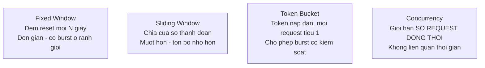

# 9.6 — 6. Rate Limiting (.NET 7+)

> Nguồn: https://tiennhm.io.vn/docs/dotnet-backend-zero-to-senior/stage-03-aspnet-core-backend/module-09-web-api-professional/9.6-rate-limiting
> Bốn thuật toán rate limiting và cái giá của từng cái, phân vùng theo người dùng, header Retry-After, và giới hạn của rate limiter in-memory khi scale ngang.

> Rate limiting bảo vệ API khỏi ba thứ: lạm dụng có chủ đích, client lỗi gọi trong vòng lặp vô hạn, và **chính bạn** — một job đồng bộ gọi quá nhanh. .NET 7 đưa nó vào framework với **bốn thuật toán**, và chọn sai gây ra vấn đề thật: **fixed window** cho phép gấp **đôi** hạn mức ở ranh giới cửa sổ (100 request ở giây 59 và 100 nữa ở giây 61). Nhưng giới hạn quan trọng nhất phải nhớ là: rate limiter tích hợp sẵn **nằm trong bộ nhớ một tiến trình**. Chạy 4 instance nghĩa là hạn mức thực tế **gấp 4 lần** con số bạn đặt, và người dùng bị chặn hay không phụ thuộc vào load balancer đưa họ tới pod nào.

## Mục tiêu bài học

Sau bài này bạn có thể:

- Chọn đúng thuật toán trong bốn lựa chọn.
- Phân vùng giới hạn theo người dùng, API key hoặc IP.
- Trả `Retry-After` và `429` đúng cách.
- Nhận ra khi nào cần rate limiter phân tán.
- Tránh rate limit chính hệ thống giám sát của mình.

## Nội dung bài học

### 9.7.1 — Bốn thuật toán



**Fixed window** — đơn giản nhất, và có một khuyết điểm cụ thể:

```csharp
options.AddFixedWindowLimiter("fixed", o =>
{
    o.PermitLimit = 100;
    o.Window = TimeSpan.FromMinutes(1);
    o.QueueLimit = 0;                    // từ chối ngay thay vì xếp hàng
});
```

```
Cua so 1: 00:00 - 00:59  -> 100 request luc 00:59
Cua so 2: 01:00 - 01:59  -> 100 request luc 01:00
=> 200 request trong 2 giay, du gioi han la 100/phut
```

**Sliding window** vá đúng vấn đề đó bằng cách chia cửa sổ thành nhiều đoạn:

```csharp
options.AddSlidingWindowLimiter("sliding", o =>
{
    o.PermitLimit = 100;
    o.Window = TimeSpan.FromMinutes(1);
    o.SegmentsPerWindow = 6;             // mỗi đoạn 10 giây
});
```

Mỗi 10 giây, đoạn cũ nhất hết hạn và trả lại quota của nó. Burst tối đa giảm từ 2× xuống còn khoảng 1,17×.

**Token bucket** — cho phép burst **có kiểm soát**, hợp với API mà người dùng thao tác theo đợt:

```csharp
options.AddTokenBucketLimiter("bucket", o =>
{
    o.TokenLimit = 100;                          // suc chua toi da
    o.TokensPerPeriod = 10;
    o.ReplenishmentPeriod = TimeSpan.FromSeconds(1);   // 10 token/giay
    o.AutoReplenishment = true;
});
```

Người dùng không hoạt động một lúc sẽ tích đủ 100 token và dùng hết một lần — đúng hành vi tự nhiên: mở trang, tải 20 thứ cùng lúc, rồi ngồi đọc.

**Concurrency** — không liên quan tới thời gian, chỉ giới hạn **số request đang chạy cùng lúc**:

```csharp
options.AddConcurrencyLimiter("concurrent", o =>
{
    o.PermitLimit = 10;
    o.QueueLimit = 20;
    o.QueueProcessingOrder = QueueProcessingOrder.OldestFirst;
});
```

Đây là lựa chọn đúng cho endpoint **nặng**: xuất báo cáo, gọi AI, xử lý ảnh. Bạn không quan tâm mỗi phút bao nhiêu request, bạn quan tâm **không quá 10 cái chạy cùng lúc**.

| Thuật toán | Dùng cho |
|---|---|
| Fixed window | Đơn giản, chấp nhận được burst |
| Sliding window | API công khai cần giới hạn công bằng |
| Token bucket | Client thao tác theo đợt |
| Concurrency | Endpoint nặng, giới hạn tài nguyên |

### 9.7.2 — Phân vùng

Một giới hạn chung cho toàn bộ API gần như luôn sai: một client hung hăng sẽ dùng hết quota của mọi người. Phân vùng theo danh tính:

```csharp
builder.Services.AddRateLimiter(options =>
{
    options.RejectionStatusCode = StatusCodes.Status429TooManyRequests;

    options.AddPolicy("per-user", context =>
    {
        var userId = context.User.FindFirst(ClaimTypes.NameIdentifier)?.Value;

        // Người dùng đã đăng nhập: hạn mức rộng
        if (userId is not null)
            return RateLimitPartition.GetTokenBucketLimiter(userId, _ => new()
            {
                TokenLimit = 100,
                TokensPerPeriod = 20,
                ReplenishmentPeriod = TimeSpan.FromSeconds(10),
                AutoReplenishment = true
            });

        // Khách vãng lai: hạn mức hẹp, theo IP
        var ip = context.Connection.RemoteIpAddress?.ToString() ?? "unknown";
        return RateLimitPartition.GetFixedWindowLimiter(ip, _ => new()
        {
            PermitLimit = 20,
            Window = TimeSpan.FromMinutes(1)
        });
    });
});

app.UseRateLimiter();
```

```csharp
[EnableRateLimiting("per-user")]
public class CustomersController : ControllerBase
{
    [HttpPost("export")]
    [EnableRateLimiting("concurrent")]     // endpoint nang: chinh sach rieng
    public Task<IActionResult> Export(CancellationToken ct);

    [HttpGet("health")]
    [DisableRateLimiting]
    public IActionResult Health() => Ok();
}
```

**Phân vùng theo IP có hai cái bẫy:**

1. **Sau reverse proxy**, `RemoteIpAddress` là IP của proxy — mọi người dùng chung một phân vùng và bị chặn như một. Phải bật `UseForwardedHeaders()` **trước** `UseRateLimiter()` ([bài 8.2](../module-08-aspnet-core-fundamentals/8.1-aspnet-core-architecture.mdx)).
2. **NAT**: cả một văn phòng đi chung một IP công cộng. Hạn mức 20/phút theo IP sẽ chặn nhầm 50 nhân viên.

Vì vậy giới hạn theo IP chỉ nên dùng cho khách chưa đăng nhập, và nên rộng tay hơn bạn nghĩ.

### 9.7.3 — Trả lời cho client bị chặn

Mặc định, client chỉ nhận **429 với body rỗng** — họ không biết chờ bao lâu, nên thường retry ngay lập tức và làm mọi thứ tệ hơn.

```csharp
options.OnRejected = async (context, ct) =>
{
    context.HttpContext.Response.StatusCode = StatusCodes.Status429TooManyRequests;

    if (context.Lease.TryGetMetadata(MetadataName.RetryAfter, out var retryAfter))
        context.HttpContext.Response.Headers.RetryAfter =
            ((int)retryAfter.TotalSeconds).ToString();

    await context.HttpContext.Response.WriteAsJsonAsync(new ProblemDetails
    {
        Status = StatusCodes.Status429TooManyRequests,
        Title = "Qua nhieu yeu cau",
        Detail = "Bạn đã vượt hạn mức. Vui lòng thử lại sau.",
        Extensions = { ["traceId"] = context.HttpContext.TraceIdentifier }
    }, ct);
};
```

`Retry-After` là thứ quan trọng nhất: thư viện HTTP client tử tế sẽ **đọc và tôn trọng** nó.

Đáng thêm: log mỗi lần từ chối để biết ai đang bị chặn.

```csharp
logger.LogWarning("Rate limit: {User} tai {Path}",
    context.HttpContext.User.Identity?.Name ?? "anonymous",
    context.HttpContext.Request.Path);
```

Không có log này, bạn sẽ nhận một ticket "API lúc được lúc không" mà không hiểu vì sao.

### 9.7.4 — Giới hạn quan trọng nhất: nó nằm trong một tiến trình

Rate limiter của .NET lưu trạng thái **trong bộ nhớ**. Hệ quả khi chạy nhiều instance:

```
Gioi han dat: 100 request/phut
Chay 4 pod   -> moi pod dem RIENG
=> Han muc thuc te: 400 request/phut
=> Va nguoi dung bi chan hay khong phu thuoc vao pod nao nhan request
```

Hệ quả thứ hai tệ hơn con số: **hành vi không đoán trước được**. Cùng một client, cùng một tốc độ, lúc bị chặn lúc không.

Thêm nữa, **restart là mất sạch** bộ đếm — deploy giữa giờ cao điểm là reset quota cho tất cả.

Ba cách xử lý:

1. **Chấp nhận và chia cho số instance.** Muốn 100/phút với 4 pod thì đặt 25. Nhưng số pod thay đổi khi autoscale, nên con số này sai ngay khi hệ thống co giãn.
2. **Đẩy lên tầng gateway.** Nginx, Kong, Azure API Management, AWS API Gateway đều có rate limiting phân tán. Đây là chỗ **đúng** cho giới hạn toàn cục.
3. **Rate limiter phân tán bằng Redis** cho những giới hạn thật sự cần chính xác.

Quy tắc thực dụng: **giới hạn thô ở gateway, giới hạn theo nghiệp vụ trong ứng dụng.** Gateway chặn lạm dụng ở tầng hạ tầng; ứng dụng biết "người dùng gói Free được 10 lần xuất báo cáo mỗi ngày" — thứ gateway không thể biết.

### 9.7.5 — Đừng chặn nhầm

```csharp
// Health check, chỉ số, callback của đối tác: KHÔNG giới hạn
[DisableRateLimiting]
```

Health check bị rate limit là một sự cố tự gây: orchestrator nhận 429, coi pod là không khoẻ, restart nó ([bài 8.10](../module-08-aspnet-core-fundamentals/8.9-health-checks.mdx)).

Cũng cần loại trừ: endpoint nhận webhook từ đối tác (họ retry theo lịch của họ), và các job nội bộ. Với job nội bộ, cách sạch nhất là phân vùng riêng theo API key của service:

```csharp
options.AddPolicy("per-client", context =>
{
    var apiKey = context.Request.Headers["X-Api-Key"].ToString();

    return apiKey switch
    {
        "" => RateLimitPartition.GetFixedWindowLimiter("anon", _ => new()
            { PermitLimit = 20, Window = TimeSpan.FromMinutes(1) }),

        var k when _internalKeys.Contains(k) => RateLimitPartition.GetNoLimiter(k),

        var k => RateLimitPartition.GetFixedWindowLimiter(k, _ => new()
            { PermitLimit = 1000, Window = TimeSpan.FromMinutes(1) })
    };
});
```

### 9.7.6 — Rà lại code của bạn

**Danh sách rà soát rate limiting**

- [ ] Thuật toán được chọn có chủ đích, không mặc định fixed window vì tiện.
- [ ] Giới hạn được phân vùng theo người dùng hoặc API key, không phải một hạn mức chung.
- [ ] UseForwardedHeaders() đặt trước UseRateLimiter().
- [ ] Giới hạn theo IP chỉ dùng cho khách chưa đăng nhập và đủ rộng cho trường hợp NAT.
- [ ] Phản hồi 429 có header Retry-After.
- [ ] Mỗi lần từ chối đều được ghi log kèm danh tính và đường dẫn.
- [ ] Health check và endpoint nội bộ được loại trừ.
- [ ] Biết rõ giới hạn thực tế bị nhân với số instance đang chạy.
- [ ] Giới hạn toàn cục đặt ở gateway, giới hạn theo nghiệp vụ đặt trong ứng dụng.
- [ ] Endpoint nặng dùng concurrency limiter thay vì giới hạn theo thời gian.

## Bài tập áp dụng

#### Bài 1 — Đợt tăng vọt ở ranh giới cửa sổ

Cấu hình cửa sổ cố định 100 request mỗi phút, bắn 100 request ở giây thứ 59 và 100 nữa ở giây thứ 61. Xác nhận cả 200 đều qua. Đổi sang cửa sổ trượt và đo lại.

**Tiêu chí hoàn thành:** bạn giải thích được vì sao cửa sổ cố định cho phép **gấp đôi** hạn mức trong một khoảng ngắn.

Gợi ý và lời giải — Bài 1

**Gợi ý.** Cửa sổ cố định đặt lại bộ đếm về 0 ở mỗi mốc phút. Hãy vẽ trục thời gian và đánh dấu mốc đặt lại.

**Lời giải.**

```csharp
builder.Services.AddRateLimiter(o =>
{
    o.AddFixedWindowLimiter("fixed", opt =>
    {
        opt.PermitLimit = 100;
        opt.Window = TimeSpan.FromMinutes(1);
    });
});
```

```bash
# Chờ tới giây thứ 59 của một phút
while [ $(date +%S) -ne 59 ]; do sleep 0.1; done
for i in $(seq 1 100); do curl -s -o /dev/null -w "%{http_code} " localhost:5000/api/v1/customers & done; wait
echo
sleep 2      # sang phút mới
for i in $(seq 1 100); do curl -s -o /dev/null -w "%{http_code} " localhost:5000/api/v1/customers & done; wait
```

**Kết quả:** cả 200 request đều trả `200`.

**Trục thời gian:**

```text
Phút 1                              | Phút 2
...........................[59s]    | [01s]......................
                            100 req |  100 req
                                    ^
                              bộ đếm ĐẶT LẠI về 0

-> 200 request trong khoảng 2 giây, dù hạn mức là 100 mỗi phút
```

Server nhận **gấp đôi** hạn mức trong một khoảng rất ngắn — đúng thứ mà giới hạn tần suất sinh ra để ngăn.

**Cửa sổ trượt:**

```csharp
o.AddSlidingWindowLimiter("sliding", opt =>
{
    opt.PermitLimit = 100;
    opt.Window = TimeSpan.FromMinutes(1);
    opt.SegmentsPerWindow = 6;          // chia thành 6 đoạn 10 giây
});
```

Thay vì đặt lại một lần mỗi phút, nó chia cửa sổ thành các đoạn nhỏ và **trượt dần**: mỗi 10 giây, đoạn cũ nhất hết hạn và giải phóng phần hạn mức của nó. Đợt thứ hai sẽ bị chặn phần lớn, vì 100 request của đợt đầu vẫn nằm trong cửa sổ 60 giây tính lùi.

**Bốn thuật toán, so sánh:**

| Thuật toán | Cho phép tăng vọt | Bộ nhớ | Độ chính xác | Dùng khi |
|---|---|---|---|---|
| Cửa sổ cố định | **Gấp đôi ở ranh giới** | Thấp nhất | Thấp | Chỉ cần chặn thô |
| Cửa sổ trượt | Ít | Trung bình | Cao | **Mặc định tốt** |
| Gáo token | **Có chủ ý** | Thấp | Cao | Cho phép tăng vọt ngắn, ví dụ nhập liệu hàng loạt |
| Đồng thời | Không áp dụng | Thấp | — | Giới hạn **số request đang chạy**, không phải tần suất |

**Gáo token đáng chú ý** vì nó cho phép tăng vọt **một cách có kiểm soát**:

```csharp
o.AddTokenBucketLimiter("token-bucket", opt =>
{
    opt.TokenLimit = 100;                                  // sức chứa gáo
    opt.TokensPerPeriod = 10;                              // nạp lại 10 mỗi lần
    opt.ReplenishmentPeriod = TimeSpan.FromSeconds(6);     // mỗi 6 giây
});
```

Người dùng không hoạt động một lúc sẽ tích đủ 100 token và dùng hết một lần — hợp lý cho thao tác nhập liệu hàng loạt. Nhưng về lâu dài họ chỉ duy trì được 100 request mỗi phút.

**Giới hạn đồng thời giải quyết một vấn đề khác hẳn:**

```csharp
o.AddConcurrencyLimiter("concurrency", opt =>
{
    opt.PermitLimit = 10;                                  // tối đa 10 request ĐANG chạy
    opt.QueueLimit = 50;
});
```

Nó bảo vệ **tài nguyên** chứ không bảo vệ khỏi lạm dụng — ví dụ giới hạn số báo cáo nặng chạy cùng lúc. Với endpoint tốn kém, đây thường là công cụ đúng chứ không phải giới hạn tần suất.

#### Bài 2 — Hạn mức nhân lên theo số thể hiện

Chạy 3 thể hiện sau một bộ cân bằng tải với giới hạn 10 request mỗi phút **trên mỗi thể hiện**. Bắn 30 request và đếm bao nhiêu cái qua.

**Tiêu chí hoàn thành:** bạn nêu được vì sao đây là giới hạn cơ bản của giới hạn tần suất trong tiến trình, và hai cách khắc phục.

Gợi ý và lời giải — Bài 2

**Gợi ý.** Middleware giới hạn tần suất của ASP.NET Core giữ bộ đếm **trong bộ nhớ của tiến trình**. Ba tiến trình thì có bao nhiêu bộ đếm?

**Lời giải.**

```csharp
o.AddFixedWindowLimiter("mac-dinh", opt =>
{
    opt.PermitLimit = 10;
    opt.Window = TimeSpan.FromMinutes(1);
});
```

Bắn 30 request qua bộ cân bằng tải luân phiên trước 3 thể hiện:

```bash
for i in $(seq 1 30); do curl -s -o /dev/null -w "%{http_code}\n" localhost:8080/api/v1/customers; done | sort | uniq -c
```

**Kết quả:**

```text
  30 200
```

**Cả 30 đều qua.** Mỗi thể hiện nhận 10 request và mỗi cái đều nghĩ mình đang ở đúng hạn mức.

**Hạn mức thực tế = hạn mức cấu hình × số thể hiện.**

| Thể hiện | Hạn mức cấu hình | Hạn mức thực tế |
|---|---|---|
| 1 | 10/phút | 10/phút |
| 3 | 10/phút | **30/phút** |
| 10 (sau khi tự mở rộng) | 10/phút | **100/phút** |

Dòng cuối là điều nguy hiểm nhất: hạn mức **thay đổi theo số thể hiện đang chạy**, và số đó tự động biến động. Bạn không kiểm soát được hạn mức thật.

**Vì sao đây là giới hạn cơ bản.** Bộ đếm nằm trong bộ nhớ tiến trình, và các tiến trình **không biết gì về nhau** — đúng vấn đề trạng thái cục bộ ở [bài 9.1](9.1-rest-api-design-principles.mdx). Đây không phải thiếu sót của ASP.NET Core mà là hệ quả tất yếu của thiết kế phi trạng thái.

**Hai cách khắc phục:**

**Cách 1 — đặt giới hạn ở tầng hạ tầng.** Đây là cách phổ biến nhất và thường tốt nhất:

```nginx
# Nginx — một bộ đếm dùng shared cho mọi thể hiện phía after
limit_req_zone $binary_remote_addr zone=api:10m rate=10r/m;

location /api/ {
    limit_req zone=api burst=5 nodelay;
    proxy_pass http://backend;
}
```

Ưu điểm lớn: lưu lượng thừa bị chặn **trước khi** chạm tới ứng dụng, nên không tốn tài nguyên nào của bạn. Cloudflare, AWS API Gateway, Azure API Management đều làm việc này tốt hơn.

**Cách 2 — bộ đếm dùng chung trong Redis:**

```csharp
o.AddPolicy("redis", ctx =>
    RedisRateLimitPartition.GetFixedWindowRateLimiter(
        partitionKey: ctx.User.Identity?.Name ?? ctx.Connection.RemoteIpAddress?.ToString() ?? "anon",
        _ => new RedisFixedWindowRateLimiterOptions
        {
            ConnectionMultiplexerFactory = () => _redis,
            PermitLimit = 10,
            Window = TimeSpan.FromMinutes(1)
        }));
```

Chính xác hơn, nhưng thêm một phụ thuộc vào đường dẫn nóng của **mọi** request — và Redis hỏng thì bạn phải quyết định: chặn hết hay cho qua hết.

**Khuyến nghị: dùng cả hai tầng, với vai trò khác nhau.**

| Tầng | Chặn gì | Hạn mức |
|---|---|---|
| Hạ tầng | Lưu lượng thô theo IP, tấn công từ chối dịch vụ | Rộng, ví dụ 1000/phút mỗi IP |
| Ứng dụng | Theo người dùng hoặc khoá API, theo gói dịch vụ | Chặt, theo nghiệp vụ |

Tầng ứng dụng lúc này không cần chính xác tuyệt đối — nó chỉ cần đủ tốt, vì tầng hạ tầng đã chặn phần nguy hiểm.

**Một cách giảm nhẹ nếu chỉ dùng trong tiến trình.** Chia hạn mức cho số thể hiện dự kiến:

```csharp
var soThersHien = builder.Configuration.GetValue<int>("ExpectedInstanceCount", 3);
opt.PermitLimit = 100 / soThersHien;
```

Cách này thô và sai khi số thể hiện thay đổi, nhưng tốt hơn là không làm gì — và nó ít nhất làm cho giả định trở nên tường minh trong code.

#### Bài 3 — Thử lại gây bão

Viết client thử lại **ngay lập tức** khi nhận `429` mà không đọc `Retry-After`, đo số request nó tạo ra trong một phút. Sửa để tôn trọng `Retry-After` và đo lại.

**Tiêu chí hoàn thành:** bạn nêu được vì sao việc thử lại ngay lập tức làm **tình hình tệ hơn** cho chính client đó.

Gợi ý và lời giải — Bài 3

**Gợi ý.** `429` nghĩa là "bạn đang gửi quá nhanh". Thử lại ngay lập tức là phản ứng nào với thông điệp đó?

**Lời giải — client sai:**

```csharp
async Task<HttpResponseMessage> CallBadly(string url, CancellationToken ct)
{
    while (true)
    {
        var res = await _http.GetAsync(url, ct);
        if (res.StatusCode != HttpStatusCode.TooManyRequests) return res;
        // thử lại NGAY
    }
}
```

**Đo trong một phút với hạn mức 10 request mỗi phút:**

```text
10 request đầu   -> 200
Phần còn lại     -> 429, thử lại ngay, lại 429, ...
Tổng số request gửi đi trong 1 phút: hàng nghìn
Tổng số thành công: 10
```

Client tạo ra **hàng nghìn** request để nhận đúng 10 kết quả.

**Vì sao làm tình hình tệ hơn cho chính client đó:**

1. **Tốn tài nguyên của chính nó.** Hàng nghìn kết nối, hàng nghìn lần bắt tay TLS — chi phí mà [bài 2.2](../../stage-01-foundation/module-02-computer-science-basics/2.2-how-the-internet-works.mdx) đã đo là đáng kể.
2. **Có thể bị chặn ở tầng cao hơn.** Nhiều hệ thống phát hiện mẫu hành vi này và chuyển từ giới hạn tần suất sang **chặn hẳn địa chỉ IP**. Lúc đó client không gọi được gì nữa, kể cả request hợp lệ.
3. **Với nhiều client cùng làm vậy**, chúng đồng bộ hoá với nhau và tạo ra các đợt dội đúng vào thời điểm hạn mức được đặt lại — làm server chịu tải đỉnh cao hơn nữa.

**Client đúng:**

```csharp
async Task<HttpResponseMessage> CallWell(string url, CancellationToken ct)
{
    for (int attempt = 0; attempt < 5; attempt++)
    {
        var res = await _http.GetAsync(url, ct);
        if (res.StatusCode != HttpStatusCode.TooManyRequests) return res;

        var delay = res.Headers.RetryAfter?.Delta
                    ?? TimeSpan.FromSeconds(Math.Pow(2, attempt));   // lùi theo cấp số nhân
        delay += TimeSpan.FromMilliseconds(Random.Shared.Next(0, 1000));  // thêm nhiễu

        _logger.LogWarning("Bị giới hạn, chờ {Seconds}s", delay.TotalSeconds);
        await Task.Delay(delay, ct);
    }
    throw new HttpRequestException("Vẫn bị giới hạn after 5 lần thử");
}
```

**Số request trong một phút giảm từ hàng nghìn xuống dưới 20.**

**Ba yếu tố bắt buộc trong đoạn trên:**

1. **Đọc `Retry-After`.** Server biết chính xác khi nào hạn mức được đặt lại; đừng đoán.
2. **Lùi theo cấp số nhân** khi không có `Retry-After`: 1, 2, 4, 8, 16 giây.
3. **Thêm nhiễu ngẫu nhiên.** Không có nó, mọi client bị chặn cùng lúc sẽ thử lại **cùng lúc** — và tạo ra đúng đợt dội mà việc lùi định giải quyết.

Yếu tố thứ ba hay bị bỏ qua nhất và lại quan trọng nhất khi có nhiều client.

**Phía server phải trả `Retry-After`:**

```csharp
o.OnRejected = async (ctx, ct) =>
{
    ctx.HttpContext.Response.StatusCode = StatusCodes.Status429TooManyRequests;

    if (ctx.Lease.TryGetMetadata(MetadataName.RetryAfter, out var ra))
        ctx.HttpContext.Response.Headers.RetryAfter = ((int)ra.TotalSeconds).ToString();

    await ctx.HttpContext.Response.WriteAsJsonAsync(new ProblemDetails
    {
        Status = 429,
        Title = "Quá nhiều yêu cầu",
        Detail = "Bạn đã vượt hạn mức. Vui lòng thử lại after."
    }, ct);
};
```

Không trả `Retry-After` nghĩa là buộc mọi client phải đoán — và phần lớn sẽ đoán sai theo hướng quá hung hăng.

**Dùng thư viện thay vì tự viết.** `Microsoft.Extensions.Http.Resilience` xử lý sẵn cả ba yếu tố:

```csharp
builder.Services.AddHttpClient<ICrmApiClient, CrmApiClient>()
    .AddStandardResilienceHandler();
```

Nó có lùi theo cấp số nhân, nhiễu ngẫu nhiên, cầu dao ngắt mạch và hạn chờ — [Module 17](../../stage-05-senior-engineering/module-17-distributed-systems/) trình bày từng cơ chế.

## Tự kiểm tra

### Fixed window có khuyết điểm gì?

Nó cho phép gấp đôi hạn mức ở ranh giới cửa sổ: 100 request ở giây 59 và 100 nữa ở giây 61 là 200 request trong 2 giây dù giới hạn là 100 mỗi phút. Sliding window vá đúng vấn đề đó bằng cách chia cửa sổ thành nhiều đoạn, giảm burst tối đa từ 2 lần xuống khoảng 1,17 lần.

### Concurrency limiter khác các thuật toán khác ở đâu?

Nó không liên quan tới thời gian mà giới hạn số request đang chạy cùng lúc. Đây là lựa chọn đúng cho endpoint nặng như xuất báo cáo hay gọi AI, nơi bạn không quan tâm mỗi phút bao nhiêu request mà quan tâm không quá N cái chạy đồng thời.

### Phân vùng theo IP có bẫy gì?

Hai bẫy. Sau reverse proxy thì RemoteIpAddress là IP của proxy nên mọi người dùng chung một phân vùng và bị chặn như một; phải bật UseForwardedHeaders trước UseRateLimiter. Và NAT khiến cả một văn phòng đi chung một IP công cộng, nên hạn mức hẹp sẽ chặn nhầm nhiều người.

### Vì sao phải trả header Retry-After?

Vì mặc định client chỉ nhận 429 với body rỗng nên không biết chờ bao lâu, thường retry ngay lập tức và làm mọi thứ tệ hơn. Thư viện HTTP client tử tế sẽ đọc và tôn trọng Retry-After.

### Rate limiter tích hợp của .NET có giới hạn gì khi scale ngang?

Nó lưu trạng thái trong bộ nhớ một tiến trình, nên chạy 4 pod là hạn mức thực tế gấp 4 lần con số bạn đặt, và người dùng bị chặn hay không phụ thuộc vào load balancer đưa họ tới pod nào. Restart cũng làm mất sạch bộ đếm.

### Nên đặt rate limiting ở đâu?

Giới hạn thô ở tầng gateway như Nginx, Kong hay API Management, vì đó là chỗ có trạng thái phân tán. Giới hạn theo nghiệp vụ thì đặt trong ứng dụng, vì chỉ ứng dụng biết những thứ kiểu người dùng gói Free được 10 lần xuất báo cáo mỗi ngày.

## Kết luận

Ba điều đáng nhớ nhất:

1. **Fixed window cho burst gấp đôi ở ranh giới.** Chọn thuật toán có chủ đích.
2. **Rate limiter tích hợp nằm trong một tiến trình** — hạn mức thực tế nhân với số instance.
3. **Loại trừ health check.** 429 trên health check là restart loop tự gây.

## Tham khảo

- [Rate limiting middleware in ASP.NET Core](https://learn.microsoft.com/en-us/aspnet/core/performance/rate-limit)
- [System.Threading.RateLimiting](https://learn.microsoft.com/en-us/dotnet/api/system.threading.ratelimiting)
- [Announcing rate limiting for .NET (blog)](https://devblogs.microsoft.com/dotnet/announcing-rate-limiting-for-dotnet/)
- [RFC 6585 — 429 Too Many Requests](https://www.rfc-editor.org/rfc/rfc6585.html)

## Điều hướng

- **Bài trước:** [9.5 — 5. File Upload và Download](9.5-file-upload-and-download.mdx)
- **Bài tiếp theo:** [9.7 — 7. Response Caching và Output Caching](9.7-response-caching-and-output-caching.mdx)
- **Về module:** [Trang mục lục](./)
