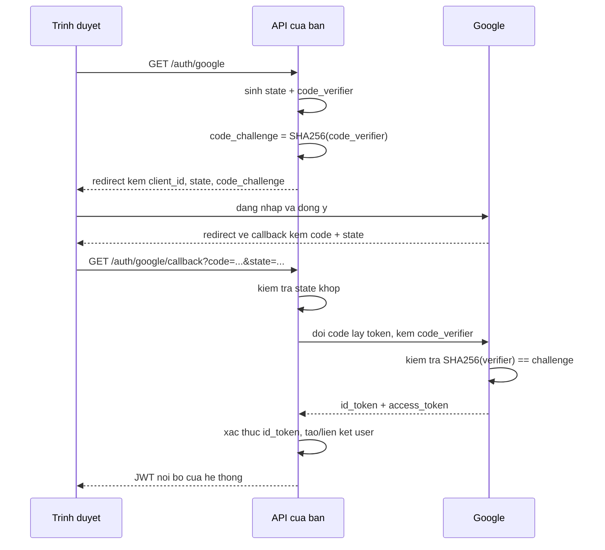

# 10.10 — 9. External Login và OAuth2 (Overview)

> Nguồn: https://tiennhm.io.vn/docs/dotnet-backend-zero-to-senior/stage-03-aspnet-core-backend/module-10-authentication-authorization/10.10-overview
> Authorization Code + PKCE là luồng duy nhất nên dùng, phân biệt OAuth2 với OpenID Connect, liên kết tài khoản theo email và rủi ro chiếm tài khoản.

> Hai chuẩn hay bị gọi lẫn nhau: **OAuth 2.0 là uỷ quyền** (*"cho ứng dụng này đọc Google Drive của tôi"*), **OpenID Connect là xác thực** (*"đây là ai"*) — và OIDC xây **trên** OAuth2 bằng cách thêm `id_token`. Đăng nhập bằng Google thực ra là OIDC, không phải OAuth2 thuần. Về luồng: chỉ có **một** luồng nên dùng ngày nay — **Authorization Code + PKCE**; Implicit flow đã bị RFC 9700 **khuyến cáo bỏ**. Và rủi ro lớn nhất khi tích hợp: **liên kết tài khoản theo email mà không kiểm tra `email_verified`** — kẻ tấn công đăng ký một tài khoản ở nhà cung cấp nào đó với email của bạn và chiếm luôn tài khoản trong hệ thống.

## Mục tiêu bài học

Sau bài này bạn có thể:

- Phân biệt OAuth 2.0 và OpenID Connect.
- Mô tả luồng Authorization Code + PKCE và vai trò của từng tham số.
- Liên kết tài khoản ngoài với tài khoản nội bộ an toàn.
- Nhận ra rủi ro chiếm tài khoản qua email chưa xác minh.
- Biết `state` và `nonce` chống lại điều gì.

## Nội dung bài học

### 10.10.1 — OAuth2 hay OpenID Connect

| | OAuth 2.0 | OpenID Connect |
|---|---|---|
| Trả lời | "Ứng dụng này được làm gì?" | "Người này là ai?" |
| Trả về | `access_token` | `access_token` + **`id_token`** |
| `id_token` là | — | **JWT** chứa danh tính, đã ký |
| Dùng cho | Gọi API của bên thứ ba | **Đăng nhập** |

Dùng `access_token` của OAuth2 để xác thực là sai: nó là **chìa khoá cho một API**, không phải bằng chứng danh tính, và với phần lớn nhà cung cấp nó là chuỗi mờ mà bạn không tự xác thực được.

`id_token` thì khác — nó là JWT có chữ ký, xác thực được bằng khoá công từ endpoint JWKS của nhà cung cấp, đúng như [bài 10.3](10.3-jwt-authentication.mdx).

Khi bạn thấy "Sign in with Google/Microsoft/GitHub", đó gần như luôn là OIDC.

### 10.10.2 — Authorization Code + PKCE



Ba tham số bảo mật, mỗi cái chống một thứ khác nhau:

| Tham số | Chống |
|---|---|
| **`state`** | **CSRF** — kẻ tấn công ép bạn hoàn tất luồng đăng nhập bằng tài khoản của họ |
| **`nonce`** | **Replay** — `id_token` cũ bị dùng lại |
| **`code_verifier` / PKCE** | **Đánh cắp mã** — mã bị chặn trên đường redirect cũng vô dụng |

`state` phải là chuỗi ngẫu nhiên, được lưu ở phía bạn, và **đối chiếu** khi callback về. Bỏ qua bước đối chiếu là một lỗ hổng CSRF thật sự — và nó dễ bị bỏ qua vì luồng vẫn chạy bình thường khi không có ai tấn công.

**PKCE** sinh ra cho ứng dụng di động (không giữ được secret), nhưng RFC 9700 khuyến nghị dùng cho **mọi** loại client, kể cả web server có secret.

**Implicit flow** — trả token thẳng trong URL fragment — đã bị khuyến cáo **không dùng**: token lọt vào lịch sử trình duyệt, vào log của proxy, vào header `Referer`.

### 10.10.3 — Cấu hình

```bash
dotnet add package Microsoft.AspNetCore.Authentication.Google
```

```csharp
builder.Services.AddAuthentication()
    .AddGoogle(options =>
    {
        options.ClientId     = builder.Configuration["Google:ClientId"]!;
        options.ClientSecret = builder.Configuration["Google:ClientSecret"]!;
        options.CallbackPath = "/api/auth/google/callback";

        options.UsePkce = true;                       // mac dinh true tu .NET 6
        options.SaveTokens = false;                   // khong luu token cua Google
        options.Scope.Add("email");
        options.Scope.Add("profile");

        options.ClaimActions.MapJsonKey("email_verified", "email_verified");
    });
```

`ClientSecret` là **secret** — biến môi trường hoặc Key Vault, không phải `appsettings.json` ([bài 8.7](../module-08-aspnet-core-fundamentals/8.7-configuration-system.mdx)).

`SaveTokens = false` trừ khi bạn thật sự cần gọi API của Google sau đó. Lưu token của bên thứ ba là thêm một thứ phải bảo vệ.

Dòng `ClaimActions` là quan trọng nhất trong đoạn cấu hình — nó đưa `email_verified` vào claim để mục sau dùng.

### 10.10.4 — Rủi ro chiếm tài khoản

```csharp
// SAI — lien ket theo email ma khong kiem tra gi
var user = await _userManager.FindByEmailAsync(email);
if (user is not null)
    await _userManager.AddLoginAsync(user, info);   // CHIEM TAI KHOAN
```

Kịch bản tấn công:

1. Nạn nhân có tài khoản `victim@company.com` trong hệ thống của bạn, đăng nhập bằng mật khẩu.
2. Kẻ tấn công tìm một nhà cung cấp OIDC **không xác minh email** và đăng ký ở đó với `victim@company.com`.
3. Kẻ tấn công bấm "Đăng nhập bằng nhà cung cấp X" trên hệ thống của bạn.
4. Hệ thống thấy email khớp, liên kết tài khoản, và **cấp quyền vào tài khoản của nạn nhân**.

Hai tầng bảo vệ:

```csharp
// 1. Chi tin email DA XAC MINH
var emailVerified = info.Principal.FindFirstValue("email_verified");
if (!string.Equals(emailVerified, "true", StringComparison.OrdinalIgnoreCase))
    return Result.Fail("Nhà cung cấp chưa xác minh email này");

// 2. Chi tu dong lien ket voi nha cung cap DANG TIN CAY
if (!_options.TrustedProviders.Contains(info.LoginProvider))
{
    // Gui email xac nhan cho chu tai khoan, khong lien ket ngay
    await _linkRequests.SendConfirmationAsync(existingUser, info, ct);
    return Result.Fail("Chúng tôi đã gửi email xác nhận để liên kết tài khoản");
}
```

Danh sách nhà cung cấp đáng tin nên **rất ngắn** — Google và Microsoft xác minh email; nhiều nhà cung cấp khác thì không, hoặc không nói rõ.

Luồng đầy đủ:

```csharp
public async Task<Result<TokenPair>> HandleExternalLoginAsync(
    ExternalLoginInfo info, CancellationToken ct)
{
    // 1. Da lien ket -> dang nhap
    var user = await _userManager.FindByLoginAsync(info.LoginProvider, info.ProviderKey);
    if (user is not null)
        return Result.Success(await _tokens.IssuePairAsync(user, ct));

    var email = info.Principal.FindFirstValue(ClaimTypes.Email);
    if (email is null)
        return Result.Fail("Nhà cung cấp không trả về email");

    if (!IsEmailVerified(info))
        return Result.Fail("Nhà cung cấp chưa xác minh email này");

    // 2. Email da ton tai -> can xac nhan truoc khi lien ket
    var existing = await _userManager.FindByEmailAsync(email);
    if (existing is not null)
    {
        if (!_options.TrustedProviders.Contains(info.LoginProvider))
        {
            await _linkRequests.SendConfirmationAsync(existing, info, ct);
            return Result.Fail("Chúng tôi đã gửi email xác nhận để liên kết tài khoản");
        }

        await _userManager.AddLoginAsync(existing, info);
        return Result.Success(await _tokens.IssuePairAsync(existing, ct));
    }

    // 3. Nguoi dung moi
    var newUser = new AppUser
    {
        UserName = email, Email = email, EmailConfirmed = true,
        FullName = info.Principal.FindFirstValue(ClaimTypes.Name),
    };

    var created = await _userManager.CreateAsync(newUser);
    if (!created.Succeeded)
        return Result.Fail(string.Join("; ", created.Errors.Select(e => e.Description)));

    await _userManager.AddLoginAsync(newUser, info);
    await _userManager.AddToRoleAsync(newUser, CrmRoles.ReadOnly);   // quyen thap nhat

    return Result.Success(await _tokens.IssuePairAsync(newUser, ct));
}
```

Chú ý dòng cuối: người dùng mới nhận **quyền thấp nhất**. Tự động cấp quyền theo tên miền email (`@company.com` thành `Manager`) là cách nhiều hệ thống bị xâm nhập — tên miền email không phải bằng chứng về vai trò trong tổ chức.

### 10.10.5 — Xử lý ở phía client

Với SPA hoặc mobile, đừng trả JWT nội bộ trong **URL**:

```csharp
// SAI — token vao lich su trinh duyet, vao log proxy, vao Referer
return Redirect($"{clientUrl}/auth/callback?token={jwt}");
```

```csharp
// DUNG — refresh token trong cookie HttpOnly, client tu doi lay access token
Response.Cookies.Append("refresh_token", refreshToken, new CookieOptions
{
    HttpOnly = true, Secure = true, SameSite = SameSiteMode.Lax,
    Path = "/api/auth", Expires = DateTimeOffset.UtcNow.AddDays(7),
});

return Redirect($"{clientUrl}/auth/callback");
```

`SameSite = Lax` ở đây có chủ đích: `Strict` sẽ **không** gửi cookie trong lần điều hướng từ Google về — và luồng đăng nhập hỏng theo cách rất khó chẩn đoán.

Client sau đó gọi `/api/auth/refresh` để lấy access token, đúng mẫu ở [bài 10.4](10.4-refresh-token.mdx).

### 10.10.6 — Rà lại code của bạn

**Danh sách rà soát đăng nhập ngoài**

- [ ] Dùng Authorization Code + PKCE, không dùng Implicit flow.
- [ ] state được sinh ngẫu nhiên và ĐỐI CHIẾU khi callback.
- [ ] id_token được xác thực chữ ký bằng khoá công từ JWKS.
- [ ] Chỉ liên kết tài khoản khi email_verified là true.
- [ ] Email trùng với tài khoản có sẵn cần xác nhận trước khi liên kết.
- [ ] Danh sách nhà cung cấp đáng tin rất ngắn và được review.
- [ ] Người dùng mới nhận quyền thấp nhất, không cấp theo tên miền email.
- [ ] ClientSecret nằm trong biến môi trường hoặc Key Vault.
- [ ] SaveTokens tắt trừ khi thật sự cần gọi API của nhà cung cấp.
- [ ] Không trả JWT nội bộ qua URL; dùng cookie HttpOnly.
- [ ] Cookie dùng SameSite Lax để sống sót qua redirect từ nhà cung cấp.

## Bài tập áp dụng

1. **Đọc `id_token`.** Hoàn tất một luồng đăng nhập Google, lấy `id_token` và giải mã payload. Liệt kê các claim và xác định cái nào bạn thật sự dùng.

2. **Mô phỏng chiếm tài khoản.** Tạo tài khoản `test@example.com` bằng mật khẩu. Giả lập một `ExternalLoginInfo` có cùng email nhưng `email_verified = false`, và xác nhận code **không** liên kết.

3. **`SameSite` phá luồng.** Đặt cookie refresh token với `SameSite = Strict`, chạy luồng đăng nhập Google, và xác nhận cookie **không** được gửi khi quay về. Đổi sang `Lax` và kiểm chứng lại.

## Tự kiểm tra

### OAuth 2.0 và OpenID Connect khác nhau thế nào?

OAuth 2.0 là uỷ quyền, trả lời ứng dụng này được làm gì, và trả về access_token. OpenID Connect là xác thực, trả lời người này là ai, và xây trên OAuth2 bằng cách thêm id_token là một JWT có chữ ký chứa danh tính. Đăng nhập bằng Google thực ra là OIDC.

### Vì sao không dùng access_token để xác thực?

Vì nó là chìa khoá cho một API chứ không phải bằng chứng danh tính, và với phần lớn nhà cung cấp nó là chuỗi mờ mà bạn không tự xác thực được. id_token thì là JWT có chữ ký, xác thực được bằng khoá công từ endpoint JWKS.

### state, nonce và PKCE chống lại những gì?

state chống CSRF, tức kẻ tấn công ép bạn hoàn tất luồng đăng nhập bằng tài khoản của họ. nonce chống replay id_token cũ. PKCE chống đánh cắp mã, làm cho mã bị chặn trên đường redirect cũng vô dụng vì thiếu code_verifier.

### Vì sao Implicit flow không nên dùng nữa?

Vì nó trả token thẳng trong URL fragment, nên token lọt vào lịch sử trình duyệt, vào log của proxy và vào header Referer. RFC 9700 khuyến cáo không dùng; thay bằng Authorization Code cộng PKCE cho mọi loại client.

### Rủi ro khi liên kết tài khoản theo email là gì?

Kẻ tấn công tìm một nhà cung cấp OIDC không xác minh email, đăng ký ở đó bằng email của nạn nhân, rồi đăng nhập vào hệ thống của bạn. Hệ thống thấy email khớp, liên kết tài khoản và cấp quyền vào tài khoản nạn nhân. Phải kiểm tra email_verified và chỉ tự động liên kết với danh sách nhà cung cấp đáng tin rất ngắn.

### Vì sao cookie phải là SameSite Lax chứ không phải Strict trong luồng này?

Vì Strict sẽ không gửi cookie trong lần điều hướng từ nhà cung cấp quay về ứng dụng của bạn, nên luồng đăng nhập hỏng theo cách rất khó chẩn đoán. Lax vẫn gửi cookie với điều hướng cấp cao nhất bằng GET, đúng trường hợp này.

## Kết luận

Ba điều đáng nhớ nhất:

1. **Đăng nhập là OIDC, không phải OAuth2 thuần.** Xác thực `id_token`, đừng dùng `access_token`.
2. **Authorization Code + PKCE là luồng duy nhất nên dùng**, và `state` phải được đối chiếu.
3. **Không liên kết tài khoản theo email chưa xác minh** — đó là đường chiếm tài khoản.

## Tham khảo

- [RFC 6749 — The OAuth 2.0 Authorization Framework](https://www.rfc-editor.org/rfc/rfc6749.html)
- [RFC 9700 — Best Current Practice for OAuth 2.0 Security](https://www.rfc-editor.org/rfc/rfc9700.html)
- [External provider authentication in ASP.NET Core](https://learn.microsoft.com/en-us/aspnet/core/security/authentication/social/)
- [OpenID Connect Core 1.0](https://openid.net/specs/openid-connect-core-1_0.html)

## Điều hướng

- **Bài trước:** [10.9 — 8. ASP.NET Core Identity (Overview)](10.9-overview.mdx)
- **Bài tiếp theo:** [10.11 — 10. Security Best Practices](10.11-security-best-practices.mdx)
- **Về module:** [Trang mục lục](./)
