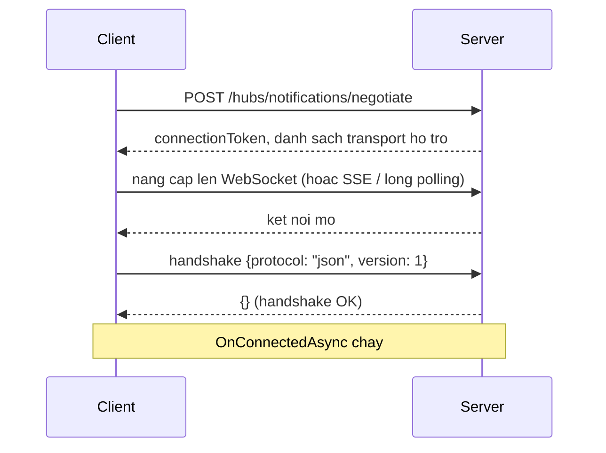

# 11.2 — 2. SignalR Architecture

> Nguồn: https://tiennhm.io.vn/docs/dotnet-backend-zero-to-senior/stage-03-aspnet-core-backend/module-11-signalr/11.2-signalr-architecture
> Negotiate, transport, Hub là transient, ConnectionId không ổn định, UserIdentifier, và vòng đời một kết nối từ bắt tay tới ngắt.

> Ba hiểu lầm về kiến trúc SignalR gây ra phần lớn lỗi trong thực tế. **Một: `Hub` là transient** — một instance mới được tạo cho **mỗi lời gọi**, không phải mỗi kết nối, nên field instance trong Hub **không giữ được gì**. **Hai: `ConnectionId` không ổn định** — nó đổi mỗi lần kết nối lại, và kết nối lại xảy ra thường xuyên trên mạng di động, nên đừng lưu nó vào database như định danh người dùng; hãy dùng `UserIdentifier`. **Ba: một người dùng có nhiều kết nối** — hai tab, điện thoại, laptop. Gửi tới một `ConnectionId` là gửi tới **một tab**, không phải tới một người.

## Mục tiêu bài học

Sau bài này bạn có thể:

- Mô tả bước `negotiate` và vì sao nó tồn tại.
- Giải thích vòng đời của `Hub` và hệ quả với trạng thái.
- Phân biệt `ConnectionId`, `UserIdentifier` và nhóm.
- Xử lý đúng việc một người dùng có nhiều kết nối.
- Đọc hiểu vòng đời một kết nối từ bắt tay tới ngắt.

## Nội dung bài học

### 11.3.1 — Bắt tay



Bước `negotiate` tồn tại vì client **không biết trước** transport nào dùng được. Mạng công ty chặn WebSocket, proxy cũ không hỗ trợ nâng cấp giao thức — `negotiate` cho server nói rõ nó hỗ trợ gì.

Hai hệ quả thực tế:

**`negotiate` là một request HTTP riêng**, nên nó đi qua toàn bộ pipeline: CORS, xác thực, rate limit. Nhiều lỗi "SignalR không kết nối được" thực ra là **`negotiate` bị chặn** bởi CORS hoặc bởi rate limit — và thông báo lỗi ở client thì mơ hồ.

**Bỏ qua `negotiate`** được nếu bạn chắc chắn WebSocket dùng được:

```javascript
new signalR.HubConnectionBuilder()
    .withUrl("/hubs/notifications", {
        skipNegotiation: true,
        transport: signalR.HttpTransportType.WebSockets
    })
    .build();
```

Nó bớt một vòng đi về và **bỏ luôn nhu cầu sticky session** — nhưng không còn dự phòng khi WebSocket bị chặn.

### 11.3.2 — `Hub` là transient

```csharp
public class NotificationHub : Hub<INotificationClient>
{
    private int _messageCount;         // VO DUNG — luon la 0

    public async Task SendMessage(string text)
    {
        _messageCount++;               // instance moi moi lan goi
        ...
    }
}
```

SignalR tạo **một instance Hub mới cho mỗi lời gọi từ client** — không phải mỗi kết nối. Nên:

- **Field instance không giữ được gì** giữa hai lời gọi.
- Trạng thái phải nằm ở service singleton, cache phân tán, hoặc database.
- Hub **không** được lưu tham chiếu tới `Clients` hay `Context` để dùng sau — chúng chỉ hợp lệ trong lời gọi hiện tại.

```csharp
// SAI — Context đã không còn hợp lệ khi callback chạy
public override Task OnConnectedAsync()
{
    _timer = new Timer(_ => Clients.Caller.Ping(), null, 0, 5000);
    return base.OnConnectedAsync();
}
```

Muốn gửi từ ngoài ngữ cảnh một lời gọi thì dùng `IHubContext` ([bài 11.8](11.7-ihubcontext-server-push-outside-hub.mdx)).

Về DI: Hub được resolve từ **scope của kết nối**, nên tiêm `DbContext` vào constructor Hub **chạy được** — nhưng scope đó sống suốt thời gian kết nối, có thể hàng giờ. Đó là một captive dependency trá hình ([bài 7.5](../../stage-02-csharp-professional/module-07-dependency-injection/7.4-service-lifetimes.mdx)): `DbContext` tích luỹ entity và trả dữ liệu cũ.

```csharp
// ĐÚNG — tạo scope riêng cho mỗi lần gọi
public class NotificationHub(IServiceScopeFactory scopeFactory) : Hub<INotificationClient>
{
    public async Task MarkAsRead(Guid id)
    {
        await using var scope = scopeFactory.CreateAsyncScope();
        var db = scope.ServiceProvider.GetRequiredService<AppDbContext>();
        ...
    }
}
```

### 11.3.3 — Ba cách định danh

| | Là gì | Ổn định | Dùng để |
|---|---|---|---|
| **`ConnectionId`** | Một kết nối (một tab) | **Không** — đổi khi kết nối lại | Trả lời đúng tab vừa gọi |
| **`UserIdentifier`** | Một người dùng | **Có** | Gửi tới **mọi** thiết bị của một người |
| **Group** | Một tập kết nối có tên | Có (tên nhóm) | Broadcast theo chủ đề |

```csharp
await Clients.Caller.Receive(dto);                    // dung tab vua goi
await Clients.User(userId).Receive(dto);              // MỌI thiết bị của người đó
await Clients.Group("tenant-123").Receive(dto);       // ca nhom
await Clients.All.Receive(dto);                       // tat ca — hiem khi dung
```

**`ConnectionId` đổi mỗi lần kết nối lại**, và kết nối lại xảy ra liên tục: mạng di động chuyển sóng, laptop mở nắp, Wi-Fi chập chờn. Lưu nó vào database như định danh người dùng là một lỗi phổ biến — sau 30 giây nó đã sai.

`UserIdentifier` mặc định lấy từ claim `NameIdentifier`. Đổi được:

```csharp
public sealed class UserIdProvider : IUserIdProvider
{
    public string? GetUserId(HubConnectionContext connection)
        => connection.User?.FindFirstValue("sub");
}

builder.Services.AddSingleton<IUserIdProvider, UserIdProvider>();
```

`Clients.User(id)` tự động gửi tới **mọi** kết nối của người đó — SignalR duy trì ánh xạ đó giúp bạn. Đây là lý do gần như luôn nên dùng `Clients.User` thay vì tự quản lý danh sách `ConnectionId`.

### 11.3.4 — Vòng đời kết nối

```csharp
public class NotificationHub(IPresenceTracker presence) : Hub<INotificationClient>
{
    public override async Task OnConnectedAsync()
    {
        var userId = Context.UserIdentifier;
        if (userId is null)
        {
            Context.Abort();                 // không xác thực được
            return;
        }

        await Groups.AddToGroupAsync(Context.ConnectionId, $"user-{userId}");
        await presence.ConnectAsync(userId, Context.ConnectionId);

        await base.OnConnectedAsync();
    }

    public override async Task OnDisconnectedAsync(Exception? exception)
    {
        var userId = Context.UserIdentifier;
        if (userId is not null)
            await presence.DisconnectAsync(userId, Context.ConnectionId);

        if (exception is not null)
            _logger.LogWarning(exception, "Ket noi {Id} ngat bat thuong", Context.ConnectionId);

        await base.OnDisconnectedAsync(exception);
    }
}
```

Bốn điều về `OnDisconnectedAsync`:

1. **`exception` khác `null`** nghĩa là ngắt bất thường (mất mạng); `null` nghĩa là client chủ động đóng.
2. Nó có thể **không chạy** nếu tiến trình server bị kill — trạng thái presence phải tự hết hạn, đừng chỉ dựa vào sự kiện này ([bài 11.10](11.9-presence-online-offline-status.mdx)).
3. Nó có thể chạy **muộn** — mất tới `ClientTimeoutInterval` (mặc định 30 giây) để phát hiện kết nối chết.
4. Nhóm được dọn tự động, không cần `RemoveFromGroupAsync`.

Và nhớ: người dùng mở 3 tab thì `OnDisconnectedAsync` chạy **3 lần**, mỗi lần một `ConnectionId`. "Người này đã offline" chỉ đúng khi **kết nối cuối cùng** đóng.

### 11.3.5 — Giữ nhịp và timeout

```csharp
builder.Services.AddSignalR(options =>
{
    options.KeepAliveInterval     = TimeSpan.FromSeconds(15);   // server ping client
    options.ClientTimeoutInterval = TimeSpan.FromSeconds(30);   // > 2x KeepAlive
    options.HandshakeTimeout      = TimeSpan.FromSeconds(15);
    options.MaximumReceiveMessageSize = 32 * 1024;
    options.EnableDetailedErrors  = builder.Environment.IsDevelopment();
});
```

Vì sao cần giữ nhịp: **TCP không báo ngay khi kết nối chết**. Rút cáp mạng và socket vẫn "mở" trong nhiều phút. Ping định kỳ là cách duy nhất phát hiện sớm.

Quy tắc: **`ClientTimeoutInterval` ít nhất gấp đôi `KeepAliveInterval`**, để một ping bị mất không làm đứt kết nối. Đặt sai tỷ lệ này gây ra hiện tượng "cứ vài phút lại mất kết nối" rất khó chẩn đoán.

`EnableDetailedErrors` chỉ bật ở Development — ở production nó gửi **stack trace tới client** ([bài 8.9](../module-08-aspnet-core-fundamentals/8.8-global-exception-handling.mdx)).

`MaximumReceiveMessageSize` mặc định 32KB. SignalR không dành cho truyền file; dùng HTTP upload thường ([bài 9.6](../module-09-web-api-professional/9.5-file-upload-and-download.mdx)).

### 11.3.6 — Rà lại code của bạn

**Danh sách rà soát kiến trúc SignalR**

- [ ] Không có field instance nào trong Hub dùng để giữ trạng thái.
- [ ] Không lưu tham chiếu tới Clients hay Context để dùng ngoài lời gọi.
- [ ] Hub tạo scope riêng cho mỗi lời gọi thay vì tiêm DbContext vào constructor.
- [ ] Không lưu ConnectionId vào database như định danh người dùng.
- [ ] Dùng Clients.User thay vì tự quản lý danh sách ConnectionId.
- [ ] Hiểu rằng một người dùng có nhiều kết nối và OnDisconnected chạy nhiều lần.
- [ ] Trạng thái presence có cơ chế tự hết hạn, không chỉ dựa vào OnDisconnectedAsync.
- [ ] ClientTimeoutInterval ít nhất gấp đôi KeepAliveInterval.
- [ ] EnableDetailedErrors chỉ bật ở Development.
- [ ] Endpoint negotiate được xem xét trong cấu hình CORS và rate limit.

## Bài tập áp dụng

1. **Hub là transient.** Thêm một biến đếm là field instance trong Hub, tăng nó mỗi lời gọi, và in ra. Xác nhận nó luôn là 1.

2. **`ConnectionId` đổi.** Log `ConnectionId` trong `OnConnectedAsync`, bật tắt mạng vài lần, và ghi lại các giá trị khác nhau cho cùng một người dùng.

3. **Timeout sai tỷ lệ.** Đặt `KeepAliveInterval = 30s` và `ClientTimeoutInterval = 30s`, chạy vài phút và ghi lại số lần mất kết nối. Sửa tỷ lệ và so sánh.

## Tự kiểm tra

### Bước negotiate để làm gì?

Client không biết trước transport nào dùng được vì mạng công ty có thể chặn WebSocket hay proxy cũ không hỗ trợ nâng cấp giao thức, nên negotiate cho server nói rõ nó hỗ trợ gì. Nó là một request HTTP riêng nên đi qua CORS, xác thực và rate limit; nhiều lỗi SignalR không kết nối được thực ra là negotiate bị chặn.

### Hub có vòng đời thế nào?

Nó là transient, một instance mới cho mỗi lời gọi từ client chứ không phải mỗi kết nối. Nên field instance không giữ được gì giữa hai lời gọi, và không được lưu tham chiếu tới Clients hay Context để dùng sau vì chúng chỉ hợp lệ trong lời gọi hiện tại.

### Tiêm DbContext vào constructor Hub có sao không?

Chạy được nhưng sai, vì Hub resolve từ scope của kết nối và scope đó sống suốt thời gian kết nối, có thể hàng giờ. Đó là captive dependency trá hình: DbContext tích luỹ entity và trả dữ liệu cũ. Nên tạo scope riêng cho mỗi lời gọi bằng IServiceScopeFactory.

### Vì sao không lưu ConnectionId vào database?

Vì nó đổi mỗi lần kết nối lại, và kết nối lại xảy ra liên tục khi mạng di động chuyển sóng, laptop mở nắp hay Wi-Fi chập chờn. Sau vài chục giây giá trị đã sai. Dùng UserIdentifier, và Clients.User tự gửi tới mọi kết nối của người đó.

### OnDisconnectedAsync có đáng tin không?

Không hoàn toàn. Nó có thể không chạy nếu tiến trình server bị kill, và có thể chạy muộn vì mất tới ClientTimeoutInterval để phát hiện kết nối chết. Vì vậy trạng thái presence phải có cơ chế tự hết hạn chứ không chỉ dựa vào sự kiện này.

### Vì sao ClientTimeoutInterval phải gấp đôi KeepAliveInterval?

Để một gói ping bị mất không làm đứt kết nối. Đặt hai giá trị bằng nhau gây ra hiện tượng cứ vài phút lại mất kết nối, rất khó chẩn đoán vì nó phụ thuộc vào chất lượng mạng.

## Kết luận

Ba điều đáng nhớ nhất:

1. **`Hub` là transient.** Trạng thái thuộc về service singleton hoặc kho dùng chung.
2. **`ConnectionId` là một tab, không phải một người.** Dùng `Clients.User`.
3. **`ClientTimeoutInterval` gấp đôi `KeepAliveInterval`** — sai tỷ lệ là mất kết nối định kỳ.

## Tham khảo

- [Use hubs in SignalR for ASP.NET Core](https://learn.microsoft.com/en-us/aspnet/core/signalr/hubs)
- [ASP.NET Core SignalR configuration](https://learn.microsoft.com/en-us/aspnet/core/signalr/configuration)
- [Manage users and groups in SignalR](https://learn.microsoft.com/en-us/aspnet/core/signalr/groups)
- [Logging and diagnostics in ASP.NET Core SignalR](https://learn.microsoft.com/en-us/aspnet/core/signalr/diagnostics)

## Điều hướng

- **Bài trước:** [11.1 — 1. Tại sao cần Real-time?](11.1-tai-sao-can-real-time.mdx)
- **Bài tiếp theo:** [11.3 — 3. Setup SignalR Server](11.3-setup-signalr-server.mdx)
- **Về module:** [Trang mục lục](./)
