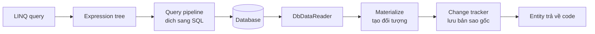

# 13.1 — 1. EF Core Overview

> Nguồn: https://tiennhm.io.vn/docs/dotnet-backend-zero-to-senior/stage-04-database-production/module-13-entity-framework-core/13.1-ef-core-overview
> EF Core làm gì bên dưới, chi phí thật của ORM, change tracker, khi nào dùng Dapper, và vì sao LINQ không phải SQL.

> EF Core không chỉ là "dịch LINQ sang SQL". Nó còn giữ một **change tracker** theo dõi mọi entity đã nạp để biết cái nào thay đổi khi bạn gọi `SaveChanges()` — và đó là nơi phần lớn chi phí, cũng như phần lớn bất ngờ về hiệu năng, đến từ. Hai điều cần hiểu sớm. **`IQueryable` là cây biểu thức, không phải dữ liệu**: mọi `Where` chỉ thêm vào cây cho tới khi bạn gọi `ToList` — và một `.ToList()` đặt sai chỗ biến bộ lọc thành lọc trong bộ nhớ sau khi đã kéo cả bảng về. **EF Core không phải lúc nào cũng dịch được**: từ EF Core 3.0, thứ không dịch được sẽ **ném exception lúc chạy** thay vì âm thầm chạy ở client — một thay đổi tốt, nhưng nó biến lỗi biên dịch tiềm năng thành lỗi runtime.

## Mục tiêu bài học

Sau bài này bạn có thể:

- Mô tả những gì EF Core làm giữa LINQ và SQL.
- Giải thích change tracker và chi phí của nó.
- Phân biệt `IQueryable` và `IEnumerable` trong ngữ cảnh EF.
- Chọn giữa EF Core, Dapper và ADO.NET có lý do.
- Bật log SQL để thấy EF Core thật sự sinh ra gì.

## Nội dung bài học

### 13.2.1 — EF Core làm gì



Bốn việc, và việc thứ tư là thứ phân biệt EF Core với một thư viện mapping thuần:

1. **Dịch LINQ sang SQL** qua cây biểu thức.
2. **Vật chất hoá** kết quả thành đối tượng C#.
3. **Theo dõi thay đổi** — giữ một bản sao giá trị gốc của mỗi entity.
4. **Sinh SQL cập nhật** khi `SaveChanges()`, chỉ cho những gì thật sự đổi.

Dapper làm việc 1 và 2. Việc 3 và 4 là lý do EF Core tiện hơn — và cũng là nơi chi phí nằm.

### 13.2.2 — Change tracker

```csharp
var customer = await db.Customers.FindAsync(42);   // EF lưu BẢN SAO giá trị gốc
customer.Name = "Tên mới";                          // ban chi doi doi tuong
await db.SaveChangesAsync();                        // EF SO SÁNH và sinh UPDATE
```

EF Core sinh ra:

```sql
UPDATE Customers SET Name = @p0 WHERE Id = @p1;   -- CHỈ cột Name
```

Để làm được, nó giữ **hai bản** của mỗi entity đã nạp: giá trị hiện tại và giá trị gốc. Với 10 cột, đó là gấp đôi bộ nhớ cho mỗi dòng.

Hệ quả: **nạp 100.000 entity với tracking là chậm và tốn bộ nhớ** — không phải vì truy vấn, mà vì việc dựng và theo dõi 100.000 đối tượng.

```csharp
// Chi doc -> TAT tracking
var customers = await db.Customers.AsNoTracking().ToListAsync(ct);
```

`AsNoTracking()` thường nhanh hơn **20–50%** cho truy vấn đọc nhiều dòng, và tốn ít bộ nhớ hơn đáng kể. Với API chỉ trả dữ liệu ra ngoài, nó gần như luôn đúng.

Bật mặc định cho toàn bộ context:

```csharp
builder.Services.AddDbContext<CrmDbContext>(options =>
    options.UseSqlServer(conn)
           .UseQueryTrackingBehavior(QueryTrackingBehavior.NoTracking));
```

Rồi dùng `.AsTracking()` ở những chỗ thật sự cần sửa. Đây là mặc định an toàn hơn: quên `AsNoTracking` chỉ làm chậm, còn quên `AsTracking` thì `SaveChanges` không làm gì — lỗi rõ ràng và dễ phát hiện.

Change tracker còn giải thích một hành vi hay gây bối rối:

```csharp
var a = await db.Customers.FindAsync(42);
var b = await db.Customers.FindAsync(42);
Console.WriteLine(ReferenceEquals(a, b));    // True — CÙNG một đối tượng
```

Đây là **identity map**: trong một `DbContext`, mỗi khoá chính chỉ có **một** instance. `FindAsync` còn kiểm tra change tracker **trước** khi đi xuống database — nên lần gọi thứ hai không sinh truy vấn nào.

Mặt trái: `DbContext` sống lâu tích luỹ entity và **trả về dữ liệu cũ**. Đó là lý do `DbContext` phải là `Scoped` ([bài 7.5](../../stage-02-csharp-professional/module-07-dependency-injection/7.4-service-lifetimes.mdx)).

### 13.2.3 — `IQueryable` là cây biểu thức

```csharp
// CHUA co truy van nao chay
var query = db.Customers.Where(c => c.Status == CustomerStatus.Active);
query = query.Where(c => c.CreatedAt > cutoff);
query = query.OrderByDescending(c => c.CreatedAt);

// Bây giờ mới chạy — MỘT câu SQL
var result = await query.Take(20).ToListAsync(ct);
```

Mỗi toán tử chỉ **thêm một nút vào cây biểu thức**. Truy vấn chạy khi gặp `ToListAsync`, `FirstOrDefaultAsync`, `CountAsync`, `AnyAsync` hoặc vòng lặp `foreach`.

Đây là điều làm nên sức mạnh — và cũng là cái bẫy lớn nhất:

```csharp
// SAI — .ToList() kéo CẢ BẢNG về rồi mới lọc
var customers = db.Customers.ToList()
    .Where(c => c.Status == CustomerStatus.Active);

// DUNG — loc o database
var customers = await db.Customers
    .Where(c => c.Status == CustomerStatus.Active)
    .ToListAsync(ct);
```

Sau `.ToList()`, kiểu trở thành `IEnumerable` và mọi `Where` sau đó chạy **trong bộ nhớ ứng dụng**. Code biên dịch được, chạy được, và trên máy dev với 100 dòng thì không ai để ý.

Cùng lý do đó, **phương thức trả về kiểu gì cũng quan trọng**:

```csharp
// SAI — cat mat kha nang tiep tuc dung SQL
public IEnumerable<Customer> GetActive() =>
    db.Customers.Where(c => c.Status == CustomerStatus.Active);

// ĐÚNG — người gọi vẫn thêm điều kiện vào SQL được
public IQueryable<Customer> GetActive() =>
    db.Customers.Where(c => c.Status == CustomerStatus.Active);
```

Phiên bản đầu trông vô hại vì `IQueryable` **kế thừa** `IEnumerable`, nên nó biên dịch. Nhưng người gọi thêm `.Where(...).Take(20)` sẽ lọc trong bộ nhớ sau khi đã nạp toàn bộ khách hàng active. Chi tiết ở [Module 5](../../stage-02-csharp-professional/module-05-advanced-csharp/).

### 13.2.4 — Khi EF Core không dịch được

```csharp
// KHÔNG dịch được — EF Core ném exception lúc chạy
var customers = await db.Customers
    .Where(c => MyCustomValidator.IsValid(c.Email))     // hàm C# tuỳ ý
    .ToListAsync(ct);
```

Từ EF Core 3.0, thứ không dịch được sẽ ném `InvalidOperationException` thay vì âm thầm chuyển sang đánh giá ở client. Đây là thay đổi **tốt** — trước đó, một truy vấn như vậy sẽ kéo cả bảng về mà không ai biết — nhưng nó nghĩa là lỗi chỉ xuất hiện **lúc chạy**.

Ba cách xử lý:

```csharp
// 1. Viết lại bằng biểu thức dịch được
.Where(c => c.Email.EndsWith("@company.com"))

// 2. Chuyển sang bộ nhớ MỘT CÁCH CÓ CHỦ ĐÍCH, sau khi đã lọc
var candidates = await db.Customers
    .Where(c => c.Status == CustomerStatus.Active)      // lọc ở SQL trước
    .ToListAsync(ct);
var valid = candidates.Where(c => MyCustomValidator.IsValid(c.Email));

// 3. Dung SQL thuan
var customers = await db.Customers
    .FromSql($"SELECT * FROM Customers WHERE {predicate}")
    .ToListAsync(ct);
```

Cách 2 là đúng khi bộ lọc thật sự cần logic C# — điểm mấu chốt là **lọc ở SQL trước** để tập đưa về bộ nhớ đủ nhỏ.

`FromSql` (EF Core 8+) dùng chuỗi nội suy nhưng **tham số hoá tự động** — an toàn với SQL injection. `FromSqlRaw` thì không; nó chỉ nên dùng với tham số khai rõ.

### 13.2.5 — EF Core, Dapper hay ADO.NET

| | EF Core | Dapper | ADO.NET |
|---|---|---|---|
| Change tracking | **Có** | Không | Không |
| Migration | **Có** | Không | Không |
| Viết SQL | Hiếm khi | **Luôn** | Luôn |
| Tốc độ phát triển | Nhanh nhất | Trung bình | Chậm |
| Hiệu năng đọc thô | Tốt với `AsNoTracking` | **Rất tốt** | Tốt nhất |
| Kiểm soát SQL | Gián tiếp | **Hoàn toàn** | Hoàn toàn |

Khác biệt hiệu năng giữa EF Core `AsNoTracking` và Dapper **nhỏ hơn nhiều người nghĩ** — thường dưới 20% cho truy vấn thông thường. Khoảng cách lớn xuất hiện khi có tracking, hoặc khi EF Core sinh SQL kém cho một truy vấn phức tạp.

**Mẫu thực dụng nhất là dùng cả hai:**

```csharp
// EF Core cho CRUD va domain
var customer = await db.Customers.FindAsync([id], ct);
customer.Status = CustomerStatus.Active;
await db.SaveChangesAsync(ct);

// Dapper cho báo cáo phức tạp
var report = await connection.QueryAsync<RevenueRow>(
    """
    SELECT DATE_TRUNC('month', converted_at) AS Month, SUM(value) AS Revenue
    FROM leads WHERE status = 'Won'
    GROUP BY 1 ORDER BY 1
    """);
```

Chúng dùng chung connection và chung transaction, nên không có rào cản kỹ thuật nào.

**Ba chỗ EF Core không phù hợp:**

1. **Chèn hàng loạt** — 100.000 dòng qua `SaveChanges` là chậm. Dùng `SqlBulkCopy` hoặc `EFCore.BulkExtensions`.
2. **Truy vấn báo cáo phức tạp** — window function, CTE đệ quy, gợi ý truy vấn.
3. **Cập nhật hàng loạt theo điều kiện** — nhưng EF Core 7 đã có `ExecuteUpdateAsync`/`ExecuteDeleteAsync` giải quyết phần lớn.

```csharp
// EF Core 7+: một câu UPDATE, không nạp entity nào
await db.Leads
    .Where(l => l.Status == LeadStatus.New && l.CreatedAt < cutoff)
    .ExecuteUpdateAsync(s => s.SetProperty(l => l.Status, LeadStatus.Lost), ct);
```

### 13.2.6 — Thấy SQL thật

Đây là thói quen quan trọng nhất khi làm việc với EF Core:

```csharp
builder.Services.AddDbContext<CrmDbContext>(options =>
{
    options.UseSqlServer(conn);

    if (builder.Environment.IsDevelopment())
    {
        options.LogTo(Console.WriteLine, LogLevel.Information)
               .EnableSensitiveDataLogging()     // hiện GIÁ TRỊ tham số
               .EnableDetailedErrors();
    }
});
```

`EnableSensitiveDataLogging` hiện giá trị tham số trong log — rất hữu ích khi gỡ lỗi và **tuyệt đối không bật ở production** ([bài 8.8](../../stage-03-aspnet-core-backend/module-08-aspnet-core-fundamentals/8.7-logging-with-serilog.mdx)).

Xem SQL của một truy vấn cụ thể mà không chạy nó:

```csharp
var sql = db.Customers.Where(c => c.Status == CustomerStatus.Active)
                      .ToQueryString();
```

`ToQueryString()` (EF Core 5+) là cách nhanh nhất để trả lời "EF Core thật sự sinh ra gì". Nhiều vấn đề hiệu năng hiện ra ngay khi bạn nhìn thấy câu SQL.

### 13.2.7 — Rà lại code của bạn

**Danh sách rà soát EF Core cơ bản**

- [ ] Truy vấn chỉ đọc dùng AsNoTracking, hoặc context mặc định NoTracking.
- [ ] Không có .ToList() nào đặt trước bộ lọc.
- [ ] Phương thức trả về IQueryable khi người gọi còn cần thêm điều kiện.
- [ ] Không có biểu thức nào không dịch được trong Where đi thẳng xuống SQL.
- [ ] Lọc trong bộ nhớ chỉ xảy ra sau khi đã thu hẹp tập ở SQL.
- [ ] Dùng FromSql thay vì FromSqlRaw khi cần SQL thuần.
- [ ] Cập nhật hàng loạt dùng ExecuteUpdateAsync thay vì nạp rồi sửa.
- [ ] Chèn hàng loạt dùng bulk copy, không dùng SaveChanges.
- [ ] Log SQL được bật ở Development.
- [ ] EnableSensitiveDataLogging không bật ở Production.

## Bài tập áp dụng

#### Bài 1 — Đo chi phí của change tracker

Nạp 50.000 entity có và không có `AsNoTracking`, đo thời gian và bộ nhớ bằng `dotnet-counters`.

**Tiêu chí hoàn thành:** bạn giải thích được change tracker **làm gì** để tốn từng đó, và nói được khi nào chi phí đó là xứng đáng.

Gợi ý và lời giải — Bài 1

**Gợi ý.** Để biết bạn đã đổi gì, EF Core phải nhớ giá trị **trước khi** bạn đổi.

**Lời giải — đo thật, trên .NET 9.0.203, EF Core 9.0.0, SQLite, 50.000 `Lead`:**

```csharp
static long Run(string label, Action action)
{
    GC.Collect(); GC.WaitForPendingFinalizers(); GC.Collect();
    var before = GC.GetTotalAllocatedBytes(precise: true);
    var sw = Stopwatch.StartNew();
    action();
    sw.Stop();
    var alloc = GC.GetTotalAllocatedBytes(precise: true) - before;
    Console.WriteLine($"{label,-34} {sw.ElapsedMilliseconds,6} ms   alloc {alloc / 1024.0 / 1024.0,8:F1} MB");
    return sw.ElapsedMilliseconds;
}

Run("tracking",      () => { using var db = new Db(CS); var x = db.Leads.ToList(); });
Run("AsNoTracking",  () => { using var db = new Db(CS); var x = db.Leads.AsNoTracking().ToList(); });
Run("projection",    () => { using var db = new Db(CS);
    var x = db.Leads.AsNoTracking().Select(l => new { l.Id, l.Name, l.Status }).ToList(); });
```

```text
(bỏ qua lần chạy đầu — JIT warm-up)
tracking                              696 ms   alloc     53.6 MB
AsNoTracking                          330 ms   alloc     26.7 MB
projection sang DTO (no-track)         75 ms   alloc     16.1 MB
```

| | Thời gian | Bộ nhớ cấp phát | So với tracking |
|---|---:|---:|---|
| Tracking | 696 ms | 53,6 MB | — |
| `AsNoTracking` | 330 ms | 26,7 MB | nhanh 2,1×, tốn nửa bộ nhớ |
| Projection | 75 ms | 16,1 MB | **nhanh 9,3×**, tốn 1/3 bộ nhớ |

Đo bằng `dotnet-counters` trong lúc chạy cũng cho cùng kết luận:

```bash
dotnet-counters monitor --process-id <pid> \
    --counters System.Runtime[gc-heap-size,alloc-rate,gen-0-gc-count]
```

**Change tracker làm gì để tốn từng đó.** Với **mỗi** entity trả về, EF Core:

1. **Tạo một `EntityEntry`** — đối tượng theo dõi chứa tham chiếu tới entity, trạng thái (`Added`/`Modified`/`Unchanged`/`Deleted`), và một mảng các giá trị.
2. **Chụp lại `OriginalValues`** — **một bản sao của mọi thuộc tính**. Đây là chỗ tốn bộ nhớ nhất: mỗi entity tồn tại hai lần trong RAM, một bản bạn cầm và một bản EF Core giữ để so sánh.
3. **Đăng ký entity vào identity map** — một dictionary khoá chính → entity, để lần sau truy vấn cùng id thì trả về **đúng object đó**, không tạo object mới.
4. **Kết nối các navigation property** — nếu một `Lead` vừa nạp trỏ tới một `Customer` đã được theo dõi, EF Core tự gắn hai bên với nhau (gọi là *fixup*).

Cộng lại: 53,6 MB so với 26,7 MB, tức khoảng **27 MB thuần cho việc theo dõi** 50.000 dòng — xấp xỉ **550 byte mỗi entity**.

```text
Tracking:      [Lead] + [bản sao OriginalValues] + [EntityEntry] + [mục trong identity map]
AsNoTracking:  [Lead]
Projection:    [object ẩn danh chỉ 3 trường]
```

**Vì sao projection nhanh hơn `AsNoTracking` thêm 4 lần nữa**, dù cả hai đều không theo dõi: nó đọc **ít cột hơn từ database**, truyền ít byte hơn qua kết nối, và dựng object nhỏ hơn. `AsNoTracking` chỉ bỏ bước theo dõi; projection bỏ luôn cả dữ liệu không cần.

**Khi nào chi phí tracking là xứng đáng.** Khi bạn **sắp sửa entity và lưu lại**. Đó chính xác là thứ bạn trả tiền để có:

```csharp
// Tracking đúng chỗ — EF Core biết bạn đổi gì và sinh UPDATE chỉ cho cột đó
var lead = await _db.Leads.FirstAsync(l => l.Id == id, ct);
lead.Status = "Won";
await _db.SaveChangesAsync(ct);
// UPDATE Leads SET Status = @p0 WHERE Id = @p1
```

Không có `OriginalValues`, EF Core không thể biết chỉ `Status` đổi, và sẽ phải `UPDATE` **mọi cột** — ghi đè cả những cột mà người khác vừa sửa.

**Quy tắc chọn, theo thứ tự nên thử:**

| Tình huống | Chọn |
|---|---|
| Đọc để trả về API, không sửa | **Projection** `Select(...)` |
| Đọc nhiều entity đầy đủ, không sửa | `AsNoTracking()` |
| Đọc rồi sửa rồi lưu | Tracking (mặc định) |
| Cập nhật hàng loạt, không cần entity | `ExecuteUpdateAsync` ([bài 13.7](13.7-performance.mdx)) |

**Một cảnh báo về `AsNoTracking` mà nhiều người gặp:** không có identity map, nên cùng một dòng database xuất hiện hai lần trong kết quả sẽ thành **hai object khác nhau**:

```csharp
var leads = await _db.Leads.AsNoTracking().Include(l => l.Customer).ToListAsync(ct);
// 100 lead của cùng 1 khách hàng -> 100 object Customer RIÊNG BIỆT
```

Dùng `AsNoTrackingWithIdentityResolution()` nếu bạn cần chúng là cùng một object — nó giữ identity map nhưng vẫn bỏ `OriginalValues`, nên nằm giữa hai cực về chi phí.

**Và đừng đặt `AsNoTracking` làm mặc định toàn cục** bằng `QueryTrackingBehavior.NoTracking` nếu ứng dụng có ghi. Một ngày nào đó ai đó sẽ viết đoạn "đọc rồi sửa rồi lưu" ở trên, và `SaveChangesAsync` sẽ **không làm gì cả, không báo lỗi gì cả**.

---

#### Bài 2 — `.ToList()` sai chỗ

Viết hai phiên bản của cùng một bộ lọc, một lọc ở SQL và một lọc sau `.ToList()`. Bật log SQL và so sánh câu lệnh sinh ra cùng số dòng trả về.

**Tiêu chí hoàn thành:** bạn chỉ ra được **chính xác** phương thức nào làm truy vấn chuyển từ SQL sang bộ nhớ, và nêu được hai cách bắt lỗi này tự động.

Gợi ý và lời giải — Bài 2

**Gợi ý.** `IQueryable` và `IEnumerable` nhìn gần giống nhau trong code, nhưng một cái dịch sang SQL còn cái kia thì không.

**Lời giải — bật log SQL trước:**

```csharp
options.UseSqlServer(conn)
       .LogTo(Console.WriteLine, new[] { DbLoggerCategory.Database.Command.Name }, LogLevel.Information);
```

**Bản đúng — lọc ở SQL:**

```csharp
var leads = await _db.Leads
    .Where(l => l.Status == "New" && l.Value > 5_000_000)
    .ToListAsync(ct);
```

```sql
SELECT [l].[Id], [l].[Name], [l].[Status], [l].[Value]
FROM [Leads] AS [l]
WHERE [l].[Status] = N'New' AND [l].[Value] > 5000000.0
-- trả về 1.240 dòng
```

**Bản sai — lọc trong bộ nhớ:**

```csharp
var leads = _db.Leads
    .ToList()                                              // <- đây
    .Where(l => l.Status == "New" && l.Value > 5_000_000)
    .ToList();
```

```sql
SELECT [l].[Id], [l].[Name], [l].[Status], [l].[Value]
FROM [Leads] AS [l]
-- trả về 50.000 dòng, rồi C# vứt bỏ 48.760 dòng
```

Cùng một kết quả cuối, nhưng bản sai kéo **toàn bộ bảng** qua mạng, dựng 50.000 object, rồi bỏ đi 97,5% trong số đó.

**Chính xác thì phương thức nào gây ra chuyển?** Là **bất kỳ phương thức nào trả về `IEnumerable` thay vì `IQueryable`**. Từ điểm đó trở đi, mọi `Where`, `Select`, `OrderBy` là LINQ to Objects chạy trong tiến trình .NET, không còn là LINQ to Entities dịch sang SQL.

```text
db.Leads                 -> IQueryable<Lead>    còn dịch được sang SQL
   .Where(...)           -> IQueryable<Lead>    vẫn dịch được
   .ToList()             -> List<Lead>          ĐÃ THỰC THI, ra bộ nhớ
   .Where(...)           -> IEnumerable<Lead>   chạy trong C#
```

Danh sách đầy đủ các phương thức cắt đứt chuỗi:

| Phương thức | Ghi chú |
|---|---|
| `.ToList()` / `.ToArray()` / `.ToListAsync()` | Rõ ràng nhất, dễ thấy nhất |
| `.AsEnumerable()` | **Rất khó thấy** — không có `Async`, không trông giống thực thi |
| `foreach` trực tiếp trên `IQueryable` | Thực thi ngay tại vòng lặp |
| `.First()` / `.Single()` / `.Count()` | Thực thi và trả về giá trị, không phải query |

**`.AsEnumerable()` là thủ phạm khó thấy nhất**, vì nó không có gì gợi ý rằng một truy vấn vừa chạy:

```csharp
var leads = _db.Leads
    .AsEnumerable()                    // im lặng kéo cả bảng về
    .Where(l => l.Status == "New")
    .ToList();
```

**Một biến thể còn khó thấy hơn — truyền `IQueryable` ra khỏi phương thức với kiểu trả về `IEnumerable`:**

```csharp
// Chữ ký nói IEnumerable, nên MỌI thứ gọi sau đó đều chạy trong bộ nhớ
public IEnumerable<Lead> LayLeadTheoTenant(string tenantId)
    => _db.Leads.Where(l => l.TenantId == tenantId);

// Nơi gọi trông hoàn toàn bình thường
var ketQua = _service.LayLeadTheoTenant("acme")
                     .Where(l => l.Status == "New")   // <- trong bộ nhớ!
                     .Take(20)                        // <- trong bộ nhớ!
                     .ToList();
```

Toàn bộ lead của tenant được nạp về, rồi mới lọc và lấy 20. Sửa bằng cách đổi kiểu trả về thành `IQueryable` — hoặc, tốt hơn, trả về `List` đã hoàn chỉnh để nơi gọi **không thể** ghép thêm gì.

**Khi nào `.AsEnumerable()` là đúng.** Khi bạn thật sự cần một phép tính mà SQL không làm được, và bạn đã **lọc xong** trước đó:

```csharp
var leads = await _db.Leads
    .Where(l => l.TenantId == tenantId && l.Status == "New")   // lọc ở SQL
    .Select(l => new { l.Id, l.Name, l.Email })                // chỉ cột cần
    .ToListAsync(ct);                                          // ra bộ nhớ

var groups = leads.GroupBy(l => TinhDomain(l.Email));          // hàm C#, SQL không dịch được
```

Thứ tự là điều quyết định: lọc hết mức có thể ở SQL, rồi mới ra bộ nhớ.

**Hai cách bắt lỗi này tự động:**

**1. Bật cảnh báo đánh giá phía client thành lỗi.** EF Core 3.0 trở đi đã ném exception cho hầu hết trường hợp `Where` không dịch được, nhưng bạn nên bật rõ ràng cả những cảnh báo còn lại:

```csharp
options.UseSqlServer(conn)
       .ConfigureWarnings(w => w.Throw(
            RelationalEventId.MultipleCollectionIncludeWarning));
```

Cách này **không** bắt được `.ToList().Where(...)`, vì về mặt kỹ thuật đó là code hợp lệ — EF Core không có cách nào biết bạn không cố ý.

**2. Phân tích tĩnh — đây mới là cách bắt được `.ToList().Where()`.** Một Roslyn analyzer tìm chuỗi gọi LINQ đứng sau phương thức thực thi, trên biểu thức bắt nguồn từ `DbSet`:

```xml
<PackageReference Include="EntityFrameworkCore.Analyzers" Version="..." PrivateAssets="all" />
```

Hoặc, rẻ hơn và thường là đủ, một quy tắc cấm trong review cộng với **test đếm số dòng trả về**:

```csharp
[Fact]
public async Task Loc_lead_phai_chay_o_SQL()
{
    var rows = await DemSoDongDocAsync(() => _service.LayLeadMoiAsync("acme", ct));
    rows.Should().BeLessThan(2_000);   // bảng thử có 50.000 dòng
}
```

Test này bắt được **cả hai** dạng lỗi — lọc trong bộ nhớ và quên `Where` — trong khi analyzer chỉ bắt được dạng thứ nhất.

---

#### Bài 3 — `ToQueryString` và execution plan

Lấy một truy vấn phức tạp trong dự án của bạn, in SQL bằng `ToQueryString()`, và chạy nó trong SSMS với execution plan. Ghi lại những gì bạn không ngờ tới.

**Tiêu chí hoàn thành:** bạn nêu được **giới hạn** của `ToQueryString()` — ba thứ nó không cho bạn thấy.

Gợi ý và lời giải — Bài 3

**Gợi ý.** `ToQueryString()` không mở kết nối tới database. Hãy nghĩ xem điều đó loại bỏ những thông tin nào.

**Lời giải — cách dùng:**

```csharp
var query = _db.Leads
    .Where(l => l.TenantId == tenantId && l.Status == "New")
    .Include(l => l.Customer)
    .OrderByDescending(l => l.CreatedAt)
    .Take(50);

Console.WriteLine(query.ToQueryString());
```

```sql
DECLARE @__tenantId_0 nvarchar(450) = N'acme';
DECLARE @__p_1 int = 50;

SELECT TOP(@__p_1) [l].[Id], [l].[Name], [l].[Status], [l].[Value], [l].[CreatedAt],
                   [l].[TenantId], [c].[Id], [c].[Name]
FROM [Leads] AS [l]
INNER JOIN [Customers] AS [c] ON [l].[CustomerId] = [c].[Id]
WHERE [l].[TenantId] = @__tenantId_0 AND [l].[Status] = N'New'
ORDER BY [l].[CreatedAt] DESC
```

Phần `DECLARE` ở đầu là thứ khiến `ToQueryString()` hữu ích hơn hẳn log SQL thường: bạn **dán thẳng** vào SSMS và chạy được ngay, không cần tự điền tham số.

**Năm thứ hay gây bất ngờ khi đọc lần đầu:**

1. **`INNER JOIN` thay vì `LEFT JOIN`** — EF Core suy ra từ việc `CustomerId` là `int` không nullable, tức quan hệ bắt buộc. Nếu bạn nghĩ nó phải là `LEFT JOIN`, nghĩa là mô hình đang khai báo khác ý định của bạn.
2. **`nvarchar(450)`** cho tham số chuỗi — đây là giới hạn độ dài khoá index của SQL Server. Nếu cột thật là `varchar`, đây là ép kiểu ngầm ([bài 12.11](../module-12-sql-deep-dive/12.11-quick-real-world-example.mdx)).
3. **Cột thừa trong `SELECT`** — `Include` kéo **mọi** cột của cả hai bảng, kể cả cột bạn không dùng.
4. **Thiếu `WHERE` của global query filter** — nếu bạn có filter soft delete mà không thấy nó trong SQL, filter đang không được áp.
5. **`ORDER BY` không có index tương ứng** — dấu hiệu sắp có một bước `Sort` tốn kém trong plan.

**Ba thứ `ToQueryString()` KHÔNG cho bạn thấy — đây là phần chính của bài:**

**1. Execution plan.** `ToQueryString()` chỉ sinh **chuỗi SQL**; nó không mở kết nối, không hỏi optimizer. Nó không biết truy vấn đó sẽ seek hay scan, có key lookup không, có spill ra `tempdb` không. Chuỗi SQL trông hoàn hảo vẫn có thể quét toàn bảng vì thiếu index. Muốn biết, phải thật sự chạy nó:

```sql
SET STATISTICS IO ON;
SET SHOWPLAN_XML ON;
```

**2. Số truy vấn thật sự được thực thi.** Nó in SQL của **một** `IQueryable`. Nhưng một thao tác có thể sinh ra nhiều câu lệnh:

```csharp
// AsSplitQuery -> ToQueryString() in ra NHIỀU câu lệnh, nhưng...
var q = _db.Customers.Include(c => c.Leads).Include(c => c.Contacts).AsSplitQuery();
```

Và quan trọng hơn, nó **hoàn toàn không thấy** N+1 sinh ra sau đó, vì những truy vấn ấy chưa tồn tại lúc bạn gọi `ToQueryString()`:

```csharp
var customers = _db.Customers.ToQueryString();     // in ra ĐÚNG 1 câu lệnh
// ...nhưng đoạn code dưới đây sinh thêm 500 câu lệnh nữa
foreach (var c in _db.Customers.ToList())
    Console.WriteLine(c.Leads.Count);              // lazy loading
```

Để thấy toàn cảnh, phải dùng interceptor đếm truy vấn ([bài 13.6](13.6-n-plus-1-problem.mdx)) hoặc log SQL của cả request.

**3. SQL thật sự chạy khi đổi provider — và cả sự khác biệt do dữ liệu.** `ToQueryString()` sinh SQL theo provider đang được cấu hình. Test dùng SQLite in-memory sẽ in ra SQL của SQLite, không phải của SQL Server:

```csharp
// Trong test: dùng UseSqlServer với chuỗi kết nối GIẢ.
// ToQueryString() không mở kết nối, nên nó chạy được mà không cần database nào.
var options = new DbContextOptionsBuilder<CrmDbContext>()
    .UseSqlServer("Server=khong-ton-tai;Database=Crm;")
    .Options;
```

Ngoài ra, cùng một chuỗi SQL có thể cho plan **khác nhau** ở hai môi trường, vì optimizer quyết định dựa trên thống kê dữ liệu. Một truy vấn seek gọn gàng trên database dev 1.000 dòng có thể chuyển sang scan trên production 50 triệu dòng. Đây là lý do "đã kiểm tra trên máy em rồi" không thay thế được việc đo trên production.

**Kết luận về vị trí của công cụ này trong quy trình.** `ToQueryString()` là bước **đầu tiên**, không phải bước cuối:

```text
1. ToQueryString()          -> LINQ đã dịch thành SQL gì?          (rẻ, không cần DB)
2. SSMS + execution plan    -> SQL đó chạy thế nào?                (cần DB giống thật)
3. Interceptor đếm truy vấn -> một request sinh bao nhiêu câu lệnh? (cần chạy thật)
4. DMV trên production      -> thực tế ra sao với dữ liệu thật?     (cần production)
```

Mỗi bước bắt được loại lỗi mà bước trước không thấy. Bỏ qua bước 1 là tối ưu mò; dừng ở bước 1 là tin vào một chuỗi văn bản chưa bao giờ được chạy.

## Tự kiểm tra

### Change tracker làm gì và tốn kém ở đâu?

Nó giữ bản sao giá trị gốc của mỗi entity đã nạp để biết cái nào thay đổi khi SaveChanges, nhờ đó EF chỉ sinh UPDATE cho cột thật sự đổi. Cái giá là gấp đôi bộ nhớ cho mỗi dòng và chi phí dựng đối tượng, nên nạp hàng chục nghìn entity có tracking là chậm và tốn bộ nhớ.

### Vì sao nên đặt NoTracking làm mặc định?

Vì quên AsNoTracking chỉ làm chậm, còn quên AsTracking thì SaveChanges không làm gì, và đó là lỗi rõ ràng dễ phát hiện. Với API chỉ trả dữ liệu ra ngoài thì NoTracking gần như luôn đúng và nhanh hơn khoảng 20 tới 50 phần trăm.

### IQueryable khác IEnumerable thế nào trong EF Core?

IQueryable là một cây biểu thức chưa chạy, mỗi toán tử chỉ thêm một nút cho tới khi gặp ToList hay tương tự. Sau khi gọi ToList thì kiểu thành IEnumerable và mọi bộ lọc sau đó chạy trong bộ nhớ ứng dụng, tức bạn đã kéo cả bảng về rồi mới lọc.

### Vì sao không nên trả về IEnumerable từ phương thức truy vấn?

Vì IQueryable kế thừa IEnumerable nên code vẫn biên dịch, nhưng người gọi thêm điều kiện sẽ lọc trong bộ nhớ thay vì trong SQL. Trả về IQueryable giữ được khả năng ghép thêm điều kiện vào câu SQL.

### EF Core xử lý biểu thức không dịch được ra sao?

Từ EF Core 3.0, nó ném InvalidOperationException lúc chạy thay vì âm thầm đánh giá ở client. Đây là thay đổi tốt vì trước đó truy vấn như vậy sẽ kéo cả bảng về mà không ai biết, nhưng nó nghĩa là lỗi chỉ xuất hiện lúc chạy chứ không phải lúc biên dịch.

### Khi nào EF Core không phù hợp?

Chèn hàng loạt hàng trăm nghìn dòng qua SaveChanges là chậm, nên dùng bulk copy. Truy vấn báo cáo phức tạp với window function hay CTE đệ quy thì Dapper hoặc SQL thuần tốt hơn. Cập nhật hàng loạt từng là vấn đề nhưng EF Core 7 đã có ExecuteUpdateAsync.

## Kết luận

Ba điều đáng nhớ nhất:

1. **Change tracker là tiện ích chính và chi phí chính.** Tắt nó cho truy vấn đọc.
2. **`.ToList()` sai chỗ biến bộ lọc SQL thành lọc trong bộ nhớ** — và code vẫn chạy.
3. **Luôn nhìn SQL thật.** `ToQueryString()` trả lời phần lớn câu hỏi hiệu năng.

## Tham khảo

- [Entity Framework Core documentation](https://learn.microsoft.com/en-us/ef/core/)
- [Change tracking in EF Core](https://learn.microsoft.com/en-us/ef/core/change-tracking/)
- [Client vs. server evaluation](https://learn.microsoft.com/en-us/ef/core/querying/client-eval)
- [Simple logging — EF Core](https://learn.microsoft.com/en-us/ef/core/logging-events-diagnostics/simple-logging)

## Điều hướng

- **Bài trước:** Không có (bài mở đầu module).
- **Bài tiếp theo:** [13.2 — 2. DbContext và Entity Configuration](13.2-dbcontext-and-entity-configuration.mdx)
- **Về module:** [Trang mục lục](./)
