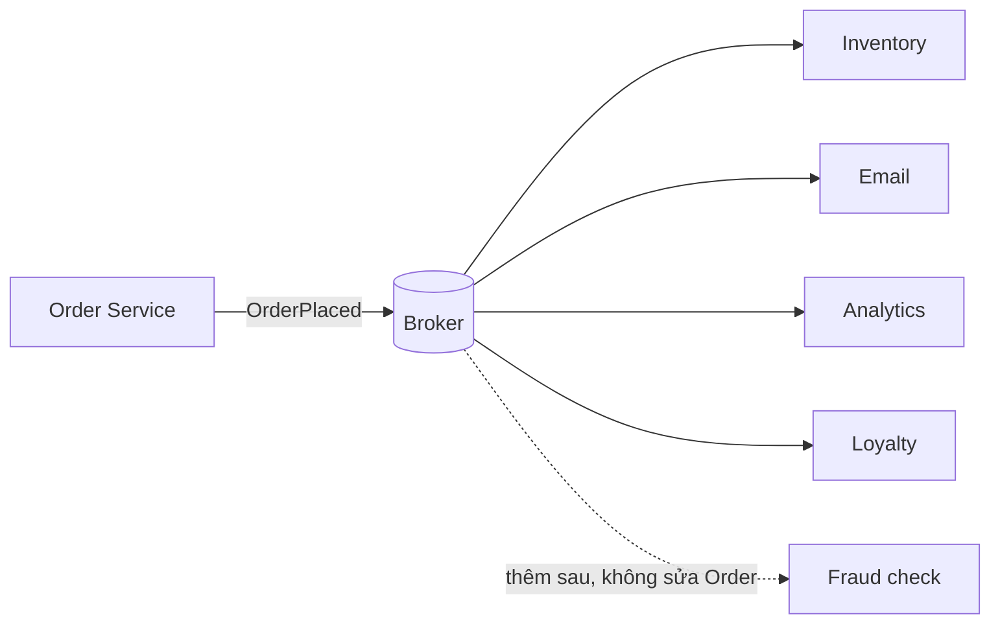

# 17.2 — 1. Event-driven architecture (EDA) — khi nào dùng?

> Nguồn: https://tiennhm.io.vn/docs/dotnet-backend-zero-to-senior/stage-05-senior-engineering/module-17-distributed-systems/17.2-event-driven-architecture-when-to-use
> Ba lý do chính đáng để dùng broker, chi phí thật ít ai nói trước, và vì sao domain event in-process thường đủ cho một monolith.

> EDA giải quyết một vấn đề cụ thể: **coupling thời gian** — bên gửi không phải chờ bên nhận xử lý xong, và không sập khi bên nhận sập. Nhưng nó **không miễn phí**, và cái giá không nằm ở chỗ dựng broker (một `docker compose` là xong) mà ở chỗ **hệ thống của bạn không còn nhất quán ngay lập tức**: đơn hàng tạo xong nhưng tồn kho chưa trừ, và trong vài trăm mili giây đó mọi câu hỏi "dữ liệu đúng chưa" đều có câu trả lời "còn tuỳ". Thêm vào đó là **schema versioning**, **thứ tự**, **message trùng**, **DLQ** và debug xuyên tiến trình. Nguyên tắc chọn: nếu bạn chỉ có **một** service và một database, **domain event in-process** ([bài 16.9](../module-16-clean-architecture/16.9-in-process.mdx)) cộng một job nền gần như luôn là lựa chọn đúng.

## Mục tiêu bài học

Sau bài này bạn có thể:

- Nêu ba lý do chính đáng để đưa broker vào hệ thống.
- Kể đúng chi phí thật của EDA, không chỉ chi phí hạ tầng.
- Phân biệt domain event và integration event.
- Chọn giữa in-process event, job nền và broker theo tình huống.
- Nhận ra khi nào EDA đang được dùng vì "nghe hiện đại".

## Nội dung bài học

### 17.2.1 — Ba lý do chính đáng

**1. Giảm coupling thời gian.**

```csharp
// DONG BO — Sales phu thuoc vao Billing con song
public async Task<Result> ConvertLeadAsync(LeadId id, CancellationToken ct)
{
    var customer = await CreateCustomerAsync(id, ct);

    // Billing down 30 giay -> convert lead THAT BAI, du nghiep vu chinh da xong
    await _billingClient.CreateSubscriptionAsync(customer.Id, ct);

    return Result.Success();
}
```

Ở đây Sales **không thể** hoàn thành việc của mình nếu Billing chết. Đây là coupling thời gian: hai service phải **cùng sống** tại cùng một thời điểm.

```csharp
// BAT DONG BO — Sales xong viec cua no, Billing xu ly khi no san sang
public async Task<Result> ConvertLeadAsync(LeadId id, CancellationToken ct)
{
    var customer = await CreateCustomerAsync(id, ct);

    await _publisher.PublishAsync(
        new LeadConvertedIntegrationEvent(customer.Id, DateTime.UtcNow), ct);

    return Result.Success();
}
```

Billing down 30 giây? Message nằm trong queue và được xử lý khi nó sống lại.

**2. Nhiều bên quan tâm cùng một sự kiện.**

Khi `OrderPlaced` cần kích hoạt: trừ tồn kho, gửi email xác nhận, ghi analytics, cập nhật điểm thưởng — và danh sách này **còn dài ra**. Gọi trực tiếp nghĩa là mỗi lần thêm một bên quan tâm, bạn phải sửa code của bên gửi.



Đây là [Publisher-Subscriber](https://learn.microsoft.com/en-us/azure/architecture/patterns/publisher-subscriber): bên gửi **không biết** ai đang nghe.

**3. Hấp thụ tải đột biến.**

Chiến dịch marketing đẩy 10.000 đơn trong 5 phút. Xử lý đồng bộ nghĩa là 10.000 request cùng đánh vào database. Queue biến đỉnh tải thành một hàng đợi mà consumer rút ra với tốc độ nó chịu được — đây là [Competing Consumers](https://learn.microsoft.com/en-us/azure/architecture/patterns/competing-consumers).

Đổi lại: độ trễ. Đơn thứ 9.000 có thể đợi vài phút. Điều đó **chấp nhận được** với email xác nhận, **không chấp nhận được** với kiểm tra thẻ tín dụng.

### 17.2.2 — Chi phí thật, cái mà ít ai nói trước

Chi phí lớn nhất **không phải** dựng broker. Nó là bốn thứ sau.

**Nhất quán cuối cùng (eventual consistency).** Đây là thay đổi lớn nhất và nó **lan ra tới giao diện người dùng**:

```
t=0ms    POST /orders -> 201 Created, OrderId = 123
t=1ms    User redirect sang /orders/123
t=2ms    Trang hien thi: ton kho CHUA tru, diem thuong CHUA cong
t=400ms  Consumer xu ly xong
```

Người dùng bấm F5 và thấy số khác. Bạn phải **thiết kế cho việc này**: hiển thị trạng thái "đang xử lý", hoặc đọc lại từ chính service vừa ghi, hoặc chấp nhận và giải thích trong UI. Đây không phải bug — đây là hệ quả tất yếu, và nó phải được quyết định **trước**, không phải vá sau.

**Schema versioning.** Message đang nằm trong queue được tạo bởi **phiên bản code cũ**. Bạn triển khai bản mới có thêm trường bắt buộc → consumer mới không đọc được message cũ.

```csharp
// V1 — dang chay
public record LeadConvertedEvent(Guid CustomerId, DateTime ConvertedAt);

// V2 — them truong: PHAI co gia tri mac dinh, KHONG duoc bat buoc
public record LeadConvertedEvent(
    Guid CustomerId,
    DateTime ConvertedAt,
    string? Source = null);      // nullable + default => doc duoc message V1
```

Quy tắc: **chỉ thêm trường tuỳ chọn, không bao giờ xoá hay đổi nghĩa trường cũ**. Muốn thay đổi lớn thì phát hành `LeadConvertedEventV2` song song và tắt V1 sau khi queue cạn.

**Thứ tự không được đảm bảo.** `LeadCreated` và `LeadConverted` có thể tới consumer **ngược thứ tự** nếu chúng đi qua các partition hoặc consumer khác nhau. Consumer phải chịu được điều này — thường bằng cách kiểm tra trạng thái hiện tại thay vì giả định trạng thái trước đó.

**Debug xuyên tiến trình.** Một lỗi giờ nằm ở "đâu đó" giữa bốn service. Không có `correlation id` truyền qua message và log tập trung, bạn gần như mù. Đây là chi phí bắt buộc, không phải tuỳ chọn ([bài 15.9](../../stage-04-database-production/module-15-docker-deployment/15.9-production-monitoring.mdx)).

### 17.2.3 — Domain event và integration event

Hai khái niệm hay bị trộn, và trộn chúng gây hậu quả thật.

| | Domain event | Integration event |
|---|---|---|
| Phạm vi | Trong một service | Xuyên service |
| Vận chuyển | In-process, cùng transaction | Broker |
| Đặt tên | Ngôn ngữ nghiệp vụ nội bộ | Hợp đồng công khai |
| Đổi được không | Tự do, refactor thoải mái | **Là API — đổi là breaking change** |
| Dữ liệu | Có thể chứa entity | Chỉ dữ liệu nguyên thuỷ, tự chứa |

```csharp
// Domain event — noi bo, co the chua entity
public sealed record LeadConvertedDomainEvent(Lead Lead) : IDomainEvent;

// Integration event — hop dong cong khai, tu chua, khong entity
public sealed record LeadConvertedIntegrationEvent(
    Guid EventId,
    Guid CustomerId,
    string CustomerEmail,
    decimal ContractValue,
    DateTime OccurredAtUtc);
```

**Sai lầm phổ biến:** publish thẳng domain event ra broker. Khi đó mọi lần refactor entity nội bộ đều thành breaking change với các service khác — bạn vừa biến cấu trúc bên trong của mình thành API công khai.

Luồng đúng: domain event kích hoạt handler nội bộ, handler đó **dịch** sang integration event và đưa vào outbox ([bài 17.4](17.4-outbox-pattern-applied.mdx)).

### 17.2.4 — Khi nào KHÔNG cần broker

```csharp
// Mot service, mot database -> in-process la du va DON GIAN HON NHIEU
public async Task Handle(LeadConvertedDomainEvent e, CancellationToken ct)
{
    await _loyaltyService.AddPointsAsync(e.Lead.CustomerId, 100, ct);
}
```

Không broker, không serialize, không trùng lặp, không DLQ, **trong cùng transaction** nên không có trạng thái nửa vời. Debug bằng một breakpoint.

**Cần chạy nền nhưng vẫn một service?** Job nền ([bài 14.7](../../stage-04-database-production/module-14-caching-background-jobs/14.7-hangfire-background-jobs.mdx)) rẻ hơn broker rất nhiều:

```csharp
_jobs.Enqueue<IEmailSender>(s => s.SendWelcomeEmailAsync(customerId));
```

Hangfire đã có retry, dashboard, và lưu trữ bền trên chính database bạn đang dùng.

**Bảng quyết định:**

| Tình huống | Dùng gì |
|---|---|
| Một service, cần nhất quán ngay | Domain event in-process |
| Một service, việc chạy nền được | Job nền (Hangfire/Quartz) |
| Nhiều service, chịu được trễ | **Broker** |
| Nhiều service, cần trả lời ngay | Gọi HTTP/gRPC đồng bộ |
| Cần replay lịch sử, nhiều consumer độc lập | **Kafka** |

Hàng thứ tư đáng chú ý: EDA **không thay thế** gọi đồng bộ. "Số dư tài khoản là bao nhiêu" là câu hỏi cần trả lời ngay — đó là một truy vấn, không phải một sự kiện.

**Dấu hiệu EDA đang bị dùng sai:** bạn publish một event rồi **chờ** event phản hồi để trả về cho người dùng. Đó là gọi đồng bộ được viết bằng cách phức tạp gấp năm lần — và mất luôn khả năng gỡ lỗi bằng stack trace.

### 17.2.5 — Rà lại code của bạn

**Danh sách rà soát trước khi đưa broker vào**

- [ ] Đã trả lời được broker giải quyết vấn đề cụ thể nào trong ba lý do.
- [ ] Đã cân nhắc domain event in-process và job nền trước.
- [ ] Đội chấp nhận được nhất quán cuối cùng, và giao diện đã tính tới nó.
- [ ] Integration event tự chứa, không tham chiếu entity nội bộ.
- [ ] Quy ước phiên bản message đã thống nhất: chỉ thêm trường tuỳ chọn.
- [ ] Consumer không giả định thứ tự message.
- [ ] Có correlation id truyền qua message và log tập trung.
- [ ] Không dùng event để mô phỏng gọi đồng bộ rồi chờ phản hồi.

## Bài tập áp dụng

1. **Đo coupling thời gian.** Trong dự án của bạn, tìm một lời gọi HTTP đồng bộ giữa hai thành phần. Tắt bên nhận và ghi lại chính xác điều gì xảy ra với người dùng.

2. **Dịch domain event sang integration event.** Chọn một domain event và viết integration event tương ứng — tự chứa, không entity. So sánh số trường.

3. **Thử phiên bản message.** Thêm một trường **bắt buộc** vào một record event, serialize bằng bản cũ và deserialize bằng bản mới. Ghi lại lỗi nhận được.

## Tự kiểm tra

### Ba lý do chính đáng để dùng broker là gì?

Giảm coupling thời gian để bên gửi không sập khi bên nhận sập, cho phép nhiều bên cùng quan tâm một sự kiện mà không phải sửa bên gửi, và hấp thụ tải đột biến bằng cách biến đỉnh tải thành hàng đợi.

### Chi phí lớn nhất của EDA là gì?

Không phải dựng broker mà là nhất quán cuối cùng. Hệ thống không còn đúng ngay lập tức, nên giao diện phải được thiết kế cho việc đó. Ba chi phí còn lại là schema versioning, thứ tự không đảm bảo, và debug xuyên tiến trình.

### Domain event khác integration event thế nào?

Domain event nằm trong một service, đi in-process trong cùng transaction, và refactor tự do. Integration event đi xuyên service qua broker nên nó là hợp đồng công khai, phải tự chứa và không được tham chiếu entity nội bộ, vì đổi nó là breaking change.

### Vì sao không nên publish thẳng domain event ra broker?

Vì khi đó cấu trúc bên trong của service trở thành API công khai, nên mọi lần refactor entity đều thành breaking change với các service khác. Cách đúng là domain event kích hoạt handler nội bộ, handler dịch sang integration event rồi đưa vào outbox.

### Quy tắc thêm trường vào message đang dùng là gì?

Chỉ thêm trường tuỳ chọn có giá trị mặc định, không bao giờ xoá hay đổi nghĩa trường cũ, vì trong queue vẫn còn message do phiên bản cũ tạo ra. Muốn thay đổi lớn thì phát hành event phiên bản mới song song và tắt bản cũ sau khi queue cạn.

### Dấu hiệu nào cho thấy EDA đang bị dùng sai?

Publish một event rồi chờ event phản hồi để trả kết quả cho người dùng. Đó thực chất là gọi đồng bộ nhưng viết phức tạp hơn nhiều lần và mất khả năng gỡ lỗi bằng stack trace. Câu hỏi cần trả lời ngay là truy vấn, không phải sự kiện.

## Kết luận

Ba điều đáng nhớ nhất:

1. **EDA mua coupling thời gian bằng nhất quán cuối cùng.** Đó là một giao dịch, không phải nâng cấp thuần.
2. **Một service một database thì in-process event hoặc job nền gần như luôn đúng hơn.**
3. **Integration event là API.** Thiết kế nó như thiết kế một endpoint công khai.

## Tham khảo

- [Publisher-Subscriber pattern](https://learn.microsoft.com/en-us/azure/architecture/patterns/publisher-subscriber)
- [Event-driven architecture (Martin Fowler)](https://martinfowler.com/articles/201701-event-driven.html)
- [Integration events in .NET microservices](https://learn.microsoft.com/en-us/dotnet/architecture/microservices/multi-container-microservice-net-applications/integration-event-based-microservice-communications)
- [Competing Consumers pattern](https://learn.microsoft.com/en-us/azure/architecture/patterns/competing-consumers)

## Điều hướng

- **Bài trước:** Không có (bài mở đầu module).
- **Bài tiếp theo:** [17.3 — 2. Hai nỗi sợ cốt lõi: mất tin & gửi trùng](17.3-messaging-fears-lost-duplicates.mdx)
- **Về module:** [Trang mục lục](./)
