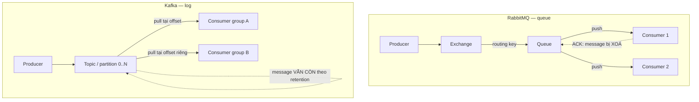

# 17.4 — 4. So sánh Kafka và RabbitMQ (thực dụng)

> Nguồn: https://tiennhm.io.vn/docs/dotnet-backend-zero-to-senior/stage-05-senior-engineering/module-17-distributed-systems/17.4-kafka-vs-rabbitmq-pragmatic
> Hai mô hình khác nhau về bản chất: queue xoá sau khi đọc và log giữ lại để replay. Chọn theo yêu cầu replay, ordering và khả năng vận hành của đội.

> Đây không phải hai sản phẩm cùng loại cạnh tranh nhau — chúng là **hai mô hình khác nhau về bản chất**. RabbitMQ là **hàng đợi**: message được **xoá sau khi consumer ACK**, và broker chủ động đẩy tới consumer. Kafka là **log có thứ tự**: message **ở nguyên đó** theo retention dù đã đọc, consumer tự nhớ mình đọc tới đâu (offset), nên **đọc lại được**. Khác biệt đó kéo theo mọi thứ còn lại. Điều cần nhớ khi chọn: **khả năng replay** là lý do kỹ thuật mạnh nhất để chọn Kafka, còn **khả năng vận hành của đội** thường là yếu tố quyết định thật sự. Một Kafka bị vận hành sai — consumer lag không ai theo dõi, partition chọn nhầm key — gây thiệt hại lớn hơn nhiều so với một RabbitMQ chạy đúng.

## Mục tiêu bài học

Sau bài này bạn có thể:

- Giải thích khác biệt bản chất giữa mô hình queue và mô hình log.
- Nói đúng phạm vi đảm bảo thứ tự của mỗi hệ.
- Chọn message key cho Kafka mà không phá song song.
- Cấu hình prefetch và quorum queue cho RabbitMQ.
- Chọn công nghệ theo yêu cầu thật, không theo xu hướng.

## Nội dung bài học

### 17.5.1 — Khác biệt bản chất



Hệ quả trực tiếp của khác biệt này:

| | RabbitMQ | Kafka |
|---|---|---|
| Sau khi đọc | Message bị xoá | Message vẫn còn tới hết retention |
| Đọc lại | Không (trừ khi publish lại) | **Có — đặt lại offset** |
| Thêm consumer mới | Chỉ nhận message từ lúc đó | **Đọc lại toàn bộ lịch sử** |
| Hướng vận chuyển | Broker **đẩy** | Consumer **kéo** |
| Vị trí đọc | Broker giữ | **Consumer group giữ** (offset) |

Hàng thứ ba là lý do mạnh nhất để chọn Kafka. Thêm một service analytics mới và cần dữ liệu **sáu tháng trước**? Với Kafka, chỉ cần đọc từ offset đầu. Với RabbitMQ, dữ liệu đó không còn tồn tại.

### 17.5.2 — Thứ tự

Cả hai đều đảm bảo thứ tự trong **một phạm vi hẹp**, và phạm vi đó nhỏ hơn người ta tưởng.

**RabbitMQ** giữ thứ tự trong một queue với **một** consumer. Ngay khi bạn thêm consumer thứ hai để tăng thông lượng, thứ tự **mất**:

```
Queue: [M1, M2, M3]
Consumer A lấy M1 (xử lý 500ms)
Consumer B lấy M2 (xử lý  10ms)  <-- M2 xong TRƯỚC M1
```

**Kafka** giữ thứ tự trong **một partition**. Message cùng key luôn vào cùng partition:

```csharp
// Cùng LeadId -> cùng partition -> đúng thứ tự
await producer.ProduceAsync("leads", new Message<string, string>
{
    Key   = lead.Id.ToString(),        // KEY quyết định partition
    Value = JsonSerializer.Serialize(evt)
});
```

**Cái bẫy chọn key:** key quyết định cả thứ tự **và** mức độ song song.

| Key | Thứ tự | Song song |
|---|---|---|
| `null` (ngẫu nhiên) | Không có | Tối đa |
| `LeadId` | Đúng cho từng lead | Tốt — nhiều lead khác nhau |
| `TenantId` | Đúng cho từng tenant | **Kém nếu một tenant chiếm phần lớn tải** |
| Hằng số `"all"` | Đúng toàn cục | **Chỉ một partition — mất hết song song** |

Hàng cuối là sai lầm thật hay gặp: muốn thứ tự tuyệt đối nên đặt key cố định, và vô tình biến Kafka thành hàng đợi một luồng.

### 17.5.3 — Vận hành: hai chỉ số phải theo dõi

**Kafka — consumer lag.** Đây là chỉ số quan trọng nhất: khoảng cách giữa offset mới nhất và offset consumer đã đọc.

```bash
kafka-consumer-groups.sh --bootstrap-server localhost:9092 \
  --describe --group billing-service
# TOPIC  PARTITION  CURRENT-OFFSET  LOG-END-OFFSET  LAG
# leads  0          15234           15240           6
```

Lag tăng đều đặn nghĩa là consumer xử lý **chậm hơn** tốc độ sinh message, và khoảng cách đó sẽ không bao giờ tự đóng lại. Phải cảnh báo trên xu hướng, không phải trên giá trị tuyệt đối.

Giới hạn quan trọng: **số consumer hữu ích trong một group không vượt quá số partition**. Có 3 partition mà chạy 10 consumer thì 7 consumer **ngồi không**. Muốn scale thì phải tăng partition — và tăng partition sẽ **đổi cách phân bổ key**, nên cần cân nhắc từ đầu.

**RabbitMQ — prefetch.** Mặc định, RabbitMQ đẩy message cho consumer **không giới hạn**:

```csharp
// SAI: một consumer chậm ôm hết message, consumer khác ngồi không
// (không đặt prefetch)

// ĐÚNG: mỗi consumer giữ tối đa 10 message chưa ACK
await channel.BasicQosAsync(prefetchSize: 0, prefetchCount: 10, global: false);
```

Không đặt prefetch là nguyên nhân phổ biến nhất của "thêm consumer mà không nhanh hơn": consumer đầu tiên đã nhận hết message vào bộ đệm cục bộ trước khi consumer thứ hai kịp khởi động.

**Quorum queue.** Với RabbitMQ hiện đại, dùng [quorum queue](https://www.rabbitmq.com/docs/quorum-queues) thay cho classic mirrored queue khi cần độ bền qua nhiều node:

```csharp
await channel.QueueDeclareAsync(
    queue: "leads",
    durable: true,
    exclusive: false,
    autoDelete: false,
    arguments: new Dictionary<string, object?> { ["x-queue-type"] = "quorum" });
```

Quorum queue nhân bản theo thuật toán Raft, an toàn hơn hẳn khi mất node.

### 17.5.4 — Bảng chọn

| Yêu cầu | Chọn |
|---|---|
| Gửi email, tạo PDF, job fan-out | **RabbitMQ** |
| Định tuyến phức tạp theo topic/header | **RabbitMQ** (exchange linh hoạt hơn) |
| Cần replay lịch sử | **Kafka** |
| Nhiều consumer group độc lập đọc cùng dữ liệu | **Kafka** |
| Pipeline analytics, CDC sink | **Kafka** |
| Thông lượng rất cao và ổn định | **Kafka** |
| Đội nhỏ, chưa có kinh nghiệm vận hành | **RabbitMQ** |
| Cần delayed message, priority queue | **RabbitMQ** |

Hai hàng cuối đáng chú ý. Kafka **không có** hàng đợi ưu tiên và không có delayed message gốc — hai thứ RabbitMQ làm dễ dàng. Còn hàng "đội nhỏ" không phải lời khuyên hạ thấp: RabbitMQ có giao diện quản trị dùng được ngay, khái niệm ít hơn, và sai lầm ít tốn kém hơn.

**Lời khuyên thực dụng:** phần lớn hệ thống CRM/ERP nội bộ **không cần Kafka**. Nếu bạn không trả lời được "tôi cần replay để làm gì" bằng một tình huống cụ thể, RabbitMQ (hoặc Azure Service Bus nếu đã ở trên Azure) là lựa chọn rẻ hơn về tổng chi phí.

**Và cả hai đều chưa cần** nếu bạn vẫn đang chạy một service duy nhất ([bài 17.2](17.1-event-driven-architecture-when-to-use.mdx)).

### 17.5.5 — Rà lại code của bạn

**Danh sách rà soát khi chọn và vận hành broker**

- [ ] Đã trả lời được cần replay để làm gì bằng tình huống cụ thể.
- [ ] Nếu dùng Kafka, message key chọn theo aggregate id chứ không phải hằng số.
- [ ] Số partition đủ cho số consumer dự kiến trong một group.
- [ ] Có cảnh báo trên xu hướng consumer lag, không chỉ giá trị tuyệt đối.
- [ ] Nếu dùng RabbitMQ, đã đặt prefetch count thay vì để mặc định.
- [ ] Queue quan trọng dùng quorum queue và durable.
- [ ] Không giả định thứ tự khi có nhiều consumer trên cùng queue.
- [ ] Đội có người hiểu công cụ đủ để xử lý sự cố lúc nửa đêm.

## Bài tập áp dụng

#### Bài 1 — Chứng minh mất thứ tự trên RabbitMQ

Publish 100 message đánh số, chạy 3 consumer với thời gian xử lý ngẫu nhiên, ghi lại thứ tự hoàn thành.

**Tiêu chí hoàn thành:** bạn giải thích được vì sao mất thứ tự là **hệ quả tất yếu** của việc xử lý song song, và nêu được ba cách giữ thứ tự khi thật sự cần.

Gợi ý và lời giải — Bài 1

**Gợi ý.** Ba consumer, mỗi cái xử lý mất thời gian khác nhau. Cái nào xong trước?

**Lời giải:**

```csharp
for (var i = 1; i <= 100; i++)
    await _bus.Publish(new MessageThu(SoThuTu: i), ct);
```

```csharp
public class MessageThuConsumer : IConsumer<MessageThu>
{
    public async Task Consume(ConsumeContext<MessageThu> ctx)
    {
        await Task.Delay(Random.Shared.Next(10, 200));
        _logger.LogInformation("Xử lý xong {So} lúc {Luc:HH:mm:ss.fff}",
                               ctx.Message.SoThuTu, DateTime.UtcNow);
    }
}
```

```csharp
cfg.ReceiveEndpoint("message-thu", e =>
{
    e.PrefetchCount = 16;
    e.ConcurrentMessageLimit = 3;
    e.ConfigureConsumer<MessageThuConsumer>(context);
});
```

```text
Xử lý xong 3   lúc 08:14:22.112
Xử lý xong 1   lúc 08:14:22.189
Xử lý xong 5   lúc 08:14:22.201
Xử lý xong 2   lúc 08:14:22.256
Xử lý xong 7   lúc 08:14:22.298
Xử lý xong 4   lúc 08:14:22.341
...
```

Thứ tự hoàn thành hoàn toàn xáo trộn.

**Vì sao mất thứ tự là hệ quả tất yếu:**

```text
RabbitMQ GIAO message theo thứ tự FIFO trong một queue.
Nhưng ba consumer LẤY message song song, và xử lý mất thời gian KHÁC NHAU.

t=0     Consumer A lấy message 1, xử lý mất 180 ms
        Consumer B lấy message 2, xử lý mất  45 ms
        Consumer C lấy message 3, xử lý mất  12 ms
t=12    C xong message 3 trước
t=45    B xong message 2
t=180   A xong message 1
```

**Thứ tự giao được bảo đảm; thứ tự hoàn thành thì không** — và đó là thứ tự thật sự quan trọng với nghiệp vụ.

Đây không phải khiếm khuyết của RabbitMQ. Nó là hệ quả toán học: **xử lý song song và giữ thứ tự là hai yêu cầu loại trừ nhau**. Muốn có cái này thì phải bỏ cái kia.

```text
Thông lượng cao  <-> Giữ thứ tự
```

**Hậu quả thực tế:**

```text
Message 1: LeadDaChot(lead-123)
Message 2: LeadDaHuy(lead-123)

Xử lý đúng thứ tự:  lead chốt rồi huỷ  -> trạng thái cuối = Huỷ
Xử lý ngược:        lead huỷ rồi chốt  -> trạng thái cuối = Chốt  <- SAI
```

**Ba cách giữ thứ tự khi thật sự cần:**

**Cách 1 — một consumer, không đồng thời:**

```csharp
cfg.ReceiveEndpoint("message-thu", e =>
{
    e.PrefetchCount = 1;
    e.ConcurrentMessageLimit = 1;
    e.ConfigureConsumer<MessageThuConsumer>(context);
});
```

```text
Thứ tự: ĐÚNG
Thông lượng: 1 message tại một thời điểm -> chậm nhất
Scale: không scale được
```

Đơn giản nhất, và phù hợp khi lượng message thấp.

**Cách 2 — phân vùng theo khoá, đây là cách nên dùng:**

```csharp
cfg.ReceiveEndpoint("lead-events", e =>
{
    e.ConfigurePartitioner<LeadDaChotV1>(context, 8, m => m.Message.LeadId);
    e.ConfigureConsumer<LeadEventConsumer>(context);
});
```

```text
Message cùng LeadId  -> cùng một phân vùng -> xử lý TUẦN TỰ
Message khác LeadId  -> phân vùng khác     -> xử lý SONG SONG
```

Đây là điểm cân bằng: **thứ tự được giữ ở mức cần thiết** (trong phạm vi một lead), và **song song ở mức có thể** (giữa các lead khác nhau).

Với Kafka, phân vùng là tính chất **có sẵn**:

```csharp
await _producer.ProduceAsync("lead-events", new Message<string, LeadDaChotV1>
{
    Key = e.LeadId.ToString(),        // khoá quyết định partition
    Value = e,
});
```

```text
Kafka bảo đảm: message cùng KEY luôn vào cùng PARTITION,
                và trong một partition, thứ tự được giữ TUYỆT ĐỐI
```

**Cách 3 — thiết kế message không cần thứ tự.** Cách tốt nhất, vì nó loại bỏ hẳn vấn đề:

```csharp
// Phụ thuộc thứ tự
public record TangSoLuong(Guid SanPhamId, int Them);

// KHÔNG phụ thuộc thứ tự — chứa trạng thái cuối
public record DatSoLuong(Guid SanPhamId, int SoLuongMoi, long PhienBan);
```

```csharp
public async Task Consume(ConsumeContext<DatSoLuong> ctx)
{
    var sp = await _db.SanPham.FirstAsync(p => p.Id == ctx.Message.SanPhamId, ct);

    // Bỏ qua message CŨ HƠN — thứ tự đến không còn quan trọng
    if (sp.PhienBan >= ctx.Message.PhienBan)
    {
        _logger.LogInformation("Bỏ qua message phiên bản {Cu} (hiện tại {HienTai})",
                               ctx.Message.PhienBan, sp.PhienBan);
        return;
    }

    sp.DatSoLuong(ctx.Message.SoLuongMoi, ctx.Message.PhienBan);
    await _db.SaveChangesAsync(ct);
}
```

Mẫu này gọi là **last-write-wins theo phiên bản**, và nó làm cho consumer đúng bất kể message đến theo thứ tự nào — kể cả khi có message trùng lặp.

**Bảng chọn:**

| Yêu cầu | Cách |
|---|---|
| Thứ tự tuyệt đối toàn cục | 1 consumer, 1 đồng thời — hiếm khi thật sự cần |
| Thứ tự trong phạm vi một thực thể | **Phân vùng theo khoá** |
| Không cần thứ tự | Nhiều consumer, thông lượng tối đa |
| Muốn cả thứ tự lẫn thông lượng | **Thiết kế lại message để không cần thứ tự** |

**Và một câu hỏi nên hỏi trước khi làm gì: bạn có THẬT SỰ cần thứ tự không?**

```text
"Xử lý theo thứ tự thời gian"      -> thường là muốn, không phải cần
"Trạng thái cuối phải đúng"        -> đây mới là yêu cầu thật
                                   -> giải được bằng phiên bản, không cần thứ tự
```

Nhiều hệ thống áp ràng buộc thứ tự lên toàn bộ luồng message trong khi yêu cầu thật chỉ là "trạng thái cuối của mỗi thực thể phải đúng" — và trả giá bằng thông lượng cho một thứ họ không cần.

**Đo cái giá của việc giữ thứ tự:**

```text
3 consumer, không giữ thứ tự:     100 message trong 3,4 giây
1 consumer, giữ thứ tự:           100 message trong 10,5 giây
Phân vùng 8, giữ thứ tự theo lead: 100 message trong 3,7 giây
```

Phân vùng cho gần như toàn bộ thông lượng của bản không giữ thứ tự, trong khi vẫn bảo đảm điều mà nghiệp vụ thật sự cần.

---

#### Bài 2 — Replay trên Kafka

Publish 1.000 message, đọc hết bằng một consumer group, rồi đặt lại offset về đầu và đọc lại. Xác nhận nhận đủ 1.000 message.

**Tiêu chí hoàn thành:** bạn giải thích được vì sao RabbitMQ **không** làm được điều này, và nêu được ba tình huống mà khả năng replay quyết định lựa chọn broker.

Gợi ý và lời giải — Bài 2

**Gợi ý.** Sau khi consumer ack một message, RabbitMQ làm gì với nó?

**Lời giải:**

```bash
kafka-topics --create --topic lead-events --partitions 3 --replication-factor 1 \
  --bootstrap-server localhost:9092
```

```csharp
using var producer = new ProducerBuilder<string, string>(
    new ProducerConfig { BootstrapServers = "localhost:9092" }).Build();

for (var i = 1; i <= 1000; i++)
    await producer.ProduceAsync("lead-events", new Message<string, string>
    {
        Key = $"lead-{i % 100}",
        Value = JsonSerializer.Serialize(new { SoThuTu = i }),
    });
```

```csharp
var config = new ConsumerConfig
{
    BootstrapServers = "localhost:9092",
    GroupId = "erp-service",
    AutoOffsetReset = AutoOffsetReset.Earliest,
    EnableAutoCommit = false,
};

using var consumer = new ConsumerBuilder<string, string>(config).Build();
consumer.Subscribe("lead-events");

var dem = 0;
while (dem < 1000)
{
    var kq = consumer.Consume(TimeSpan.FromSeconds(5));
    if (kq is null) break;
    dem++;
    consumer.Commit(kq);
}
Console.WriteLine($"Đã đọc {dem} message");
```

```text
Đã đọc 1000 message
```

**Đặt lại offset và đọc lại:**

```bash
kafka-consumer-groups --bootstrap-server localhost:9092 \
  --group erp-service --topic lead-events \
  --reset-offsets --to-earliest --execute
```

```text
GROUP          TOPIC         PARTITION  NEW-OFFSET
erp-service    lead-events   0          0
erp-service    lead-events   1          0
erp-service    lead-events   2          0
```

```text
Đã đọc 1000 message        <- ĐỦ 1.000, lần thứ hai
```

**Vì sao RabbitMQ không làm được:**

```text
RabbitMQ — mô hình QUEUE:
    Message vào queue
    Consumer lấy message
    Consumer ack
    -> RabbitMQ XOÁ message khỏi queue

    Message đã ack KHÔNG CÒN TỒN TẠI. Không có gì để replay.

Kafka — mô hình LOG:
    Message được GHI THÊM vào cuối log (append-only)
    Consumer đọc từ một OFFSET
    Consumer commit offset
    -> Message VẪN NẰM NGUYÊN trong log

    Message bị xoá theo CHÍNH SÁCH GIỮ (retention), không theo việc đã đọc hay chưa.
```

Khác biệt căn bản:

| | RabbitMQ | Kafka |
|---|---|---|
| Mô hình | Queue — xoá sau khi đọc | **Log — giữ lại** |
| Ai giữ vị trí đọc | Broker | **Consumer** (offset) |
| Đọc lại được | **Không** | **Có** |
| Nhiều consumer group độc lập | Cần nhiều queue, mỗi cái một bản sao | **Cùng một log, mỗi group một offset** |
| Message bị xoá khi | Được ack | Hết thời gian giữ |
| Dung lượng lưu | Chỉ message chưa xử lý | **Toàn bộ lịch sử trong khoảng giữ** |

**Ba tình huống mà khả năng replay quyết định lựa chọn:**

**Tình huống 1 — thêm consumer mới cần dữ liệu lịch sử.**

```text
Đội phân tích dựng một dịch vụ mới cần TOÀN BỘ lịch sử chốt lead
để tính mô hình dự báo.

Kafka:     tạo consumer group mới, đặt offset về earliest, đọc hết
           -> vài phút, không ai bị ảnh hưởng

RabbitMQ:  message đã ack không còn tồn tại
           -> phải viết job đọc từ database và "phát lại" thủ công
           -> hoặc chấp nhận chỉ có dữ liệu từ hôm nay
```

**Tình huống 2 — sửa bug trong consumer và xử lý lại.**

```text
Consumer có bug tính sai chiết khấu suốt hai tuần. Đã sửa.
Bây giờ cần xử lý lại hai tuần message.

Kafka:     reset offset về 14 ngày trước, chạy lại
           -> consumer idempotent sẽ ghi đè kết quả sai

RabbitMQ:  không có message nào để chạy lại
           -> phải viết script sửa dữ liệu trực tiếp trong database
           -> rủi ro cao, không dùng lại được logic của consumer
```

Đây là tình huống thực tế nhất, và nó xảy ra thường xuyên hơn người ta nghĩ.

**Tình huống 3 — event sourcing hoặc dựng lại read model.**

```text
Read model bị hỏng hoặc cần đổi cấu trúc.

Kafka:     xoá read model, reset offset về đầu, dựng lại từ event
           -> đây là mẫu chuẩn của CQRS

RabbitMQ:  không dựng lại được từ message
           -> phải dựng lại từ database ghi, mất đi lợi ích của event
```

**Và một tình huống ngược — khi replay là bất lợi:**

```text
Message chứa dữ liệu nhạy cảm cần xoá theo yêu cầu người dùng (GDPR).

Kafka:     log là append-only, không xoá được một message cụ thể
           -> phải dùng log compaction với tombstone, hoặc mã hoá
              và huỷ khoá (crypto-shredding)

RabbitMQ:  message đã ack là đã biến mất
           -> không có gì để xoá
```

**Chính sách giữ của Kafka — quyết định replay được bao xa:**

```bash
# Giữ 7 ngày (mặc định)
kafka-configs --bootstrap-server localhost:9092 --alter \
  --entity-type topics --entity-name lead-events \
  --add-config retention.ms=604800000

# Giữ mãi mãi — cho topic cần replay toàn bộ lịch sử
--add-config retention.ms=-1

# Compaction — giữ bản ghi MỚI NHẤT cho mỗi key
--add-config cleanup.policy=compact
```

Log compaction là công cụ riêng cho một trường hợp cụ thể:

```text
Topic "trang-thai-lead" với key = leadId
    -> giữ message MỚI NHẤT cho mỗi lead, xoá các message cũ hơn
    -> log không lớn vô hạn, nhưng vẫn dựng lại được trạng thái hiện tại
       của MỌI lead từ đầu
```

Đây là cách Kafka đóng vai một "database bảng trạng thái có thể replay".

**Bảng chọn broker:**

| Yêu cầu | Chọn |
|---|---|
| Cần replay, cần lịch sử | **Kafka** |
| Nhiều consumer group độc lập đọc cùng dữ liệu | **Kafka** |
| Event sourcing, CQRS dựng lại read model | **Kafka** |
| Thông lượng rất cao (trên 100k msg/s) | **Kafka** |
| Định tuyến phức tạp (topic exchange, header) | **RabbitMQ** |
| Delayed message, priority queue | **RabbitMQ** |
| Request-reply | **RabbitMQ** |
| Đội nhỏ, ít kinh nghiệm vận hành | **RabbitMQ** |

Dòng cuối quan trọng hơn vẻ ngoài: Kafka cần hiểu partition, replication factor, ISR, consumer group rebalance, và retention — trong khi RabbitMQ chạy được với cấu hình mặc định. Chọn Kafka cho một đội chưa sẵn sàng vận hành nó là cách nhanh nhất để có một sự cố mà không ai chẩn đoán được.

**Và một phương án thứ ba ít được nhắc: dùng cả hai.**

```text
RabbitMQ:  command, request-reply, định tuyến phức tạp, delayed message
Kafka:     event stream, dữ liệu cần replay, phân tích
```

Nhiều hệ thống lớn dùng cả hai cho hai mục đích khác nhau — và đó là lựa chọn hợp lý, không phải dấu hiệu của thiếu quyết đoán.

---

#### Bài 3 — Đo tác dụng của prefetch

Chạy 3 consumer RabbitMQ không đặt prefetch và đo phân bố message. Đặt `prefetchCount: 1` và đo lại.

**Tiêu chí hoàn thành:** bạn đo được phân bố, và chọn được giá trị prefetch có cơ sở cho từng loại consumer.

Gợi ý và lời giải — Bài 3

**Gợi ý.** Prefetch quyết định broker đẩy trước bao nhiêu message cho một consumer trước khi nhận ack.

**Lời giải — không đặt prefetch:**

```csharp
cfg.ReceiveEndpoint("cong-viec", e =>
{
    // Không đặt PrefetchCount -> MassTransit mặc định khá cao
    e.ConfigureConsumer<CongViecConsumer>(context);
});
```

```csharp
public class CongViecConsumer : IConsumer<CongViec>
{
    public async Task Consume(ConsumeContext<CongViec> ctx)
    {
        // Thời gian xử lý RẤT khác nhau
        await Task.Delay(ctx.Message.LaViecNang ? 5000 : 50);
        _logger.LogInformation("[{Instance}] xong {Id}", _tenInstance, ctx.Message.Id);
    }
}
```

```bash
# Đẩy 300 message: 30 việc nặng, 270 việc nhẹ, trộn ngẫu nhiên
# Chạy 3 consumer
```

```text
Phân bố message:
  consumer-1:  187 message, hoàn tất sau 96 giây
  consumer-2:   34 message, hoàn tất sau 12 giây, rồi RẢNH
  consumer-3:   79 message, hoàn tất sau 41 giây, rồi RẢNH

Tổng thời gian: 96 giây (bị giới hạn bởi consumer-1)
```

**Consumer 1 nhận gần hết việc nặng và chạy một mình 84 giây trong khi hai consumer kia rảnh.**

```bash
rabbitmqctl list_queues name messages messages_unacknowledged
```

```text
cong-viec    0    187        <- 187 message đã được ĐẨY cho consumer-1, chưa ack
```

**Với `PrefetchCount = 1`:**

```csharp
cfg.ReceiveEndpoint("cong-viec", e =>
{
    e.PrefetchCount = 1;
    e.ConcurrentMessageLimit = 1;
    e.ConfigureConsumer<CongViecConsumer>(context);
});
```

```text
Phân bố message:
  consumer-1:  102 message, hoàn tất sau 38 giây
  consumer-2:   98 message, hoàn tất sau 37 giây
  consumer-3:  100 message, hoàn tất sau 38 giây

Tổng thời gian: 38 giây
```

**Nhanh hơn 2,5 lần**, chỉ nhờ phân bố đều.

**Vì sao:**

```text
Prefetch cao:  broker ĐẨY TRƯỚC nhiều message cho consumer
               -> consumer giữ một hàng đợi cục bộ
               -> nếu nó gặp toàn việc nặng, các message trong hàng đợi cục bộ
                  PHẢI CHỜ nó, dù consumer khác đang rảnh
               -> message đã đẩy KHÔNG chuyển sang consumer khác được

Prefetch = 1:  broker chỉ đẩy khi consumer ack cái trước
               -> consumer rảnh nhận việc tiếp theo
               -> cân bằng tải tự động
```

**Nhưng prefetch = 1 không phải luôn đúng** — nó đánh đổi thông lượng lấy cân bằng:

```text
Prefetch = 1:    mỗi message cần một vòng đi về broker
                 -> với message xử lý 5 ms và độ trễ mạng 1 ms,
                    bạn mất 20% thời gian cho việc chờ message
```

```text
Message xử lý 5 ms, prefetch 1:    ~165 msg/s
Message xử lý 5 ms, prefetch 50:   ~195 msg/s
```

**Chọn giá trị prefetch có cơ sở:**

> **Prefetch ≈ số message xử lý được trong thời gian một vòng đi về broker, nhân với hệ số an toàn.**

```text
Thời gian xử lý mỗi message  |  Prefetch đề xuất
----------------------------|------------------
Trên 1 giây                 |  1
100 ms – 1 giây             |  1–5
10 – 100 ms                 |  10–50
Dưới 10 ms                  |  100–500
Rất khác nhau giữa các message | 1–2 (ưu tiên cân bằng)
```

Dòng cuối quan trọng: khi thời gian xử lý **biến thiên lớn**, prefetch thấp là đúng bất kể thời gian trung bình — vì mục tiêu lúc đó là cân bằng, không phải thông lượng.

**Và `ConcurrentMessageLimit` là một tham số khác, thường bị nhầm:**

```csharp
e.PrefetchCount = 32;              // broker đẩy trước 32 message
e.ConcurrentMessageLimit = 8;      // xử lý 8 message CÙNG LÚC
```

```text
PrefetchCount:            bao nhiêu message được ĐẨY TRƯỚC (đệm mạng)
ConcurrentMessageLimit:   bao nhiêu message được XỬ LÝ SONG SONG (đồng thời)
```

Quy tắc: `PrefetchCount` nên **lớn hơn hoặc bằng** `ConcurrentMessageLimit`, thường gấp 2–4 lần:

```csharp
e.ConcurrentMessageLimit = 8;
e.PrefetchCount = 16;              // đủ đệm để 8 worker không bao giờ đói
```

Đặt `PrefetchCount` nhỏ hơn `ConcurrentMessageLimit` là lãng phí: bạn cấu hình 8 worker nhưng chỉ có 4 message để xử lý.

**Ba cấu hình cho ba loại consumer:**

```csharp
// 1. Việc nặng, thời gian dài (xuất báo cáo, xử lý file)
cfg.ReceiveEndpoint("viec-nang", e =>
{
    e.PrefetchCount = 2;
    e.ConcurrentMessageLimit = 1;      // một việc tại một thời điểm
    e.ConfigureConsumer<XuatBaoCaoConsumer>(context);
});

// 2. Việc nhẹ, thông lượng cao (cập nhật trạng thái, ghi log)
cfg.ReceiveEndpoint("viec-nhe", e =>
{
    e.PrefetchCount = 100;
    e.ConcurrentMessageLimit = 20;
    e.ConfigureConsumer<CapNhatTrangThaiConsumer>(context);
});

// 3. Gọi API bên ngoài có rate limit
cfg.ReceiveEndpoint("goi-api", e =>
{
    e.PrefetchCount = 10;
    e.ConcurrentMessageLimit = 5;
    e.UseRateLimit(100, TimeSpan.FromMinutes(1));     // tôn trọng giới hạn của họ
    e.ConfigureConsumer<GoiApiConsumer>(context);
});
```

Ba endpoint riêng cho ba loại công việc là điểm quan trọng: một endpoint chung với một cấu hình sẽ luôn sai cho ít nhất một loại.

**Quan sát để biết cấu hình có đúng không:**

```bash
rabbitmqctl list_queues name messages messages_unacknowledged consumers
```

```text
name         messages  messages_unacked  consumers
cong-viec         412               187          3
```

Đọc ba con số:

| Dấu hiệu | Nghĩa | Hành động |
|---|---|---|
| `messages` tăng đều | Consumer không theo kịp | Thêm consumer, hoặc tăng đồng thời |
| `messages_unacked` cao và đứng yên | Consumer bị treo, hoặc prefetch quá cao | Giảm prefetch; kiểm tra có deadlock không |
| `messages_unacked` ≈ prefetch × consumers | Bình thường | — |
| `consumers` = 0 | **Không consumer nào kết nối** | Kiểm tra dịch vụ có chạy không |
| `messages` = 0, `unacked` cao | Mọi message đã đẩy hết, đang xử lý | Bình thường nếu xử lý lâu |

**Và một cảnh báo về prefetch quá cao:**

```text
PrefetchCount = 1000, message 50 KB
-> 50 MB nằm trong bộ nhớ của MỖI consumer
-> với 10 consumer, 500 MB bị giữ
-> và nếu một consumer chết, 1.000 message đó phải được giao lại
   -> đợt dội cho các consumer còn lại
```

Prefetch cũng ảnh hưởng tới thời gian dừng mượt: consumer phải xử lý hết hàng đợi cục bộ trước khi thoát, nên prefetch 1.000 với message xử lý 100 ms nghĩa là 100 giây — vượt quá `terminationGracePeriodSeconds` mặc định ([bài 15.13](../../stage-04-database-production/module-15-docker-deployment/15.13-quick-real-world-example.mdx)).

## Tự kiểm tra

### Khác biệt bản chất giữa RabbitMQ và Kafka là gì?

RabbitMQ là hàng đợi, message bị xoá sau khi consumer xác nhận và broker chủ động đẩy tới consumer. Kafka là log có thứ tự, message ở nguyên đó theo retention dù đã đọc, consumer tự kéo và tự nhớ offset, nên đọc lại được.

### Vì sao khả năng replay là lý do mạnh nhất để chọn Kafka?

Vì khi thêm một consumer group mới, nó có thể đọc lại toàn bộ lịch sử từ offset đầu. Với RabbitMQ, message đã tiêu thụ không còn tồn tại nên service mới chỉ nhận được dữ liệu từ lúc nó bắt đầu chạy.

### Kafka đảm bảo thứ tự trong phạm vi nào?

Trong một partition. Message cùng key luôn vào cùng partition nên giữ đúng thứ tự với nhau, còn giữa các partition thì không có đảm bảo nào.

### Cái bẫy khi chọn message key cho Kafka là gì?

Key quyết định cả thứ tự lẫn mức độ song song. Đặt key là hằng số để có thứ tự tuyệt đối sẽ dồn mọi message vào một partition và mất hết song song. Chọn theo aggregate id thường là cân bằng đúng.

### Vì sao không đặt prefetch trên RabbitMQ lại gây tắc nghẽn?

Vì mặc định broker đẩy message không giới hạn, nên consumer đầu tiên nhận hết vào bộ đệm cục bộ trước khi consumer khác kịp khởi động. Kết quả là thêm consumer nhưng hệ thống không nhanh hơn.

### Vì sao số consumer trong một Kafka consumer group không nên vượt số partition?

Vì mỗi partition chỉ được gán cho một consumer trong group, nên consumer thừa sẽ ngồi không. Muốn scale thêm thì phải tăng partition, và việc đó đổi cách phân bổ key nên cần cân nhắc từ đầu.

## Kết luận

Ba điều đáng nhớ nhất:

1. **Queue xoá sau khi đọc, log giữ lại.** Mọi khác biệt còn lại bắt nguồn từ đây.
2. **Thứ tự chỉ tồn tại trong phạm vi hẹp** — một queue một consumer, hoặc một partition.
3. **Khả năng vận hành của đội quan trọng hơn thông số kỹ thuật.**

## Tham khảo

- [Apache Kafka documentation](https://kafka.apache.org/documentation/)
- [RabbitMQ quorum queues](https://www.rabbitmq.com/docs/quorum-queues)
- [RabbitMQ AMQP concepts](https://www.rabbitmq.com/tutorials/amqp-concepts)
- [Competing Consumers pattern](https://learn.microsoft.com/en-us/azure/architecture/patterns/competing-consumers)

## Điều hướng

- **Bài trước:** [17.3 — 3. Outbox pattern (ứng dụng)](17.3-outbox-pattern-applied.mdx)
- **Bài tiếp theo:** [17.5 — 5. CDC (Change Data Capture)](17.5-change-data-capture.mdx)
- **Về module:** [Trang mục lục](./)
