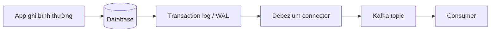
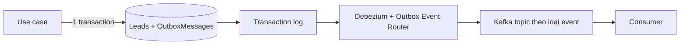

# 17.5 — 5. CDC (Change Data Capture)

> Nguồn: https://tiennhm.io.vn/docs/dotnet-backend-zero-to-senior/stage-05-senior-engineering/module-17-distributed-systems/17.5-change-data-capture
> Đọc thay đổi từ transaction log thay vì poll bảng, Debezium và SQL Server CDC, vì sao stream row-diff mất intent, và cách kết hợp CDC với outbox.

> CDC đọc **transaction log** của database — thứ database **vốn đã ghi** để phục hồi — và biến mỗi thay đổi thành một sự kiện. Ưu điểm lớn nhất: **ứng dụng không cần sửa một dòng nào**, nên nó là cách khả thi duy nhất với hệ legacy không ai dám đụng vào. Nhưng có một hạn chế mang tính bản chất, thường chỉ lộ ra sau khi đã triển khai: CDC thấy **hàng đã đổi**, không thấy **vì sao đổi**. `Status` chuyển từ `New` sang `Won` — đó là lead được convert, hay là admin sửa nhầm rồi sửa lại? Consumer buộc phải **đoán intent từ row-diff**, và mọi thay đổi schema của bạn lập tức thành breaking change với họ. Cách kết hợp tốt nhất, được dùng nhiều trên production: đặt CDC lên **bảng outbox** thay vì lên bảng nghiệp vụ — giữ được intent rõ ràng mà không cần worker poll.

## Mục tiêu bài học

Sau bài này bạn có thể:

- Giải thích CDC log-based khác gì cách poll bảng theo timestamp.
- Bật CDC trên SQL Server và hiểu Debezium làm gì.
- Nêu đúng hạn chế về intent và coupling schema.
- Kết hợp CDC với outbox qua outbox event router.
- Chọn giữa CDC và outbox theo bối cảnh hệ thống.

## Nội dung bài học

### 17.6.1 — Log-based khác gì poll

Cách thủ công thường gặp:

```sql
-- Poll theo timestamp — co ba van de nghiem trong
SELECT * FROM Leads WHERE ModifiedUtc > @lastCheck;
```

| Vấn đề | Hậu quả |
|---|---|
| Không thấy `DELETE` | Hàng biến mất mà không sinh sự kiện nào |
| Mất thay đổi trung gian | Một hàng đổi 3 lần giữa hai lần poll chỉ cho 1 sự kiện |
| Tải lên bảng nghiệp vụ | Poll liên tục trên bảng đang phục vụ người dùng |

CDC log-based không có ba vấn đề đó, vì nó đọc **transaction log** — nơi database đã ghi **mọi** thay đổi theo đúng thứ tự, kể cả `DELETE`, kể cả các bước trung gian, và việc đọc log **không đụng vào bảng nghiệp vụ**.



### 17.6.2 — SQL Server CDC

```sql
EXEC sys.sp_cdc_enable_db;

EXEC sys.sp_cdc_enable_table
     @source_schema = N'dbo',
     @source_name   = N'Leads',
     @role_name     = NULL,
     @supports_net_changes = 1;
```

SQL Server tạo bảng `cdc.dbo_Leads_CT` chứa ảnh trước và sau của mỗi thay đổi:

```sql
SELECT __$operation, __$start_lsn, Id, Name, Status
FROM cdc.dbo_Leads_CT
ORDER BY __$start_lsn;
-- __$operation: 1 = delete, 2 = insert, 3 = ảnh TRƯỚC update, 4 = ảnh SAU update
```

Hai điều phải biết khi vận hành:

- **CDC cần SQL Server Agent chạy.** Agent dừng thì capture job dừng, log không được đọc và **transaction log phình to** — đây là nguyên nhân khá phổ biến của sự cố hết ổ đĩa.
- **Có retention mặc định.** Dữ liệu capture bị dọn sau vài ngày; consumer dừng lâu hơn khoảng đó sẽ **mất thay đổi vĩnh viễn**.

### 17.6.3 — Debezium

[Debezium](https://debezium.io/documentation/reference/stable/index.html) là connector đọc log của PostgreSQL, MySQL, SQL Server, MongoDB, Oracle và đẩy vào Kafka. Message nó sinh ra có dạng:

```json
{
  "before": { "id": "...", "status": "New",  "value": 1000 },
  "after":  { "id": "...", "status": "Won",  "value": 1000 },
  "op": "u",
  "ts_ms": 1727155200000,
  "source": { "table": "Leads", "lsn": 234567 }
}
```

Nhìn message này và hỏi: **chuyện gì đã xảy ra về mặt nghiệp vụ?** Bạn biết `status` đổi từ `New` sang `Won`. Bạn **không** biết đó là lead được convert qua use case chính thức, hay là một lần sửa tay để chữa dữ liệu sai, hay là một script migration. Ba việc đó có ý nghĩa nghiệp vụ **hoàn toàn khác nhau** nhưng sinh ra **cùng một** row-diff.

### 17.6.4 — Hai hạn chế cốt lõi

**Mất intent.** Consumer phải suy ra ý nghĩa từ row-diff:

```csharp
// Consumer phải ĐOÁN — và đoán sai là chuyện thường
if (before.Status == "New" && after.Status == "Won")
{
    // Convert thật? Sửa tay? Rollback một thao tác nhầm?
    await _billing.CreateSubscriptionAsync(after.Id);   // co the tao nham
}
```

So với một integration event nói thẳng ý định:

```csharp
public sealed record LeadConvertedIntegrationEvent(
    Guid EventId, Guid LeadId, Guid CustomerId, decimal ContractValue, DateTime OccurredAtUtc);
```

Không phải đoán gì cả.

**Coupling schema.** Message CDC **là** cấu trúc bảng của bạn. Đổi tên cột `Value` thành `ContractValue` — một refactor nội bộ hoàn toàn bình thường — và mọi consumer gãy. Bạn vừa biến schema database thành API công khai, giống hệt sai lầm publish domain event ra broker ([bài 17.2](17.1-event-driven-architecture-when-to-use.mdx)).

### 17.6.5 — Kết hợp CDC với outbox

Đây là cách dùng CDC tốt nhất, và nó lấy được ưu điểm của cả hai: ứng dụng ghi **outbox** (có intent rõ ràng), còn CDC đọc **bảng outbox** thay vì bảng nghiệp vụ — thay thế worker poll.



[Outbox Event Router](https://debezium.io/documentation/reference/stable/transformations/outbox-event-router.html) của Debezium bóc payload từ hàng outbox và định tuyến sang topic tương ứng:

```json
{
  "transforms": "outbox",
  "transforms.outbox.type": "io.debezium.transforms.outbox.EventRouter",
  "transforms.outbox.table.field.event.key": "aggregate_id",
  "transforms.outbox.table.field.event.payload": "payload",
  "transforms.outbox.route.by.field": "aggregate_type"
}
```

Lợi ích cụ thể so với worker poll ([bài 17.4](17.3-outbox-pattern-applied.mdx)):

| | Worker poll | CDC trên outbox |
|---|---|---|
| Độ trễ | Bằng chu kỳ poll (vài giây) | Gần tức thì |
| Tải lên database | Mỗi chu kỳ một truy vấn | Không truy vấn bảng |
| Nhiều instance | Phải tự lo khoá hàng | Connector lo |
| Hạ tầng cần thêm | Không | **Kafka Connect + Debezium** |

Hàng cuối là cái giá: bạn phải vận hành thêm Kafka Connect. Với hệ thống vừa và nhỏ, worker poll đơn giản hơn nhiều và độ trễ vài giây thường không thành vấn đề.

### 17.6.6 — Chọn cái nào

| Bối cảnh | Nên dùng |
|---|---|
| Hệ legacy không sửa được code | **CDC trên bảng nghiệp vụ** |
| Đồng bộ sang data warehouse, search index | **CDC** (row-diff là đúng thứ cần) |
| Hệ mới, cần intent nghiệp vụ rõ ràng | **Outbox** |
| Đã có Kafka Connect, cần độ trễ thấp | **CDC trên bảng outbox** |
| Đội nhỏ, hệ thống vừa phải | **Outbox với worker poll** |

Hàng thứ hai đáng chú ý: khi đích đến là data warehouse hay Elasticsearch, bạn **thật sự muốn** row-diff chứ không phải intent — CDC là lựa chọn đúng chứ không phải lựa chọn đành chấp nhận.

### 17.6.7 — Rà lại code của bạn

**Danh sách rà soát khi dùng CDC**

- [ ] Không poll bảng nghiệp vụ theo cột timestamp để phát hiện thay đổi.
- [ ] Nếu dùng SQL Server CDC, SQL Server Agent được giám sát và có cảnh báo.
- [ ] Biết rõ retention của dữ liệu capture và đã đặt cảnh báo khi consumer tụt lại.
- [ ] Consumer không phải đoán intent từ row-diff cho nghiệp vụ quan trọng.
- [ ] Đã cân nhắc CDC trên bảng outbox thay vì trên bảng nghiệp vụ.
- [ ] Thay đổi schema bảng được coi là breaking change nếu CDC đọc bảng đó.
- [ ] Có giám sát độ trễ của connector, không chỉ trạng thái sống chết.

## Bài tập áp dụng

#### Bài 1 — Bật CDC và đọc bảng thay đổi

Bật CDC trên một bảng SQL Server, chạy một `UPDATE` và một `DELETE`, rồi đọc bảng `cdc.*_CT` và giải thích ý nghĩa từng giá trị `__$operation`.

**Tiêu chí hoàn thành:** bạn giải thích được **bốn** giá trị của `__$operation`, và nêu được vì sao `UPDATE` sinh ra **hai** dòng.

Gợi ý và lời giải — Bài 1

**Gợi ý.** CDC ghi lại thay đổi từ transaction log. Một `UPDATE` trong transaction log trông như thế nào?

**Lời giải — bật CDC:**

```sql
EXEC sys.sp_cdc_enable_db;

EXEC sys.sp_cdc_enable_table
    @source_schema = N'dbo',
    @source_name   = N'Leads',
    @role_name     = NULL,
    @supports_net_changes = 1;
```

```sql
SELECT name, is_cdc_enabled FROM sys.databases WHERE name = DB_NAME();
SELECT name, is_tracked_by_cdc FROM sys.tables WHERE name = 'Leads';
```

Bật CDC tạo ra hai job của SQL Agent:

```sql
SELECT name FROM msdb.dbo.sysjobs WHERE name LIKE 'cdc%';
```

```text
cdc.Crm_capture     <- đọc transaction log, ghi vào bảng _CT
cdc.Crm_cleanup     <- xoá bản ghi cũ theo chính sách giữ (mặc định 3 ngày)
```

**Đây là chi tiết quan trọng nhất về CDC trên SQL Server: nó phụ thuộc vào SQL Agent.** Trên Azure SQL Database (không phải Managed Instance), SQL Agent không tồn tại, và CDC hoạt động theo cơ chế khác — hãy kiểm chứng trước khi thiết kế xung quanh nó.

**Chạy thao tác:**

```sql
INSERT INTO Leads (Id, Name, Value, Status) VALUES (NEWID(), N'Công ty ABC', 5000000, 'New');

UPDATE Leads SET Status = 'Won', Value = 8000000 WHERE Name = N'Công ty ABC';

DELETE FROM Leads WHERE Name = N'Công ty ABC';
```

```sql
WAITFOR DELAY '00:00:05';       -- chờ capture job chạy

SELECT __$start_lsn, __$seqval, __$operation, __$update_mask,
       Id, Name, Value, Status
FROM cdc.dbo_Leads_CT
ORDER BY __$start_lsn, __$seqval;
```

```text
__$operation   Id        Name          Value     Status
2              abc-123   Công ty ABC   5000000   New       <- INSERT
3              abc-123   Công ty ABC   5000000   New       <- UPDATE, giá trị CŨ
4              abc-123   Công ty ABC   8000000   Won       <- UPDATE, giá trị MỚI
1              abc-123   Công ty ABC   8000000   Won       <- DELETE
```

**Bốn giá trị của `__$operation`:**

| Giá trị | Nghĩa | Dữ liệu trong dòng |
|---:|---|---|
| **1** | `DELETE` | Giá trị **trước khi** xoá |
| **2** | `INSERT` | Giá trị **sau khi** chèn |
| **3** | `UPDATE` — **ảnh trước** | Giá trị **trước khi** sửa |
| **4** | `UPDATE` — **ảnh sau** | Giá trị **sau khi** sửa |

**Vì sao `UPDATE` sinh ra hai dòng:**

```text
Transaction log ghi một UPDATE thành cặp (giá trị cũ, giá trị mới),
vì cả hai đều cần cho việc rollback và cho replication.

CDC giữ nguyên cấu trúc đó:
    dòng __$operation = 3  -> "trước đây nó là thế này"
    dòng __$operation = 4  -> "bây giờ nó là thế này"
```

Điều này cho bạn thứ mà một stream chỉ có "giá trị mới" không cho được: **biết chính xác cái gì đã đổi**.

```sql
SELECT
    truoc.Status AS StatusCu, sau.Status AS StatusMoi,
    truoc.Value  AS ValueCu,  sau.Value  AS ValueMoi
FROM cdc.dbo_Leads_CT truoc
JOIN cdc.dbo_Leads_CT sau
     ON sau.__$start_lsn = truoc.__$start_lsn AND sau.__$seqval = truoc.__$seqval
WHERE truoc.__$operation = 3 AND sau.__$operation = 4;
```

```text
StatusCu   StatusMoi   ValueCu    ValueMoi
New        Won         5000000    8000000
```

**`__$update_mask` — cột nào thật sự đổi:**

```sql
SELECT __$operation,
       sys.fn_cdc_is_bit_set(
           sys.fn_cdc_get_column_ordinal('dbo_Leads', 'Status'), __$update_mask) AS StatusDoi,
       sys.fn_cdc_is_bit_set(
           sys.fn_cdc_get_column_ordinal('dbo_Leads', 'Name'), __$update_mask) AS NameDoi
FROM cdc.dbo_Leads_CT
WHERE __$operation = 4;
```

```text
__$operation   StatusDoi   NameDoi
4              1           0
```

Đây là thứ giúp consumer bỏ qua những thay đổi không liên quan. Không có nó, một `UPDATE` chỉ sửa `UpdatedUtc` cũng kích hoạt toàn bộ luồng xử lý xuôi dòng.

**`__$start_lsn` và `__$seqval` — thứ tự:**

```text
__$start_lsn:  Log Sequence Number của TRANSACTION
               -> mọi thay đổi trong cùng transaction có cùng LSN
__$seqval:     thứ tự TRONG transaction
```

Kết hợp hai cột cho thứ tự **tuyệt đối và đúng với thứ tự commit** — điều mà một cột `UpdatedUtc` không bảo đảm được, vì hai transaction có thể có dấu thời gian giống nhau hoặc thậm chí ngược với thứ tự commit.

**Đọc CDC từ C#:**

```csharp
var tuLsn = await LayLsnDaXuLyAsync(ct);
var denLsn = await _db.Database
    .SqlQuery<byte[]>($"SELECT sys.fn_cdc_get_max_lsn()").FirstAsync(ct);

var thayDoi = await _db.Database
    .SqlQuery<ThayDoiLead>($@"
        SELECT __$operation AS Operation, __$start_lsn AS Lsn, __$seqval AS SeqVal,
               Id, Name, Value, Status
        FROM cdc.fn_cdc_get_all_changes_dbo_Leads({tuLsn}, {denLsn}, N'all update old')
        ORDER BY __$start_lsn, __$seqval")
    .ToListAsync(ct);
```

Ba chế độ của hàm `fn_cdc_get_all_changes`:

```text
'all'                -> chỉ ảnh SAU của UPDATE (operation 4)
'all update old'     -> cả ảnh TRƯỚC và SAU (operation 3 và 4)
```

Và hàm `fn_cdc_get_net_changes` (cần `@supports_net_changes = 1`) gộp nhiều thay đổi của cùng một hàng thành một:

```text
Hàng bị UPDATE 5 lần trong khoảng LSN
    fn_cdc_get_all_changes:  10 dòng (5 cặp trước/sau)
    fn_cdc_get_net_changes:   1 dòng (trạng thái cuối)
```

Dùng `net_changes` khi bạn chỉ cần trạng thái cuối — nó giảm đáng kể lượng dữ liệu phải xử lý.

**Chính sách giữ — chi tiết dễ gây sự cố:**

```sql
EXEC sys.sp_cdc_change_job @job_type = 'cleanup', @retention = 4320;   -- phút, = 3 ngày
```

```text
Consumer dừng 4 ngày (sự cố, nghỉ lễ, bug)
-> cleanup job đã xoá bản ghi CDC cũ hơn 3 ngày
-> consumer khởi động lại, LSN đã lưu không còn hợp lệ
-> MẤT DỮ LIỆU, không phục hồi được từ CDC
```

Đặt retention dài hơn thời gian ngừng tối đa bạn chấp nhận được, và **giám sát độ trễ của consumer**:

```sql
SELECT DATEDIFF(MINUTE, sys.fn_cdc_map_lsn_to_time(@lsn_da_xu_ly), SYSUTCDATETIME())
       AS DoTrePhut;
```

```text
Cảnh báo khi DoTrePhut > 50% retention.
```

**Và chi phí của CDC — ba thứ cần biết trước:**

```text
1. Transaction log KHÔNG được cắt cho tới khi capture job đọc xong
   -> capture job dừng = log phình vô hạn = đầy đĩa
   -> đây là cách CDC gây sự cố thường gặp nhất

2. Mỗi bảng bật CDC có một bảng _CT tương ứng
   -> dung lượng gần gấp đôi cho khoảng giữ

3. Capture job đọc log liên tục -> tốn I/O và CPU
```

Điểm 1 nghiêm trọng nhất và ít được lường trước: bật CDC nghĩa là bạn thêm một phụ thuộc mới vào việc **database còn ghi được hay không**. Hãy đặt cảnh báo cho kích thước transaction log trước khi bật CDC, không phải sau.

---

#### Bài 2 — Chứng minh mất intent

Với cùng một hàng, thực hiện convert qua use case và sửa tay bằng `UPDATE`. So sánh hai bản ghi CDC sinh ra.

**Tiêu chí hoàn thành:** bạn chỉ ra được hai bản ghi **giống hệt nhau**, và giải thích được vì sao điều đó làm CDC không thay thế được outbox.

Gợi ý và lời giải — Bài 2

**Gợi ý.** CDC đọc từ transaction log. Transaction log ghi lại **ý định** hay **kết quả**?

**Lời giải — hai đường, cùng kết quả:**

```csharp
// Đường 1 — qua use case, có ý nghĩa nghiệp vụ rõ ràng
public async Task<Result> ChotLeadAsync(LeadId id, CancellationToken ct)
{
    var lead = await _db.Leads.FirstAsync(l => l.Id == id, ct);
    var kq = lead.ChuyenSangWon(_user.ToNguoiDung(), _clock.GetUtcNow().UtcDateTime);
    if (!kq.ThanhCong) return kq;
    await _db.SaveChangesAsync(ct);
    return Result.ThanhCong();
}
```

```sql
-- Đường 2 — sửa tay, cùng kết quả
UPDATE Leads SET Status = 'Won', ClosedUtc = SYSUTCDATETIME() WHERE Id = 'def-456';
```

```sql
SELECT __$operation, Id, Status, ClosedUtc FROM cdc.dbo_Leads_CT
WHERE Id IN ('abc-123', 'def-456') AND __$operation IN (3, 4)
ORDER BY Id, __$start_lsn, __$seqval;
```

```text
__$operation   Id        Status   ClosedUtc
3              abc-123   New      NULL
4              abc-123   Won      2026-09-25 08:14:22
3              def-456   New      NULL
4              def-456   Won      2026-09-25 08:15:01
```

**Hai bản ghi giống hệt nhau về cấu trúc.** Không có gì trong CDC phân biệt được:

```text
- Lead abc-123 được chốt qua quy trình nghiệp vụ, đã qua kiểm tra quyền,
  đã qua kiểm tra ngưỡng duyệt, đã được ghi audit
- Lead def-456 bị sửa tay bởi một người chạy SQL trong SSMS,
  bỏ qua mọi quy tắc
```

**Vì sao: transaction log ghi KẾT QUẢ, không ghi Ý ĐỊNH.**

```text
Ý định (intent):   "chốt lead này" — một hành động nghiệp vụ có tên, có quy tắc,
                   có người thực hiện, có bối cảnh

Kết quả (state):   "cột Status đổi từ 'New' sang 'Won'" — một thay đổi dữ liệu
```

CDC làm việc ở tầng dữ liệu, nên nó chỉ thấy kết quả. Và nhiều ý định khác nhau có thể cho ra cùng một kết quả:

```text
Status: New -> Won có thể đến từ:
    - Chốt lead (quy trình bình thường)
    - Import dữ liệu từ hệ thống cũ
    - Sửa lỗi dữ liệu do một sự cố trước đó
    - Rollback một thao tác huỷ
    - Một người gõ nhầm trong SSMS
```

Consumer xuôi dòng nhận được "Status đổi thành Won" và **không có cách nào biết** nó nên phản ứng thế nào — tạo đơn hàng? gửi email chúc mừng? tính hoa hồng?

**Bốn hậu quả cụ thể:**

**1. Consumer phải đoán ý định từ sự thay đổi:**

```csharp
// Logic mong manh, và nó sẽ sai
if (truoc.Status == "New" && sau.Status == "Won")
    await TaoDonHangAsync(sau.Id, ct);
```

Đoạn này chạy cả khi ai đó sửa lỗi dữ liệu — và tạo một đơn hàng không ai muốn.

**2. Mất thông tin không nằm trong bảng:**

```text
Ai thực hiện?          -> không có trong CDC, trừ khi bảng có cột UpdatedBy
Từ màn hình nào?       -> không có
Lý do là gì?           -> không có
Ngưỡng duyệt đã qua chưa? -> không có
```

**3. Thay đổi nhiều bảng trông như nhiều sự kiện rời rạc:**

```text
Một hành động "chốt lead" thật ra sửa:
    Leads.Status
    Leads.ClosedUtc
    Approvals (thêm dòng)
    ActivityLogs (thêm dòng)

CDC sinh ra 4 stream riêng biệt.
Consumer phải TỰ GHÉP lại thành một sự kiện — bằng LSN của transaction,
và bằng hiểu biết về mô hình dữ liệu của bạn.
```

Điều này tạo ra một khớp nối chặt: consumer phải biết cấu trúc bảng của bạn, và đổi schema là thay đổi phá vỡ với họ.

**4. Hợp đồng là schema database.**

```text
Đổi tên cột Status -> TrangThai
-> mọi consumer CDC gãy
-> và không ai nhận ra khi review, vì nó trông như một refactor nội bộ
```

Đây là vấn đề ở [bài 17.1](17.1-event-driven-architecture-when-to-use.mdx), lần này xuất hiện qua CDC thay vì qua việc publish entity.

**Vì sao CDC không thay thế được outbox:**

| | Outbox | CDC |
|---|---|---|
| Ghi lại | **Ý định nghiệp vụ** | Thay đổi dữ liệu |
| Hợp đồng | **Integration event do bạn định nghĩa** | Schema database |
| Đổi schema | Không ảnh hưởng consumer | **Phá vỡ consumer** |
| Bắt được thay đổi ngoài ứng dụng | **Không** | **Có** |
| Cần thay đổi code | **Có** | **Không** |
| Vận hành | Một bảng, một dispatcher | CDC + Debezium + Kafka Connect |

**Hai cột cuối là lý do CDC tồn tại:** nó bắt được thay đổi từ **mọi** nguồn, kể cả script chạy tay và hệ thống khác ghi vào cùng database, và nó không đòi hỏi sửa ứng dụng.

**Khi nào dùng cái nào:**

```text
Dùng OUTBOX khi:
    - bạn kiểm soát code ghi dữ liệu
    - consumer cần biết Ý ĐỊNH nghiệp vụ
    - muốn hợp đồng ổn định, độc lập với schema

Dùng CDC khi:
    - KHÔNG sửa được ứng dụng (hệ thống cũ, phần mềm mua)
    - cần bắt MỌI thay đổi, kể cả từ ngoài ứng dụng
    - mục đích là đồng bộ dữ liệu, không phải kích hoạt nghiệp vụ
      (sao chép sang data warehouse, dựng search index, cache)
```

**Và cách kết hợp tốt nhất: CDC đọc bảng OUTBOX.**

```sql
CREATE TABLE Outbox (
    Id           uniqueidentifier PRIMARY KEY,
    AggregateId  uniqueidentifier NOT NULL,
    LoaiMessage  nvarchar(200)    NOT NULL,
    NoiDung      nvarchar(max)    NOT NULL,
    TaoLuc       datetime2        NOT NULL
);

EXEC sys.sp_cdc_enable_table @source_schema = N'dbo', @source_name = N'Outbox';
```

```json
{
  "name": "crm-outbox-connector",
  "config": {
    "connector.class": "io.debezium.connector.sqlserver.SqlServerConnector",
    "table.include.list": "dbo.Outbox",
    "transforms": "outbox",
    "transforms.outbox.type": "io.debezium.transforms.outbox.EventRouter",
    "transforms.outbox.table.field.event.key": "AggregateId",
    "transforms.outbox.table.field.event.payload": "NoiDung",
    "transforms.outbox.route.by.field": "LoaiMessage"
  }
}
```

Cách này có **cả hai** ưu điểm:

```text
Từ outbox:  ý định nghiệp vụ rõ ràng, hợp đồng do bạn định nghĩa
Từ CDC:     không cần dispatcher tự viết, không cần poll,
            độ trễ thấp (đọc thẳng từ transaction log),
            và Debezium lo việc theo dõi vị trí đã đọc
```

Đây là mẫu **outbox + CDC router**, và nó là lựa chọn tốt nhất khi bạn đã có Kafka và Debezium trong hệ thống. Nếu chưa có, một dispatcher tự viết ([bài 17.3](17.3-outbox-pattern-applied.mdx)) đơn giản hơn nhiều và đủ cho phần lớn dự án.

---

#### Bài 3 — Dựng Debezium với outbox router

Dùng Docker Compose chạy Postgres, Kafka và Debezium. Ghi một hàng vào bảng outbox và xác nhận message xuất hiện đúng topic.

**Tiêu chí hoàn thành:** bạn dựng được luồng chạy, và liệt kê được **bốn** thành phần phải vận hành cùng với chi phí của từng cái.

Gợi ý và lời giải — Bài 3

**Gợi ý.** Đếm số container trong `docker-compose.yml` khi xong. Mỗi cái là một thứ phải giám sát.

**Lời giải:**

```yaml
# docker-compose.yml
services:
  postgres:
    image: postgres:16-alpine
    environment:
      POSTGRES_DB: crm
      POSTGRES_USER: crm
      POSTGRES_PASSWORD: ${DB_PASSWORD}
    command: ["postgres", "-c", "wal_level=logical"]     # BẮT BUỘC cho Debezium
    ports: ["127.0.0.1:5432:5432"]
    healthcheck:
      test: ["CMD-SHELL", "pg_isready -U crm"]
      interval: 5s
      retries: 10

  kafka:
    image: apache/kafka:3.8.0
    environment:
      KAFKA_NODE_ID: 1
      KAFKA_PROCESS_ROLES: broker,controller
      KAFKA_LISTENERS: PLAINTEXT://:9092,CONTROLLER://:9093
      KAFKA_ADVERTISED_LISTENERS: PLAINTEXT://kafka:9092
      KAFKA_CONTROLLER_QUORUM_VOTERS: 1@kafka:9093
      KAFKA_CONTROLLER_LISTENER_NAMES: CONTROLLER
      KAFKA_OFFSETS_TOPIC_REPLICATION_FACTOR: 1
    ports: ["127.0.0.1:9092:9092"]

  connect:
    image: debezium/connect:2.7
    depends_on:
      postgres: { condition: service_healthy }
      kafka:    { condition: service_started }
    environment:
      BOOTSTRAP_SERVERS: kafka:9092
      GROUP_ID: crm-connect
      CONFIG_STORAGE_TOPIC: connect_configs
      OFFSET_STORAGE_TOPIC: connect_offsets
      STATUS_STORAGE_TOPIC: connect_statuses
    ports: ["127.0.0.1:8083:8083"]
```

```sql
CREATE TABLE outbox (
    id            uuid PRIMARY KEY,
    aggregate_id  uuid NOT NULL,
    aggregate_type varchar(100) NOT NULL,
    event_type    varchar(200) NOT NULL,
    payload       jsonb NOT NULL,
    created_at    timestamptz NOT NULL DEFAULT now()
);

ALTER TABLE outbox REPLICA IDENTITY FULL;
```

```bash
curl -X POST http://localhost:8083/connectors -H "Content-Type: application/json" -d '{
  "name": "crm-outbox",
  "config": {
    "connector.class": "io.debezium.connector.postgresql.PostgresConnector",
    "database.hostname": "postgres",
    "database.port": "5432",
    "database.user": "crm",
    "database.password": "'"$DB_PASSWORD"'",
    "database.dbname": "crm",
    "topic.prefix": "crm",
    "table.include.list": "public.outbox",
    "plugin.name": "pgoutput",
    "transforms": "outbox",
    "transforms.outbox.type": "io.debezium.transforms.outbox.EventRouter",
    "transforms.outbox.table.field.event.id": "id",
    "transforms.outbox.table.field.event.key": "aggregate_id",
    "transforms.outbox.table.field.event.type": "event_type",
    "transforms.outbox.table.field.event.payload": "payload",
    "transforms.outbox.route.by.field": "aggregate_type",
    "transforms.outbox.route.topic.replacement": "crm.events.${routedByValue}"
  }
}'
```

```sql
INSERT INTO outbox (id, aggregate_id, aggregate_type, event_type, payload)
VALUES (gen_random_uuid(), 'abc-123'::uuid, 'lead', 'LeadDaChotV1',
        '{"leadId":"abc-123","giaTri":5000000,"tienTe":"VND"}'::jsonb);
```

```bash
docker exec kafka /opt/kafka/bin/kafka-console-consumer.sh \
  --bootstrap-server localhost:9092 --topic crm.events.lead --from-beginning
```

```text
{"leadId":"abc-123","giaTri":5000000,"tienTe":"VND"}
```

**Payload sạch, không có metadata của CDC** — đó là công việc của `EventRouter`: nó bóc lớp bọc của Debezium và chỉ phát nội dung trong cột `payload`.

**Bốn thành phần phải vận hành, và chi phí của từng cái:**

| Thành phần | Chi phí vận hành |
|---|---|
| **PostgreSQL với `wal_level=logical`** | WAL lớn hơn; replication slot **không được rớt** |
| **Kafka** | Cụm cần ít nhất 3 broker cho production; cần hiểu partition, retention, rebalance |
| **Kafka Connect** | Cụm riêng; connector chết thì phải khởi động lại; cấu hình JSON dài |
| **Debezium connector** | Theo dõi độ trễ; xử lý schema change; snapshot ban đầu có thể rất lâu |

**Và vấn đề vận hành nguy hiểm nhất: replication slot.**

```sql
SELECT slot_name, active,
       pg_size_pretty(pg_wal_lsn_diff(pg_current_wal_lsn(), restart_lsn)) AS wal_ton_dong
FROM pg_replication_slots;
```

```text
slot_name      active   wal_ton_dong
debezium        false            42 GB
```

```text
Connector dừng (crash, bảo trì, cấu hình sai)
-> replication slot không tiến
-> PostgreSQL KHÔNG ĐƯỢC XOÁ WAL, vì slot có thể cần nó
-> WAL tích tụ
-> ĐẦY ĐĨA
-> database NGỪNG GHI
```

**Một connector hỏng có thể làm sập database.** Đây là rủi ro lớn nhất của kiến trúc này, và nó bất ngờ với nhiều người — họ nghĩ Debezium là một thành phần "chỉ đọc" nên không ảnh hưởng tới database.

Phòng bằng hai biện pháp:

```sql
-- Giới hạn dung lượng WAL giữ cho slot (PostgreSQL 13+)
ALTER SYSTEM SET max_slot_wal_keep_size = '10GB';
```

```text
Cảnh báo khi:
    pg_wal_lsn_diff(pg_current_wal_lsn(), restart_lsn) > 1 GB
    hoặc slot ở trạng thái active = false quá 5 phút
```

Khi vượt `max_slot_wal_keep_size`, PostgreSQL vô hiệu hoá slot — bạn mất dữ liệu CDC nhưng **database vẫn sống**. Đó là đánh đổi đúng.

**So sánh với dispatcher tự viết:**

| | Dispatcher tự viết | Debezium |
|---|---|---|
| Thành phần phải vận hành | **0 thêm** | **3 thêm** |
| Dòng code | ~80 | ~50 dòng JSON cấu hình |
| Độ trễ | 0,5–2 giây (poll) | **10–100 ms** |
| Tải lên database | Truy vấn poll mỗi giây | **Đọc WAL, không truy vấn** |
| Rủi ro làm sập database | Không | **Có (replication slot)** |
| Scale | Nhiều instance với `SKIP LOCKED` | Connector là singleton |
| Kiến thức cần có | C#, SQL | Kafka, Connect, Debezium, WAL |

**Khi nào Debezium xứng đáng:**

```text
XỨNG ĐÁNG:
    - Đã có Kafka và Kafka Connect trong hệ thống
    - Cần độ trễ dưới 100 ms
    - Nhiều dịch vụ, nhiều bảng outbox
    - Truy vấn poll gây tải đáng kể lên database
    - Có người trong đội vận hành được Kafka

KHÔNG XỨNG ĐÁNG:
    - Chưa có Kafka
    - Một monolith, một bảng outbox
    - Độ trễ 1 giây chấp nhận được
    - Đội chưa quen vận hành Kafka
```

**Với phần lớn dự án, dispatcher tự viết là lựa chọn đúng.** 80 dòng code, không thêm thành phần nào, không rủi ro làm sập database, và độ trễ một giây gần như không bao giờ là vấn đề với một luồng bất đồng bộ.

Debezium giải quyết một bài toán thật — nhưng đó là bài toán của hệ thống đã có Kafka và cần độ trễ rất thấp trên nhiều nguồn dữ liệu. Dựng nó cho một monolith là trả chi phí vận hành cho một lợi ích bạn không cần.

**Ba lệnh để chẩn đoán khi luồng không chạy:**

```bash
# 1. Connector còn sống không?
curl -s http://localhost:8083/connectors/crm-outbox/status | jq

# 2. Có topic nào được tạo chưa?
docker exec kafka /opt/kafka/bin/kafka-topics.sh --list --bootstrap-server localhost:9092

# 3. Slot có tiến không?
docker exec postgres psql -U crm -c \
  "SELECT slot_name, active, restart_lsn, confirmed_flush_lsn FROM pg_replication_slots"
```

Lệnh thứ nhất thường đủ: `"state": "FAILED"` kèm `"trace"` cho biết chính xác vấn đề, và nguyên nhân phổ biến nhất là `wal_level` chưa đặt thành `logical` hoặc user thiếu quyền `REPLICATION`.

## Tự kiểm tra

### CDC log-based hơn gì so với poll bảng theo timestamp?

Poll theo timestamp không thấy DELETE, mất các thay đổi trung gian giữa hai lần poll, và tạo tải lên chính bảng đang phục vụ người dùng. CDC đọc transaction log nên thấy mọi thay đổi theo đúng thứ tự và không đụng vào bảng nghiệp vụ.

### Hạn chế bản chất của CDC là gì?

Nó thấy hàng đã đổi nhưng không thấy vì sao đổi. Một thay đổi trạng thái do use case chính thức, do sửa tay chữa dữ liệu, hay do script migration đều sinh ra cùng một row-diff, nên consumer phải đoán intent.

### Vì sao CDC gây coupling schema?

Vì message CDC chính là cấu trúc bảng, nên đổi tên một cột trong lần refactor nội bộ sẽ làm mọi consumer gãy. Schema database vô tình trở thành API công khai.

### Vì sao SQL Server Agent quan trọng khi bật CDC?

Vì capture job chạy trên Agent. Agent dừng thì log không được đọc và transaction log phình to, có thể dẫn tới hết ổ đĩa. Ngoài ra dữ liệu capture có retention, nên consumer dừng lâu hơn khoảng đó sẽ mất thay đổi vĩnh viễn.

### Đặt CDC lên bảng outbox có lợi gì?

Giữ được intent rõ ràng vì ứng dụng chủ động ghi event có ý nghĩa nghiệp vụ, đồng thời bỏ được worker poll nên độ trễ gần như tức thì và không tạo truy vấn lên database. Cái giá là phải vận hành thêm Kafka Connect và Debezium.

### Khi nào CDC là lựa chọn đúng chứ không phải lựa chọn đành chấp nhận?

Khi đích đến là data warehouse hoặc search index. Ở đó bạn thật sự muốn row-diff để đồng bộ dữ liệu chứ không cần intent nghiệp vụ, nên hạn chế của CDC không còn là hạn chế.

## Kết luận

Ba điều đáng nhớ nhất:

1. **CDC không cần sửa ứng dụng** — đó là lý do nó thắng với hệ legacy.
2. **CDC thấy thay đổi, không thấy ý định.** Với nghiệp vụ quan trọng, đó là hạn chế thật.
3. **CDC trên bảng outbox** là cách kết hợp tốt nhất khi bạn đã có Kafka Connect.

## Tham khảo

- [Debezium documentation](https://debezium.io/documentation/reference/stable/index.html)
- [Debezium Outbox Event Router](https://debezium.io/documentation/reference/stable/transformations/outbox-event-router.html)
- [About Change Data Capture (SQL Server)](https://learn.microsoft.com/en-us/sql/relational-databases/track-changes/about-change-data-capture-sql-server)
- [Transactional Outbox pattern](https://microservices.io/patterns/data/transactional-outbox.html)

## Điều hướng

- **Bài trước:** [17.4 — 4. So sánh Kafka và RabbitMQ (thực dụng)](17.4-kafka-vs-rabbitmq-pragmatic.mdx)
- **Bài tiếp theo:** [17.6 — 6. Retry và backoff](17.6-retry-and-backoff.mdx)
- **Về module:** [Trang mục lục](./)
