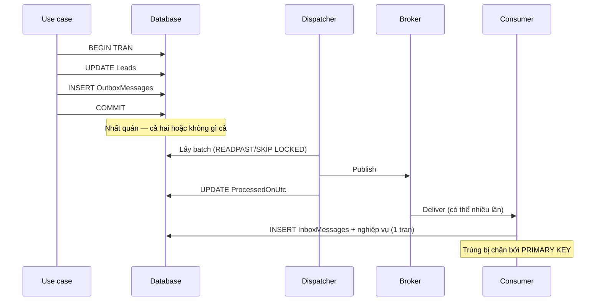

# 17.7 — 7. Demo tinh thần: Outbox + idempotency

> Nguồn: https://tiennhm.io.vn/docs/dotnet-backend-zero-to-senior/stage-05-senior-engineering/module-17-distributed-systems/17.7-outbox-idempotency-demo
> Code chạy được đầu-cuối: entity, interceptor, dispatcher an toàn nhiều instance, consumer idempotent, và ba bài test chứng minh nó đúng.

> Bài này ghép mọi thứ từ [17.3](17.2-messaging-fears-lost-duplicates.mdx), [17.4](17.3-outbox-pattern-applied.mdx) và [17.7](17.6-retry-and-backoff.mdx) thành một luồng **chạy được đầu-cuối**: use case ghi outbox trong cùng transaction → dispatcher publish an toàn kể cả khi chạy nhiều instance → consumer idempotent bằng inbox. Phần quan trọng nhất không phải code mà là **ba bài test cuối bài**: chúng chứng minh hệ thống chịu được crash sau commit, chịu được message trùng, và chịu được hai dispatcher chạy song song. Không có ba test đó, bạn chỉ **hy vọng** outbox hoạt động — và giả định đó thường chỉ được kiểm chứng lần đầu tiên vào đúng lúc sự cố xảy ra trên production.

## Mục tiêu bài học

Sau bài này bạn có thể:

- Ghép outbox, dispatcher và inbox thành một luồng hoàn chỉnh.
- Viết dispatcher dùng `READPAST`/`SKIP LOCKED` đúng cách.
- Cài consumer idempotent không có race condition.
- Kiểm thử ba tình huống hỏng quan trọng nhất.
- Giám sát luồng bằng các chỉ số đúng.

## Nội dung bài học

### 17.8.1 — Toàn cảnh



### 17.8.2 — Entity và cấu hình

```csharp
public sealed class OutboxMessage
{
    public Guid Id { get; set; }
    public DateTime OccurredOnUtc { get; set; }
    public string Type { get; set; } = null!;
    public string Payload { get; set; } = null!;
    public DateTime? ProcessedOnUtc { get; set; }
    public string? Error { get; set; }
    public int RetryCount { get; set; }
    public Guid? CorrelationId { get; set; }
}

public sealed class InboxMessage
{
    public Guid MessageId { get; set; }           // PRIMARY KEY — chan trung
    public string Type { get; set; } = null!;
    public DateTime ProcessedOnUtc { get; set; }
}
```

```csharp
public sealed class OutboxMessageConfiguration : IEntityTypeConfiguration<OutboxMessage>
{
    public void Configure(EntityTypeBuilder<OutboxMessage> b)
    {
        b.ToTable("OutboxMessages");
        b.HasKey(m => m.Id);
        b.Property(m => m.Type).HasMaxLength(300).IsRequired();
        b.Property(m => m.Payload).IsRequired();

        // Filtered index: chỉ chứa hàng CHƯA xử lý
        b.HasIndex(m => m.OccurredOnUtc)
         .HasFilter("[ProcessedOnUtc] IS NULL")
         .HasDatabaseName("IX_Outbox_Unprocessed");
    }
}
```

### 17.8.3 — Use case ghi outbox

```csharp
public sealed class ConvertLeadHandler(AppDbContext db) : IRequestHandler<ConvertLeadCommand, Result>
{
    public async Task<Result> Handle(ConvertLeadCommand request, CancellationToken ct)
    {
        var lead = await db.Leads.FirstOrDefaultAsync(l => l.Id == request.LeadId, ct);
        if (lead is null) return Result.NotFound("Lead không tồn tại");

        var customer = lead.Convert(DateTime.UtcNow);     // quy tac nghiep vu trong entity
        db.Customers.Add(customer);

        db.OutboxMessages.Add(new OutboxMessage
        {
            Id = Guid.NewGuid(),
            OccurredOnUtc = DateTime.UtcNow,
            Type = nameof(LeadConvertedIntegrationEvent),
            Payload = JsonSerializer.Serialize(new LeadConvertedIntegrationEvent(
                EventId: Guid.NewGuid(),
                LeadId: lead.Id,
                CustomerId: customer.Id,
                ContractValue: lead.Value.Amount,
                OccurredAtUtc: DateTime.UtcNow))
        });

        await db.SaveChangesAsync(ct);       // MỘT transaction cho cả ba thay đổi
        return Result.Success();
    }
}
```

Một `SaveChangesAsync`, một transaction. Lead đổi trạng thái, customer được tạo, và message nằm trong outbox — **cùng nhau hoặc không gì cả**.

### 17.8.4 — Dispatcher

```csharp
public sealed class OutboxDispatcher(
    IServiceScopeFactory scopeFactory,
    IPublishEndpoint publisher,
    ILogger<OutboxDispatcher> logger) : BackgroundService
{
    private const int BatchSize = 100;

    protected override async Task ExecuteAsync(CancellationToken ct)
    {
        while (!ct.IsCancellationRequested)
        {
            try
            {
                var processed = await DispatchBatchAsync(ct);

                // Còn việc thì làm tiếp ngay, hết việc thì nghỉ
                if (processed == 0)
                    await Task.Delay(TimeSpan.FromSeconds(5), ct);
            }
            catch (OperationCanceledException) when (ct.IsCancellationRequested)
            {
                break;                                   // shutdown binh thuong
            }
            catch (Exception ex)
            {
                logger.LogError(ex, "Outbox dispatcher lỗi, thử lại sau 5 giây");
                await Task.Delay(TimeSpan.FromSeconds(5), ct);
            }
        }
    }

    private async Task<int> DispatchBatchAsync(CancellationToken ct)
    {
        using var scope = scopeFactory.CreateScope();
        var db = scope.ServiceProvider.GetRequiredService<AppDbContext>();

        // READPAST: bỏ qua hàng instance khác đang khoá -> không publish trùng
        var messages = await db.OutboxMessages
            .FromSqlRaw($@"
                SELECT TOP ({BatchSize}) * FROM OutboxMessages WITH (READPAST, UPDLOCK)
                WHERE ProcessedOnUtc IS NULL
                ORDER BY OccurredOnUtc")
            .ToListAsync(ct);

        foreach (var message in messages)
        {
            try
            {
                var type = Type.GetType(message.Type)
                    ?? throw new InvalidOperationException($"Không tìm thấy type {message.Type}");
                var payload = JsonSerializer.Deserialize(message.Payload, type)!;

                await publisher.Publish(payload, type, ct);

                // Danh dau SAU khi publish -> at-least-once, consumer lo phan trung
                message.ProcessedOnUtc = DateTime.UtcNow;
            }
            catch (Exception ex)
            {
                message.RetryCount++;
                message.Error = ex.Message;
                logger.LogError(ex, "Publish thất bại {MessageId}, lần {Retry}",
                    message.Id, message.RetryCount);
            }
        }

        await db.SaveChangesAsync(ct);
        return messages.Count;
    }
}
```

Ba chi tiết dễ bị bỏ qua:

- **`catch (OperationCanceledException)` riêng.** Khi shutdown, `Task.Delay` ném exception này; nếu bị bắt chung vào nhánh log lỗi, mỗi lần dừng container sẽ sinh một dòng log lỗi giả ([bài 15.3](../../stage-04-database-production/module-15-docker-deployment/15.2-dockerfile-for-aspnet-core.mdx)).
- **Không `Delay` khi vừa xử lý xong một batch đầy.** Nếu hàng tồn 10.000 message mà mỗi 5 giây chỉ xử lý 100, bạn không bao giờ đuổi kịp.
- **Một message lỗi không chặn cả batch.** `try/catch` nằm **trong** vòng lặp, không bao ngoài.

### 17.8.5 — Consumer idempotent

```csharp
public sealed class LeadConvertedConsumer(BillingDbContext db, IBillingService billing)
    : IConsumer<LeadConvertedIntegrationEvent>
{
    public async Task Consume(ConsumeContext<LeadConvertedIntegrationEvent> context)
    {
        var evt = context.Message;
        var ct = context.CancellationToken;

        await using var tx = await db.Database.BeginTransactionAsync(ct);

        db.InboxMessages.Add(new InboxMessage
        {
            MessageId = evt.EventId,
            Type = nameof(LeadConvertedIntegrationEvent),
            ProcessedOnUtc = DateTime.UtcNow
        });

        try
        {
            await db.SaveChangesAsync(ct);          // "gianh cho" message nay
        }
        catch (DbUpdateException ex) when (ex.IsUniqueViolation())
        {
            return;                                  // đã xử lý rồi -> bỏ qua, ACK bình thường
        }

        var subscription = Subscription.CreateDraft(evt.CustomerId, evt.ContractValue);
        db.Subscriptions.Add(subscription);
        await db.SaveChangesAsync(ct);

        await tx.CommitAsync(ct);                    // inbox + nghiệp vụ commit CÙNG NHAU
    }
}
```

`tx.CommitAsync` ở cuối là điều kiện cho tính đúng đắn: nếu tạo subscription thất bại, transaction rollback và **hàng inbox cũng biến mất**, nên lần retry sau sẽ xử lý lại bình thường chứ không bị bỏ qua nhầm.

### 17.8.6 — Ba bài test bắt buộc

```csharp
// 1. Crash sau commit -> message KHÔNG mất
[Fact]
public async Task Outbox_ShouldSurvive_CrashAfterCommit()
{
    await _sender.Send(new ConvertLeadCommand(leadId));   // commit xong

    // Giả lập crash: không chạy dispatcher, tạo scope mới hoàn toàn
    await using var freshScope = _factory.Services.CreateAsyncScope();
    var db = freshScope.ServiceProvider.GetRequiredService<AppDbContext>();

    var pending = await db.OutboxMessages.Where(m => m.ProcessedOnUtc == null).ToListAsync();
    Assert.Single(pending);        // message vẫn còn, sẽ được publish khi dispatcher chạy lại
}

// 2. Message trùng -> chỉ xử lý MỘT lần
[Fact]
public async Task Consumer_ShouldBeIdempotent_WhenMessageDeliveredTwice()
{
    var evt = new LeadConvertedIntegrationEvent(Guid.NewGuid(), leadId, customerId, 1000, DateTime.UtcNow);

    await _consumer.Consume(CreateContext(evt));
    await _consumer.Consume(CreateContext(evt));        // CÙNG EventId

    var count = await _billingDb.Subscriptions.CountAsync(s => s.CustomerId == customerId);
    Assert.Equal(1, count);
}

// 3. Hai dispatcher song song -> không publish trùng
[Fact]
public async Task TwoDispatchers_ShouldNotPublish_SameMessageTwice()
{
    await SeedOutboxAsync(count: 200);

    await Task.WhenAll(
        RunDispatcherAsync(instance: 1),
        RunDispatcherAsync(instance: 2));

    Assert.Equal(200, _fakeBus.Published.Count);
    Assert.Equal(200, _fakeBus.Published.Select(m => m.EventId).Distinct().Count());
}
```

Test 3 **phải chạy trên database thật** (Testcontainers) — provider InMemory không có khoá nên `READPAST` không có ý nghĩa gì và test sẽ xanh một cách vô nghĩa ([bài 16.9](../module-16-clean-architecture/16.9-testing-strategy-overview.mdx)).

### 17.8.7 — Giám sát

```csharp
// Chỉ số quan trọng nhất: tuổi của message chưa xử lý CŨ NHẤT
_meter.CreateObservableGauge("outbox_oldest_pending_seconds", () =>
{
    var oldest = db.OutboxMessages
        .Where(m => m.ProcessedOnUtc == null)
        .Min(m => (DateTime?)m.OccurredOnUtc);

    return oldest is null ? 0 : (DateTime.UtcNow - oldest.Value).TotalSeconds;
});
```

Chỉ số này tốt hơn "số message chưa xử lý": 10.000 message vừa tạo trong một giây là bình thường, nhưng **một** message kẹt 10 phút là sự cố. Đếm số lượng không phân biệt được hai tình huống đó; đo tuổi thì có.

Hai chỉ số nên có cùng: `outbox_publish_failures_total` và `inbox_duplicates_total` — cái sau tăng đột biến là dấu hiệu consumer đang ACK thất bại.

### 17.8.8 — Rà lại code của bạn

**Danh sách rà soát luồng outbox đầu-cuối**

- [ ] Use case ghi outbox và thay đổi nghiệp vụ trong cùng một SaveChangesAsync.
- [ ] Dispatcher dùng READPAST hoặc SKIP LOCKED.
- [ ] Dispatcher không nghỉ khi vừa xử lý xong một batch đầy.
- [ ] Một message lỗi không chặn các message còn lại trong batch.
- [ ] OperationCanceledException khi shutdown được xử lý riêng.
- [ ] Consumer ghi inbox và thay đổi nghiệp vụ trong cùng transaction.
- [ ] Chống trùng dựa vào primary key, không dựa vào câu if.
- [ ] Có test cho crash sau commit, message trùng, và hai dispatcher song song.
- [ ] Test chạy trên database thật, không dùng provider InMemory.
- [ ] Giám sát tuổi của message chưa xử lý cũ nhất, không chỉ đếm số lượng.

## Bài tập áp dụng

#### Bài 1 — Dựng luồng đầy đủ

Cài use case, dispatcher và consumer như trên với RabbitMQ chạy trong Docker. Gửi một lệnh convert và theo dõi message đi qua từng bước.

**Tiêu chí hoàn thành:** bạn quan sát được message ở **năm** điểm, và biết chẩn đoán khi nó dừng ở mỗi điểm.

Gợi ý và lời giải — Bài 1

**Gợi ý.** Message đi qua những chặng nào? Ở mỗi chặng, bạn nhìn vào đâu để biết nó đã tới?

**Lời giải — dựng hạ tầng:**

```yaml
services:
  rabbitmq:
    image: rabbitmq:4-management-alpine
    environment:
      RABBITMQ_DEFAULT_USER: crm
      RABBITMQ_DEFAULT_PASS: ${RABBIT_PASSWORD}
    ports:
      - "127.0.0.1:5672:5672"
      - "127.0.0.1:15672:15672"
    healthcheck:
      test: ["CMD", "rabbitmq-diagnostics", "check_running"]
      interval: 10s
      retries: 10

  sqlserver:
    image: mcr.microsoft.com/mssql/server:2022-latest
    environment:
      ACCEPT_EULA: "Y"
      MSSQL_SA_PASSWORD: ${SA_PASSWORD}
    ports: ["127.0.0.1:1433:1433"]
```

```bash
curl -X POST http://localhost:8080/leads/abc-123/convert -H "Content-Type: application/json"
```

**Năm điểm quan sát:**

**Điểm 1 — thay đổi nghiệp vụ đã commit chưa:**

```sql
SELECT Id, Status, ConvertedUtc FROM Leads WHERE Id = 'abc-123';
```

```text
abc-123   Converted   2026-09-25 08:14:22
```

```text
Nếu KHÔNG có:  use case thất bại trước SaveChanges
                -> xem log ứng dụng, tìm ValidationException hoặc BusinessRuleException
```

**Điểm 2 — message đã vào outbox chưa:**

```sql
SELECT Id, LoaiMessage, TaoLuc, GuiLuc, SoLanThu, LoiGanNhat
FROM Outbox ORDER BY TaoLuc DESC;
```

```text
Id             LoaiMessage                      TaoLuc                GuiLuc   SoLanThu
0192f8a3-...   LeadConvertedIntegrationEvent    2026-09-25 08:14:22   NULL     0
```

```text
Lead đã đổi nhưng KHÔNG có dòng outbox
    -> nghiêm trọng: outbox KHÔNG nằm trong cùng transaction
    -> kiểm tra: _db.Outbox.Add() có được gọi TRƯỚC SaveChangesAsync không
    -> hoặc: có hai SaveChangesAsync riêng biệt
```

Đây là lỗi nghiêm trọng nhất trong toàn bộ luồng, vì nó phá vỡ bảo đảm cốt lõi của outbox.

**Điểm 3 — dispatcher đã publish chưa:**

```sql
SELECT Id, GuiLuc, SoLanThu, LoiGanNhat FROM Outbox WHERE Id = '0192f8a3-...';
```

```text
Id             GuiLuc                GuiLuc   SoLanThu   LoiGanNhat
0192f8a3-...   2026-09-25 08:14:23   ...      0          NULL
```

```text
GuiLuc = NULL và SoLanThu = 0 sau vài giây
    -> dispatcher KHÔNG chạy
    -> kiểm tra: BackgroundService có được đăng ký không
    -> kiểm tra: vòng lặp có nuốt exception rồi thoát không

GuiLuc = NULL và SoLanThu tăng dần
    -> dispatcher CHẠY nhưng publish thất bại
    -> đọc LoiGanNhat — thường là không kết nối được broker,
       hoặc Type.GetType trả null vì assembly không được nạp
```

Cột `LoiGanNhat` là cột đáng giá nhất trong bảng outbox khi chẩn đoán — nó biến "message không đi" thành một thông điệp cụ thể.

**Điểm 4 — message đã tới broker chưa:**

```bash
docker exec rabbitmq rabbitmqctl list_exchanges name type
docker exec rabbitmq rabbitmqctl list_queues name messages messages_unacknowledged consumers
```

```text
name                                    messages  unacked  consumers
billing-lead-converted                         1        0         1
```

Hoặc qua giao diện quản lý tại `http://localhost:15672`.

```text
Exchange có nhưng queue KHÔNG có message
    -> binding sai: message được publish nhưng không route tới queue nào
    -> kiểm tra: rabbitmqctl list_bindings
    -> nguyên nhân phổ biến: consumer chưa từng khởi động nên queue chưa được tạo
```

Đây là cái bẫy đặc trưng của RabbitMQ: **message publish trước khi consumer khởi động lần đầu sẽ biến mất**, vì chưa có queue nào bind vào exchange. Khởi động consumer ít nhất một lần trước khi publish.

**Điểm 5 — consumer đã xử lý chưa:**

```sql
SELECT MessageId, LoaiMessage, XuLyLuc FROM MessageDaXuLy ORDER BY XuLyLuc DESC;
SELECT Id, CustomerId, CreatedUtc FROM Subscriptions ORDER BY CreatedUtc DESC;
```

```text
MessageId       LoaiMessage                      XuLyLuc
0192f8a3-...    LeadConvertedIntegrationEvent    2026-09-25 08:14:23

Id              CustomerId    CreatedUtc
0192f8b1-...    cus-456       2026-09-25 08:14:23
```

```text
Queue có message nhưng consumers = 0
    -> consumer không kết nối
    -> kiểm tra chuỗi kết nối và log khởi động

Queue có message và consumers = 1, nhưng message không giảm
    -> consumer nhận và thất bại liên tục
    -> xem log; kiểm tra dead-letter queue

Message biến mất nhưng KHÔNG có dòng trong Subscriptions
    -> consumer ack mà không làm gì
    -> thường do bắt exception quá rộng rồi nuốt
```

**Bảng chẩn đoán tổng hợp:**

| Điểm dừng | Nguyên nhân thường gặp | Nhìn vào đâu |
|---|---|---|
| Chưa tới điểm 1 | Lỗi nghiệp vụ hoặc validate | Log ứng dụng |
| 1 có, 2 không | **Outbox không cùng transaction** | Code use case |
| 2 có, 3 không | Dispatcher không chạy hoặc publish lỗi | `SoLanThu`, `LoiGanNhat` |
| 3 có, 4 không | Binding sai, queue chưa tồn tại | `list_bindings` |
| 4 có, 5 không | Consumer chết hoặc thất bại liên tục | Log consumer, DLQ |

**Và một cách quan sát toàn bộ luồng trong một lần: distributed trace.**

```csharp
builder.Services.AddOpenTelemetry()
    .WithTracing(t => t
        .AddAspNetCoreInstrumentation()
        .AddSqlClientInstrumentation()
        .AddSource("MassTransit")            // MassTransit phát span sẵn
        .AddOtlpExporter());
```

```text
POST /leads/abc-123/convert                          142 ms  ████████████████
├─ SELECT Leads WHERE Id = @p0                        12 ms  █
├─ INSERT Leads, Outbox (một transaction)             18 ms  ██
│
├─ [outbox-dispatcher] publish LeadConverted          24 ms  ██
│  └─ rabbitmq send billing-lead-converted             8 ms  █
│
└─ [billing] consume LeadConverted                    31 ms  ███
   ├─ INSERT MessageDaXuLy                             6 ms  █
   └─ INSERT Subscriptions                             9 ms  █
```

Trace nối toàn bộ luồng bằng **một `trace_id`**, kể cả qua ranh giới tiến trình — MassTransit tự truyền context qua header của message. Đây là cách duy nhất trả lời nhanh câu hỏi "message của request này đi tới đâu rồi?" trên production.

**Chi tiết dễ bỏ sót: truyền trace context qua outbox.** Message nằm trong outbox vài giây, và trace context phải được lưu cùng nó:

```csharp
public static TinNhanOutbox Tao<T>(T message) where T : class => new()
{
    Id          = Guid.CreateVersion7(),
    LoaiMessage = typeof(T).AssemblyQualifiedName!,
    NoiDung     = JsonSerializer.Serialize(message),
    TraceId     = Activity.Current?.TraceId.ToString(),      // lưu lại
    SpanId      = Activity.Current?.SpanId.ToString(),
    TaoLuc      = DateTime.UtcNow,
};
```

Không có hai cột này, trace bị đứt làm hai: một phần cho request HTTP, một phần cho dispatcher — và bạn mất khả năng nối chúng lại.

---

#### Bài 2 — Viết ba bài test

Cài cả ba test ở mục 17.8.6 với Testcontainers. Xác nhận test 3 **thất bại** khi bỏ `READPAST`.

**Tiêu chí hoàn thành:** cả ba test chạy được, và bạn giải thích được vì sao test 3 **bắt buộc** phải dùng database thật.

Gợi ý và lời giải — Bài 2

**Gợi ý.** `READPAST` là một hint của SQL Server. Provider in-memory có hiểu nó không?

**Lời giải — thiết lập Testcontainers:**

```bash
dotnet add package Testcontainers.MsSql
dotnet add package Testcontainers.RabbitMq
```

```csharp
public class OutboxTestFixture : IAsyncLifetime
{
    private readonly MsSqlContainer _sql = new MsSqlBuilder()
        .WithImage("mcr.microsoft.com/mssql/server:2022-latest")
        .Build();

    public string ChuoiKetNoi => _sql.GetConnectionString();

    public async Task InitializeAsync()
    {
        await _sql.StartAsync();
        await using var db = TaoDbContext();
        await db.Database.MigrateAsync();
    }

    public async Task DisposeAsync() => await _sql.DisposeAsync();

    public CrmDbContext TaoDbContext() => new(new DbContextOptionsBuilder<CrmDbContext>()
        .UseSqlServer(ChuoiKetNoi).Options);
}
```

**Test 1 — crash sau commit, message không mất:**

```csharp
[Fact]
public async Task Outbox_khong_mat_message_khi_crash_sau_commit()
{
    await using var db = _fixture.TaoDbContext();
    var lead = await TaoLeadAsync(db);

    // Use case: đổi lead + ghi outbox trong MỘT transaction
    lead.ChuyenSangConverted(_nguoiDung, _bayGio);
    db.Outbox.Add(TinNhanOutbox.Tao(new LeadConvertedV1(Guid.CreateVersion7(), lead.Id.Value)));
    await db.SaveChangesAsync();

    // "Crash": không chạy dispatcher, mở context HOÀN TOÀN MỚI
    await using var dbMoi = _fixture.TaoDbContext();

    var leadSau = await dbMoi.Leads.AsNoTracking().FirstAsync(l => l.Id == lead.Id);
    leadSau.Status.Should().Be(LeadStatus.Converted);

    var chuaGui = await dbMoi.Outbox.Where(m => m.GuiLuc == null).ToListAsync();
    chuaGui.Should().ContainSingle("message phải còn nguyên để dispatcher publish sau");
}
```

Điểm quan trọng: mở `DbContext` **mới** thay vì dùng lại cái cũ. Dùng lại sẽ đọc từ change tracker và không chứng minh được gì về trạng thái đã commit.

**Test 2 — consumer idempotent:**

```csharp
[Fact]
public async Task Consumer_xu_ly_message_hai_lan_chi_tao_mot_ban_ghi()
{
    var e = new LeadConvertedV1(
        EventId: Guid.CreateVersion7(), LeadId: leadId, CustomerId: customerId, GiaTri: 1000);

    await using (var db = _fixture.TaoDbContext())
        await new TaoSubscriptionConsumer(db, _logger).Consume(TaoContext(e));

    await using (var db = _fixture.TaoDbContext())
        await new TaoSubscriptionConsumer(db, _logger).Consume(TaoContext(e));   // LẦN HAI

    await using var dbKiemTra = _fixture.TaoDbContext();
    (await dbKiemTra.Subscriptions.CountAsync(s => s.CustomerId == customerId))
        .Should().Be(1);
}
```

Dùng `DbContext` riêng cho mỗi lần gọi để mô phỏng đúng thực tế: hai lần giao message tới hai scope khác nhau, có thể ở hai instance khác nhau.

**Test 3 — hai dispatcher không publish trùng:**

```csharp
[Fact]
public async Task Hai_dispatcher_song_song_khong_publish_trung()
{
    await TaoMessageOutboxAsync(soLuong: 200);

    var bus = new FakePublishEndpoint();

    await Task.WhenAll(
        ChayDispatcherAsync(bus, TimeSpan.FromSeconds(10)),
        ChayDispatcherAsync(bus, TimeSpan.FromSeconds(10)));

    bus.DaPublish.Should().HaveCount(200);
    bus.DaPublish.Select(m => m.Id).Should().OnlyHaveUniqueItems();
}
```

**Bỏ `READPAST` và chạy lại:**

```csharp
// Bản không có hint
var chuaGui = await db.Outbox
    .Where(m => m.GuiLuc == null && m.SoLanThu < 10)
    .OrderBy(m => m.TaoLuc).Take(100).ToListAsync(ct);
```

```text
Expected collection to contain 200 item(s), but found 341.
Expected collection to only have unique items, but item {Id = ...} is not unique.
```

Test đỏ — đúng như mong đợi.

**Vì sao test 3 bắt buộc phải dùng database thật:**

```csharp
// Với provider in-memory
var options = new DbContextOptionsBuilder<CrmDbContext>()
    .UseInMemoryDatabase("test").Options;
```

```text
Test 3 XANH — kể cả với bản KHÔNG có READPAST
```

Ba lý do:

**1. Provider in-memory không có khoá.** Nó là một `ConcurrentDictionary` — không có khoá hàng, không có mức cô lập, không có `UPDLOCK`.

**2. `FromSql` không hoạt động.** Câu SQL thô với hint bị bỏ qua hoặc ném exception, tuỳ cách bạn viết test.

**3. Không có transaction thật.** `BeginTransactionAsync` trên provider in-memory là no-op, nên không có gì để giữ khoá qua.

```text
-> Test xanh trong CẢ HAI trường hợp
-> Nó không chứng minh được gì
-> Và tệ hơn: nó cho cảm giác an toàn sai
```

Đây là một ví dụ cụ thể của điểm ở [bài 16.9](../module-16-clean-architecture/16.9-testing-strategy-overview.mdx): coverage và số lượng test không nói lên sức mạnh của test. Một test xanh trong mọi trường hợp là một test không có giá trị.

**SQLite cũng không đủ:**

```text
SQLite có transaction, nhưng khoá ở mức DATABASE, không ở mức hàng
-> hai dispatcher sẽ tuần tự hoàn toàn
-> không trùng, nhưng cũng không chứng minh được READPAST hoạt động
-> test xanh vì lý do SAI
```

**Bảng chọn provider cho từng loại test:**

| Loại test | Provider |
|---|---|
| Logic domain thuần tuý | **Không cần database** |
| Ánh xạ, truy vấn LINQ cơ bản | SQLite in-memory |
| **Ràng buộc unique, khoá ngoại** | **Database thật** |
| **Đồng thời, khoá, mức cô lập** | **Database thật** |
| SQL thô, hint, stored procedure | **Database thật** |
| Migration | **Database thật** |

Ba dòng in đậm là những thứ mà provider giả **không thể** mô phỏng — và chúng cũng chính là những thứ hay sai nhất trên production.

**Chi phí của Testcontainers:**

```text
Khởi động container SQL Server:  15–40 giây lần đầu (kéo image)
                                  3–8 giây các lần sau
Chạy migration:                   2–5 giây
```

Giảm bằng cách dùng chung một container cho cả collection test:

```csharp
[CollectionDefinition("Database")]
public class DatabaseCollection : ICollectionFixture<OutboxTestFixture> { }

[Collection("Database")]
public class OutboxTests(OutboxTestFixture fixture) { }
```

Và dọn dữ liệu giữa các test thay vì tạo lại container:

```csharp
public async Task ResetAsync()
{
    await using var db = TaoDbContext();
    await db.Database.ExecuteSqlRawAsync("DELETE FROM Outbox; DELETE FROM Leads;");
}
```

Với `Respawn`, việc này tự động hoá được cho mọi bảng:

```csharp
_checkpoint = await Respawner.CreateAsync(ChuoiKetNoi, new RespawnerOptions
{
    TablesToIgnore = ["__EFMigrationsHistory"],
});
await _checkpoint.ResetAsync(ChuoiKetNoi);
```

**Chạy trong CI:**

```yaml
- name: Integration test
  run: dotnet test tests/Crm.IntegrationTests
  env:
    TESTCONTAINERS_RYUK_DISABLED: "false"
```

GitHub Actions runner có sẵn Docker, nên Testcontainers hoạt động không cần cấu hình thêm. Ryuk là container dọn dẹp — giữ nó bật để container không bị bỏ lại khi test crash.

---

#### Bài 3 — Thêm chỉ số giám sát

Cài `outbox_oldest_pending_seconds`, dừng dispatcher 2 phút và quan sát giá trị tăng.

**Tiêu chí hoàn thành:** bạn giải thích được vì sao chỉ số **tuổi** tốt hơn chỉ số **số lượng**, và đặt được ngưỡng cảnh báo có cơ sở.

Gợi ý và lời giải — Bài 3

**Gợi ý.** 10.000 message chưa xử lý — đó là sự cố hay là bình thường? Câu trả lời phụ thuộc vào gì?

**Lời giải:**

```csharp
public class OutboxMetrics
{
    private static readonly Meter _meter = new("Crm.Outbox");

    public OutboxMetrics(IServiceScopeFactory scopeFactory)
    {
        _meter.CreateObservableGauge("outbox_oldest_pending_seconds", () =>
        {
            using var scope = scopeFactory.CreateScope();
            var db = scope.ServiceProvider.GetRequiredService<CrmDbContext>();

            var somNhat = db.Outbox
                .Where(m => m.GuiLuc == null && m.SoLanThu < 10)
                .Min(m => (DateTime?)m.TaoLuc);

            return somNhat is null ? 0 : (DateTime.UtcNow - somNhat.Value).TotalSeconds;
        });

        _meter.CreateObservableGauge("outbox_pending_count", () =>
        {
            using var scope = scopeFactory.CreateScope();
            var db = scope.ServiceProvider.GetRequiredService<CrmDbContext>();
            return db.Outbox.Count(m => m.GuiLuc == null);
        });

        _meter.CreateObservableGauge("outbox_stuck_count", () =>
        {
            using var scope = scopeFactory.CreateScope();
            var db = scope.ServiceProvider.GetRequiredService<CrmDbContext>();
            return db.Outbox.Count(m => m.GuiLuc == null && m.SoLanThu >= 10);
        });
    }
}
```

```bash
docker stop crm-worker
# chờ 2 phút
curl -s http://localhost:8080/metrics | grep outbox
```

```text
outbox_oldest_pending_seconds 121.4
outbox_pending_count 847
outbox_stuck_count 0
```

```bash
docker start crm-worker
sleep 10
curl -s http://localhost:8080/metrics | grep outbox
```

```text
outbox_oldest_pending_seconds 0.8
outbox_pending_count 3
outbox_stuck_count 0
```

**Vì sao chỉ số tuổi tốt hơn chỉ số số lượng:**

Hai tình huống, cùng một con số `outbox_pending_count = 10000`:

```text
Tình huống A — bình thường:
    Một job import vừa tạo 10.000 message trong 5 giây
    Dispatcher đang xử lý với tốc độ 2.000 msg/s
    -> sẽ hết trong 5 giây
    -> outbox_oldest_pending_seconds = 4,2

Tình huống B — sự cố:
    Dispatcher chết 3 giờ trước
    10.000 message tích tụ
    -> outbox_oldest_pending_seconds = 10.847
```

**Cùng `pending_count`, hai tình huống hoàn toàn khác nhau.** Chỉ số số lượng không phân biệt được; chỉ số tuổi thì có.

Và ngược lại:

```text
Tình huống C:
    outbox_pending_count = 1
    outbox_oldest_pending_seconds = 7.200      <- MỘT message kẹt 2 giờ
```

Một message duy nhất bị kẹt là sự cố thật — có thể là message có kiểu không deserialize được, hoặc một luồng nghiệp vụ đang dừng. Chỉ số số lượng bằng 1 trông hoàn toàn bình thường.

```text
pending_count:            tải hiện tại — hữu ích để scale
oldest_pending_seconds:   ĐỘ TRỄ — hữu ích để phát hiện sự cố
```

**Đây là nguyên tắc chung, không chỉ cho outbox:**

| Hệ thống | Chỉ số số lượng | **Chỉ số tuổi/độ trễ** |
|---|---|---|
| Outbox | `pending_count` | **`oldest_pending_seconds`** |
| Message queue | `messages` | **`oldest_message_age`** |
| Job queue | `queued_jobs` | **`oldest_queued_job_age`** |
| CDC | `lag_bytes` | **`lag_seconds`** |
| Replication | `bytes_behind` | **`seconds_behind_master`** |

Chỉ số ở cột phải trả lời được câu hỏi mà nghiệp vụ quan tâm: *"dữ liệu của tôi chậm bao lâu?"* — còn cột trái chỉ trả lời *"có bao nhiêu thứ đang chờ?"*.

**Đặt ngưỡng cảnh báo có cơ sở:**

```text
Ngưỡng = độ trễ mà NGHIỆP VỤ chấp nhận được, không phải một con số tròn
```

```markdown
| Luồng | Độ trễ chấp nhận được | Ngưỡng cảnh báo |
|---|---|---|
| Tạo subscription sau convert | 1 phút | 120 giây |
| Đồng bộ sang ERP | 15 phút | 900 giây |
| Cập nhật dashboard | 1 giờ | 3.600 giây |
| Gửi email chào mừng | 10 phút | 600 giây |
```

Ngưỡng cảnh báo nên là **hai lần** độ trễ chấp nhận được, để tránh cảnh báo giả khi có đợt tải nhất thời.

Nếu các luồng có yêu cầu rất khác nhau, tách chỉ số theo loại message:

```csharp
_meter.CreateObservableGauge("outbox_oldest_pending_seconds", () =>
{
    using var scope = scopeFactory.CreateScope();
    var db = scope.ServiceProvider.GetRequiredService<CrmDbContext>();

    return db.Outbox
        .Where(m => m.GuiLuc == null)
        .GroupBy(m => m.LoaiMessage)
        .Select(g => new { Loai = g.Key, SomNhat = g.Min(m => m.TaoLuc) })
        .AsEnumerable()
        .Select(x => new Measurement<double>(
            (DateTime.UtcNow - x.SomNhat).TotalSeconds,
            new KeyValuePair<string, object?>("loai_message", x.Loai)));
});
```

Lưu ý cardinality: số loại message phải **hữu hạn và biết trước** — nếu không, bạn gặp đúng vấn đề ở [bài 15.8](../../stage-04-database-production/module-15-docker-deployment/15.8-production-monitoring.mdx).

**Ba chỉ số nên có cùng:**

```csharp
// Thất bại publish — tăng đột biến nghĩa là broker có vấn đề
_demLoiPublish = _meter.CreateCounter<long>("outbox_publish_failures_total");

// Message kẹt vĩnh viễn — cần can thiệp thủ công
_meter.CreateObservableGauge("outbox_stuck_count", () => /* SoLanThu >= 10 */);

// Trùng lặp ở consumer — tăng nghĩa là consumer đang ACK thất bại
_demTrungLap = _meter.CreateCounter<long>("inbox_duplicates_total");
```

Chỉ số thứ ba đáng chú ý: một lượng trùng lặp nhỏ là bình thường với at-least-once. Nhưng **tăng đột biến** nghĩa là message được giao lại liên tục — thường vì consumer xử lý xong nhưng ack thất bại, hoặc vì timeout của broker ngắn hơn thời gian xử lý.

**Cấu hình cảnh báo:**

```yaml
groups:
  - name: outbox
    rules:
      - alert: OutboxTre
        expr: outbox_oldest_pending_seconds > 120
        for: 2m
        labels: { severity: warning }
        annotations:
          summary: "Outbox trễ {{ $value | humanizeDuration }}"
          runbook: "https://wiki/runbooks/outbox-tre"

      - alert: OutboxKet
        expr: outbox_stuck_count > 0
        for: 5m
        labels: { severity: critical }
        annotations:
          summary: "{{ $value }} message kẹt vĩnh viễn, cần xem thủ công"

      - alert: DispatcherChet
        expr: outbox_oldest_pending_seconds > 600
        for: 1m
        labels: { severity: critical }
```

Trường `runbook` đáng có: người trực lúc 2 giờ sáng cần biết phải làm gì, không chỉ biết có vấn đề.

**Runbook mẫu:**

```markdown
## Outbox trễ

### Kiểm tra nhanh
1. Dispatcher còn chạy không?  `kubectl get pods -l app=crm-worker`
2. Broker còn sống không?      `rabbitmqctl status`
3. Có message kẹt không?       `SELECT * FROM Outbox WHERE SoLanThu >= 10`

### Nguyên nhân thường gặp
| Triệu chứng | Nguyên nhân | Xử lý |
|---|---|---|
| Pod worker không chạy | Crash hoặc OOM | `kubectl logs --previous` |
| SoLanThu tăng đều | Không kết nối được broker | Kiểm tra mạng và chuỗi kết nối |
| SoLanThu = 10 ở vài message | Kiểu message không deserialize được | Xem LoiGanNhat, sửa hoặc xoá |
| Mọi thứ khoẻ, vẫn trễ | Không đủ dispatcher | Tăng replicas |
```

**Và một chỉ số cuối cho dashboard — thông lượng:**

```csharp
_demDaPublish = _meter.CreateCounter<long>("outbox_published_total");
```

```promql
rate(outbox_published_total[5m])
```

Đặt cạnh `outbox_pending_count`, nó cho bạn ước lượng thời gian rút hết hàng đợi: `pending / rate` — và đó là con số bạn cần khi quyết định "chờ hay can thiệp" trong lúc có sự cố.

## Tự kiểm tra

### Vì sao use case chỉ nên gọi SaveChangesAsync một lần?

Vì một lần gọi là một transaction, nên thay đổi nghiệp vụ và hàng outbox được commit cùng nhau hoặc không gì cả. Gọi hai lần tạo ra khoảng giữa mà tiến trình có thể chết, và đó chính là dual write problem.

### Vì sao dispatcher không nên nghỉ khi vừa xử lý xong một batch đầy?

Vì batch đầy nghĩa là có thể còn message chờ. Nếu tồn 10.000 message mà mỗi 5 giây chỉ xử lý 100 thì hàng đợi không bao giờ được rút hết. Chỉ nghỉ khi batch trả về rỗng.

### Vì sao try catch phải nằm trong vòng lặp message chứ không bao ngoài?

Để một message lỗi không chặn các message còn lại trong batch. Nếu bao ngoài, một poison message sẽ làm cả batch dừng và lặp lại mãi ở cùng vị trí.

### Vì sao OperationCanceledException cần xử lý riêng?

Vì khi container dừng, Task.Delay ném exception này một cách bình thường. Bắt chung vào nhánh log lỗi sẽ sinh một dòng lỗi giả mỗi lần shutdown, làm nhiễu log và gây báo động sai.

### Vì sao commit transaction ở cuối consumer lại quan trọng?

Vì nếu phần nghiệp vụ thất bại thì transaction rollback và hàng inbox cũng biến mất, nên lần retry sau xử lý lại bình thường. Nếu inbox commit riêng trước, message bị đánh dấu đã xử lý trong khi thực ra chưa, và nó bị bỏ qua vĩnh viễn.

### Vì sao đo tuổi message chưa xử lý tốt hơn đếm số lượng?

Vì mười nghìn message vừa tạo trong một giây là bình thường, còn một message kẹt mười phút là sự cố. Đếm số lượng không phân biệt được hai tình huống đó, đo tuổi thì phân biệt được ngay.

## Kết luận

Ba điều đáng nhớ nhất:

1. **Một `SaveChangesAsync` cho cả nghiệp vụ và outbox** — đó là toàn bộ tính đúng đắn của phía gửi.
2. **Ba bài test là phần quan trọng nhất của bài này**, vì không có chúng bạn chỉ đang hy vọng.
3. **Giám sát tuổi, không giám sát số lượng.**

## Tham khảo

- [Transactional Outbox pattern](https://microservices.io/patterns/data/transactional-outbox.html)
- [MassTransit transactional outbox](https://masstransit.io/documentation/patterns/transactional-outbox)
- [Idempotent consumer](https://learn.microsoft.com/en-us/dotnet/architecture/microservices/multi-container-microservice-net-applications/subscribe-events)
- [Testing in .NET](https://learn.microsoft.com/en-us/dotnet/core/testing/)

## Điều hướng

- **Bài trước:** [17.6 — 6. Retry và backoff](17.6-retry-and-backoff.mdx)
- **Bài tiếp theo:** [17.8 — 8. MassTransit / NServiceBus / EasyNetQ](17.8-masstransit-nservicebus-easynetq.mdx)
- **Về module:** [Trang mục lục](./)
