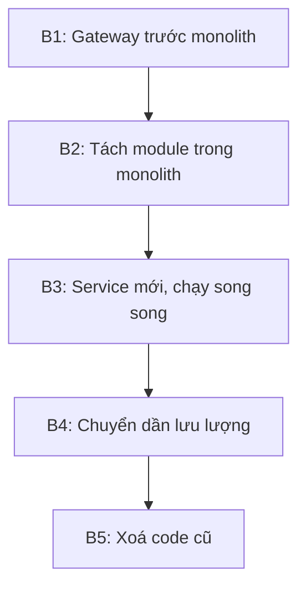

# 18.11 — Mini case study

> Nguồn: https://tiennhm.io.vn/docs/dotnet-backend-zero-to-senior/stage-05-senior-engineering/module-18-microservices/18.11-mini-case-study
> Tách Notification Service khỏi monolith CRM: kế hoạch Strangler Fig năm bước, ba sự cố gặp phải và cách xử lý từng cái.

> Một ca tách service thật: đội 9 người, monolith CRM chạy 3 năm, cần tách **Notification** ra riêng vì nó chiếm 70% tài nguyên vào giờ cao điểm nhưng chỉ là 5% code. Bài này đi qua **toàn bộ kế hoạch** và — quan trọng hơn — **ba sự cố xảy ra trong lúc tách** mà kế hoạch ban đầu không lường được: mất thông báo do dual write, người dùng nhận email trùng sau khi bật song song, và độ trễ tăng vì gọi ngược về monolith lấy thông tin người nhận. Cả ba đều có thể phòng trước nếu biết, và đó là giá trị thật của ca này.

## Mục tiêu bài học

Sau bài này bạn có thể:

- Lập kế hoạch tách một service theo Strangler Fig.
- Chọn module nào tách trước dựa trên tiêu chí rõ ràng.
- Lường trước ba loại sự cố hay gặp khi tách.
- Quyết định khi nào dừng hoặc quay lại.

## Nội dung bài học

### 18.12.1 — Đề bài

**Hiện trạng:** monolith ASP.NET Core, SQL Server, 4 instance, đội 9 người.

```
Gio cao diem (9h va 14h):
  - Module Notification gửi ~50.000 email/giờ (nhắc lịch, cảnh báo deal)
  - CPU cua ca ung dung leo len 85%
  - API nghiep vu cham theo: p99 tu 300ms len 2,1 giay
  - Phải scale cả 4 instance lên 12 -> tốn tiền cho phần KHÔNG cần scale
```

**Mục tiêu:** Notification scale độc lập, API nghiệp vụ không bị ảnh hưởng.

**Ràng buộc:** không được mất thông báo nào, không downtime, và phải quay lại được nếu hỏng.

### 18.12.2 — Vì sao chọn Notification trước

Bốn tiêu chí, và Notification đạt cả bốn:

| Tiêu chí | Notification |
|---|---|
| Ít phụ thuộc vào module khác | Chỉ cần: gửi cho ai, nội dung gì |
| Ranh giới nghiệp vụ rõ | "Gửi thông báo" là một việc tách bạch |
| Nhu cầu scale khác phần còn lại | **Chính là lý do tách** |
| Hỏng thì ít nghiêm trọng | Email trễ vài phút không làm hỏng dữ liệu |

Tiêu chí cuối đáng chú ý: tách service đầu tiên **nên chọn chỗ chịu được rủi ro**. Đây là lần đầu đội làm việc này, và sẽ có sai sót. Tách Billing hay Order trước là đặt cược vào lần đầu.

### 18.12.3 — Kế hoạch năm bước



**Bước 1 — Gateway.** Đặt YARP trước monolith, mọi route vẫn về monolith. Tự nó không đổi gì nhưng tạo **điểm chuyển đổi** cho các bước sau ([bài 18.4](18.3-api-gateway-yarp-dotnet.mdx)).

**Bước 2 — Tách module trong monolith.** Trước khi tách ra tiến trình riêng, tách thành module có ranh giới rõ **bên trong** monolith:

```
Modules/Notification/
  Notification.Domain/
  Notification.Application/
  Notification.Infrastructure/
  Notification.Contracts/        <- chỉ project này được module khác dùng
```

Bước này phát hiện ra 14 chỗ code khác gọi thẳng vào nội bộ Notification — con số mà không ai ngờ. Sửa chúng **trong monolith** rẻ hơn rất nhiều so với sửa sau khi đã tách ra mạng ([bài 18.2](18.1-when-not-to-use-microservices.mdx)).

**Bước 3 — Service mới chạy song song.** Notification Service mới nhận message từ broker, xử lý, nhưng **không gửi email thật** — chỉ ghi log. So sánh log với monolith để xác nhận hành vi giống nhau.

**Bước 4 — Chuyển dần lưu lượng.** Bật gửi thật cho 5% thông báo, theo dõi, tăng dần: 5% → 25% → 50% → 100%.

**Bước 5 — Xoá code cũ** sau hai tuần ổn định.

### 18.12.4 — Sự cố 1: mất thông báo

**Xảy ra ở bước 3.** Monolith ghi database rồi publish message cho service mới:

```csharp
// Code ban dau — dual write
await _db.SaveChangesAsync(ct);
await _bus.Publish(new SendNotificationCommand(...), ct);   // có thể thất bại
```

Trong một đợt deploy, tiến trình bị dừng giữa hai lệnh. 340 thông báo **không bao giờ** được gửi, và không có dấu vết nào trong log — vì về mặt monolith, mọi thứ đã thành công.

Đây chính là dual write problem ([bài 17.3](../module-17-distributed-systems/17.2-messaging-fears-lost-duplicates.mdx)).

**Sửa:** đưa message vào outbox trong cùng transaction.

```csharp
_db.OutboxMessages.Add(OutboxMessage.From(new SendNotificationCommand(...)));
await _db.SaveChangesAsync(ct);        // MỘT transaction cho cả hai
```

**Bài học:** outbox phải có **trước** khi bắt đầu tách, không phải thêm vào khi đã mất dữ liệu ([bài 17.4](../module-17-distributed-systems/17.3-outbox-pattern-applied.mdx)).

### 18.12.5 — Sự cố 2: email trùng

**Xảy ra ở bước 4.** Khi bật gửi thật cho 5%, một số người dùng nhận **hai email giống hệt**.

Nguyên nhân: cơ chế chia 5% dựa trên `Random`, và monolith cũ **vẫn đang gửi 100%**. Kế hoạch là "monolith gửi 95%, service mới gửi 5%", nhưng code thực tế không tắt phần tương ứng ở monolith — nên 5% đó được gửi **hai lần**.

**Sửa ngay:** thêm bảng chống trùng dùng chung, khoá theo `NotificationId`.

```csharp
try
{
    _db.SentNotifications.Add(new SentNotification { Id = notification.Id });
    await _db.SaveChangesAsync(ct);       // PRIMARY KEY chan trung
}
catch (DbUpdateException ex) when (ex.IsUniqueViolation())
{
    return;                                // bên kia đã gửi
}

await _emailSender.SendAsync(notification, ct);
```

**Bài học:** trong giai đoạn chạy song song, **luôn** có cơ chế chống trùng dùng chung, kể cả khi bạn tin rằng việc chia lưu lượng đã đúng. Niềm tin đó chính là thứ sai.

### 18.12.6 — Sự cố 3: độ trễ tăng

**Xảy ra ở bước 4, mức 50%.** Thời gian xử lý một thông báo tăng từ 40ms lên 380ms.

Nguyên nhân: service mới cần tên và email người nhận, nên nó **gọi ngược về monolith**:

```csharp
// Mỗi thông báo = một lời gọi HTTP tới monolith
var user = await _monolithClient.GetUserAsync(notification.UserId, ct);
await _emailSender.SendAsync(user.Email, ...);
```

50.000 thông báo mỗi giờ nghĩa là 50.000 lời gọi HTTP thêm — và chúng đánh vào chính monolith mà ta đang cố giảm tải.

**Sửa:** đưa dữ liệu cần thiết **vào chính message**.

```csharp
public sealed record SendNotificationCommand(
    Guid NotificationId,
    Guid UserId,
    string RecipientEmail,      // dua vao message
    string RecipientName,       // dua vao message
    string Subject,
    string Body);
```

```
Do tre: 380ms -> 35ms
Tai len monolith: giam ve 0
```

**Bài học:** integration event phải **tự chứa** ([bài 17.2](../module-17-distributed-systems/17.1-event-driven-architecture-when-to-use.mdx)). Nếu consumer phải gọi ngược về producer để hiểu message, bạn chưa thật sự tách — chỉ thêm một chặng mạng.

### 18.12.7 — Kết quả

| Chỉ số | Trước | Sau |
|---|---|---|
| p99 API nghiệp vụ giờ cao điểm | 2100ms | **310ms** |
| Số instance API cần lúc cao điểm | 12 | **4** |
| Instance notification | — | 2–8 (tự co giãn) |
| Chi phí hạ tầng giờ cao điểm | 100% | **~55%** |
| Thời gian thực hiện | — | 7 tuần (kế hoạch 4 tuần) |

Hàng cuối trung thực: kế hoạch 4 tuần, thực tế 7 tuần, và ba sự cố ở trên chiếm phần lớn phần chênh. Đó là con số nên dùng khi ước lượng lần tách tiếp theo.

### 18.12.8 — Rà lại code của bạn

**Danh sách rà soát khi tách service đầu tiên**

- [ ] Module được chọn ít phụ thuộc và hỏng thì ít nghiêm trọng.
- [ ] Đã tách thành module trong monolith trước khi tách ra tiến trình.
- [ ] Outbox đã có sẵn trước khi bắt đầu tách.
- [ ] Có cơ chế chống trùng dùng chung trong giai đoạn chạy song song.
- [ ] Integration event tự chứa, consumer không gọi ngược về producer.
- [ ] Mỗi bước đảo ngược được bằng đổi cấu hình.
- [ ] Lưu lượng chuyển dần theo phần trăm, không chuyển một lần.
- [ ] Code cũ được xoá sau khi ổn định, không để lại phòng khi cần.
- [ ] Đã ghi lại thời gian thực tế để ước lượng lần sau.

## Bài tập áp dụng

1. **Chọn module tách trước.** Với hệ thống của bạn, chấm điểm ba module theo bốn tiêu chí ở mục 18.12.2 và chọn một.

2. **Tìm phụ thuộc ẩn.** Tách module đó thành project riêng trong solution hiện tại và đếm số lỗi biên dịch — đó là số chỗ đang gọi vào nội bộ.

3. **Thiết kế message tự chứa.** Viết integration event cho module đó, đảm bảo consumer không cần gọi ngược về bất kỳ đâu.

## Tự kiểm tra

### Vì sao service tách đầu tiên nên chọn chỗ hỏng thì ít nghiêm trọng?

Vì đây là lần đầu đội làm việc này và chắc chắn sẽ có sai sót. Tách một module mà email trễ vài phút không làm hỏng dữ liệu thì rủi ro chấp nhận được, còn tách Billing hay Order trước là đặt cược vào lần đầu.

### Vì sao phải tách thành module trong monolith trước?

Vì bước đó phơi bày mọi chỗ code khác đang gọi thẳng vào nội bộ module. Sửa những chỗ đó trong monolith rẻ hơn rất nhiều so với sửa sau khi đã tách ra thành lời gọi mạng.

### Sự cố mất thông báo xảy ra vì đâu?

Dual write. Monolith ghi database rồi publish message trong hai bước riêng, và tiến trình bị dừng giữa hai bước trong một đợt deploy. Về phía monolith mọi thứ đã thành công nên không có dấu vết nào trong log.

### Vì sao cần chống trùng trong giai đoạn chạy song song?

Vì cơ chế chia lưu lượng có thể sai mà bạn không biết, như trong ca này khi monolith vẫn gửi 100 phần trăm. Một bảng chống trùng dùng chung với unique constraint đảm bảo mỗi thông báo chỉ gửi một lần bất kể ai gửi.

### Vì sao độ trễ tăng khi service mới gọi ngược về monolith?

Vì mỗi thông báo thành một lời gọi HTTP thêm, và chúng đánh vào chính monolith mà ta đang cố giảm tải. Đưa dữ liệu cần thiết vào chính message giải quyết cả hai vấn đề cùng lúc.

### Bài học chung từ sự cố thứ ba là gì?

Integration event phải tự chứa. Nếu consumer phải gọi ngược về producer để hiểu message thì bạn chưa thật sự tách, chỉ thêm một chặng mạng vào cùng một sự phụ thuộc.

## Kết luận

Ba điều đáng nhớ nhất:

1. **Tách module trong monolith trước** — đó là nơi phát hiện phụ thuộc ẩn với chi phí thấp nhất.
2. **Outbox và chống trùng phải có trước khi bắt đầu**, không phải thêm sau khi mất dữ liệu.
3. **Message tự chứa.** Gọi ngược về producer nghĩa là chưa tách xong.

## Tham khảo

- [Strangler Fig Application (Martin Fowler)](https://martinfowler.com/bliki/StranglerFigApplication.html)
- [Transactional Outbox pattern](https://microservices.io/patterns/data/transactional-outbox.html)
- [Interservice communication trong microservices](https://learn.microsoft.com/en-us/azure/architecture/microservices/design/interservice-communication)
- [.NET microservices architecture guide](https://learn.microsoft.com/en-us/dotnet/architecture/microservices/)

## Điều hướng

- **Bài trước:** [18.10 — Mở rộng và đào sâu](18.10-advanced-notes.mdx)
- **Bài tiếp theo:** [18.12 — Ví dụ thực tế nhanh](18.12-quick-real-world-example.mdx)
- **Về module:** [Trang mục lục](./)
