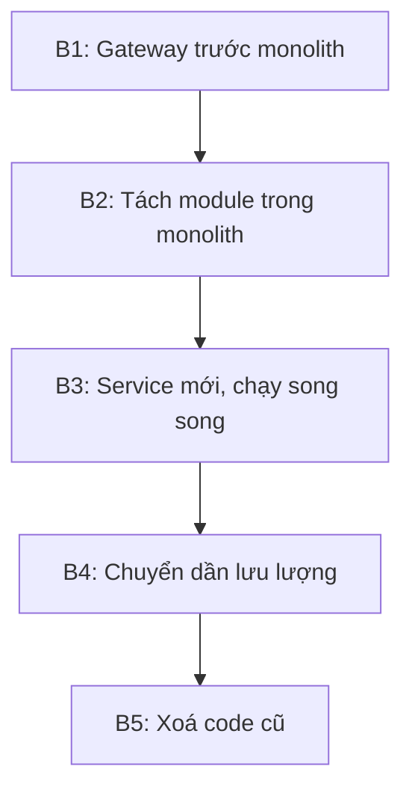

# 18.11 — Mini case study

> Nguồn: https://tiennhm.io.vn/docs/dotnet-backend-zero-to-senior/stage-05-senior-engineering/module-18-microservices/18.11-mini-case-study
> Tách Notification Service khỏi monolith CRM: kế hoạch Strangler Fig năm bước, ba sự cố gặp phải và cách xử lý từng cái.

> Một ca tách service thật: đội 9 người, monolith CRM chạy 3 năm, cần tách **Notification** ra riêng vì nó chiếm 70% tài nguyên vào giờ cao điểm nhưng chỉ là 5% code. Bài này đi qua **toàn bộ kế hoạch** và — quan trọng hơn — **ba sự cố xảy ra trong lúc tách** mà kế hoạch ban đầu không lường được: mất thông báo do dual write, người dùng nhận email trùng sau khi bật song song, và độ trễ tăng vì gọi ngược về monolith lấy thông tin người nhận. Cả ba đều có thể phòng trước nếu biết, và đó là giá trị thật của ca này.

## Mục tiêu bài học

Sau bài này bạn có thể:

- Lập kế hoạch tách một service theo Strangler Fig.
- Chọn module nào tách trước dựa trên tiêu chí rõ ràng.
- Lường trước ba loại sự cố hay gặp khi tách.
- Quyết định khi nào dừng hoặc quay lại.

## Nội dung bài học

### 18.12.1 — Đề bài

**Hiện trạng:** monolith ASP.NET Core, SQL Server, 4 instance, đội 9 người.

```
Gio cao diem (9h va 14h):
  - Module Notification gửi ~50.000 email/giờ (nhắc lịch, cảnh báo deal)
  - CPU của cả ứng dụng leo lên 85%
  - API nghiệp vụ chậm theo: p99 từ 300ms lên 2,1 giây
  - Phải scale cả 4 instance lên 12 -> tốn tiền cho phần KHÔNG cần scale
```

**Mục tiêu:** Notification scale độc lập, API nghiệp vụ không bị ảnh hưởng.

**Ràng buộc:** không được mất thông báo nào, không downtime, và phải quay lại được nếu hỏng.

### 18.12.2 — Vì sao chọn Notification trước

Bốn tiêu chí, và Notification đạt cả bốn:

| Tiêu chí | Notification |
|---|---|
| Ít phụ thuộc vào module khác | Chỉ cần: gửi cho ai, nội dung gì |
| Ranh giới nghiệp vụ rõ | "Gửi thông báo" là một việc tách bạch |
| Nhu cầu scale khác phần còn lại | **Chính là lý do tách** |
| Hỏng thì ít nghiêm trọng | Email trễ vài phút không làm hỏng dữ liệu |

Tiêu chí cuối đáng chú ý: tách service đầu tiên **nên chọn chỗ chịu được rủi ro**. Đây là lần đầu đội làm việc này, và sẽ có sai sót. Tách Billing hay Order trước là đặt cược vào lần đầu.

### 18.12.3 — Kế hoạch năm bước



**Bước 1 — Gateway.** Đặt YARP trước monolith, mọi route vẫn về monolith. Tự nó không đổi gì nhưng tạo **điểm chuyển đổi** cho các bước sau ([bài 18.4](18.3-api-gateway-yarp-dotnet.mdx)).

**Bước 2 — Tách module trong monolith.** Trước khi tách ra tiến trình riêng, tách thành module có ranh giới rõ **bên trong** monolith:

```
Modules/Notification/
  Notification.Domain/
  Notification.Application/
  Notification.Infrastructure/
  Notification.Contracts/        <- chỉ project này được module khác dùng
```

Bước này phát hiện ra 14 chỗ code khác gọi thẳng vào nội bộ Notification — con số mà không ai ngờ. Sửa chúng **trong monolith** rẻ hơn rất nhiều so với sửa sau khi đã tách ra mạng ([bài 18.2](18.1-when-not-to-use-microservices.mdx)).

**Bước 3 — Service mới chạy song song.** Notification Service mới nhận message từ broker, xử lý, nhưng **không gửi email thật** — chỉ ghi log. So sánh log với monolith để xác nhận hành vi giống nhau.

**Bước 4 — Chuyển dần lưu lượng.** Bật gửi thật cho 5% thông báo, theo dõi, tăng dần: 5% → 25% → 50% → 100%.

**Bước 5 — Xoá code cũ** sau hai tuần ổn định.

### 18.12.4 — Sự cố 1: mất thông báo

**Xảy ra ở bước 3.** Monolith ghi database rồi publish message cho service mới:

```csharp
// Code ban đầu — dual write
await _db.SaveChangesAsync(ct);
await _bus.Publish(new SendNotificationCommand(...), ct);   // có thể thất bại
```

Trong một đợt deploy, tiến trình bị dừng giữa hai lệnh. 340 thông báo **không bao giờ** được gửi, và không có dấu vết nào trong log — vì về mặt monolith, mọi thứ đã thành công.

Đây chính là dual write problem ([bài 17.3](../module-17-distributed-systems/17.2-messaging-fears-lost-duplicates.mdx)).

**Sửa:** đưa message vào outbox trong cùng transaction.

```csharp
_db.OutboxMessages.Add(OutboxMessage.From(new SendNotificationCommand(...)));
await _db.SaveChangesAsync(ct);        // MỘT transaction cho cả hai
```

**Bài học:** outbox phải có **trước** khi bắt đầu tách, không phải thêm vào khi đã mất dữ liệu ([bài 17.4](../module-17-distributed-systems/17.3-outbox-pattern-applied.mdx)).

### 18.12.5 — Sự cố 2: email trùng

**Xảy ra ở bước 4.** Khi bật gửi thật cho 5%, một số người dùng nhận **hai email giống hệt**.

Nguyên nhân: cơ chế chia 5% dựa trên `Random`, và monolith cũ **vẫn đang gửi 100%**. Kế hoạch là "monolith gửi 95%, service mới gửi 5%", nhưng code thực tế không tắt phần tương ứng ở monolith — nên 5% đó được gửi **hai lần**.

**Sửa ngay:** thêm bảng chống trùng dùng chung, khoá theo `NotificationId`.

```csharp
try
{
    _db.SentNotifications.Add(new SentNotification { Id = notification.Id });
    await _db.SaveChangesAsync(ct);       // PRIMARY KEY chặn trùng
}
catch (DbUpdateException ex) when (ex.IsUniqueViolation())
{
    return;                                // bên kia đã gửi
}

await _emailSender.SendAsync(notification, ct);
```

**Bài học:** trong giai đoạn chạy song song, **luôn** có cơ chế chống trùng dùng chung, kể cả khi bạn tin rằng việc chia lưu lượng đã đúng. Niềm tin đó chính là thứ sai.

### 18.12.6 — Sự cố 3: độ trễ tăng

**Xảy ra ở bước 4, mức 50%.** Thời gian xử lý một thông báo tăng từ 40ms lên 380ms.

Nguyên nhân: service mới cần tên và email người nhận, nên nó **gọi ngược về monolith**:

```csharp
// Mỗi thông báo = một lời gọi HTTP tới monolith
var user = await _monolithClient.GetUserAsync(notification.UserId, ct);
await _emailSender.SendAsync(user.Email, ...);
```

50.000 thông báo mỗi giờ nghĩa là 50.000 lời gọi HTTP thêm — và chúng đánh vào chính monolith mà ta đang cố giảm tải.

**Sửa:** đưa dữ liệu cần thiết **vào chính message**.

```csharp
public sealed record SendNotificationCommand(
    Guid NotificationId,
    Guid UserId,
    string RecipientEmail,      // đưa vào message
    string RecipientName,       // đưa vào message
    string Subject,
    string Body);
```

```
Độ trễ: 380ms -> 35ms
Tải lên monolith: giảm về 0
```

**Bài học:** integration event phải **tự chứa** ([bài 17.2](../module-17-distributed-systems/17.1-event-driven-architecture-when-to-use.mdx)). Nếu consumer phải gọi ngược về producer để hiểu message, bạn chưa thật sự tách — chỉ thêm một chặng mạng.

### 18.12.7 — Kết quả

| Chỉ số | Trước | Sau |
|---|---|---|
| p99 API nghiệp vụ giờ cao điểm | 2100ms | **310ms** |
| Số instance API cần lúc cao điểm | 12 | **4** |
| Instance notification | — | 2–8 (tự co giãn) |
| Chi phí hạ tầng giờ cao điểm | 100% | **~55%** |
| Thời gian thực hiện | — | 7 tuần (kế hoạch 4 tuần) |

Hàng cuối trung thực: kế hoạch 4 tuần, thực tế 7 tuần, và ba sự cố ở trên chiếm phần lớn phần chênh. Đó là con số nên dùng khi ước lượng lần tách tiếp theo.

### 18.12.8 — Rà lại code của bạn

**Danh sách rà soát khi tách service đầu tiên**

- [ ] Module được chọn ít phụ thuộc và hỏng thì ít nghiêm trọng.
- [ ] Đã tách thành module trong monolith trước khi tách ra tiến trình.
- [ ] Outbox đã có sẵn trước khi bắt đầu tách.
- [ ] Có cơ chế chống trùng dùng chung trong giai đoạn chạy song song.
- [ ] Integration event tự chứa, consumer không gọi ngược về producer.
- [ ] Mỗi bước đảo ngược được bằng đổi cấu hình.
- [ ] Lưu lượng chuyển dần theo phần trăm, không chuyển một lần.
- [ ] Code cũ được xoá sau khi ổn định, không để lại phòng khi cần.
- [ ] Đã ghi lại thời gian thực tế để ước lượng lần sau.

## Bài tập áp dụng

#### Bài 1 — Chọn module tách trước

Với hệ thống của bạn, chấm điểm ba module theo bốn tiêu chí ở mục 18.12.2 và chọn một.

**Tiêu chí hoàn thành:** bạn chọn được một module, và nêu rõ vì sao **tiêu chí thứ tư** — hỏng thì ít nghiêm trọng — lại quan trọng hơn ba tiêu chí kia ở lần tách đầu tiên.

Gợi ý và lời giải — Bài 1

**Gợi ý.** Ba tiêu chí đầu nói module nào *tách được*. Tiêu chí thứ tư nói module nào *nên tách trước*.

**Lời giải — chấm ba module:**

| Tiêu chí | Notification | Reporting | Billing |
|---|---|---|---|
| Ít phụ thuộc vào module khác | **Cao** — cần email + nội dung | **Cao** — chỉ đọc | Thấp — ghi vào Lead, KhachHang |
| Ranh giới nghiệp vụ rõ | **Cao** — "gửi thông báo" | **Cao** — "tổng hợp số liệu" | Trung bình — lẫn với quy trình chốt deal |
| Nhu cầu scale khác biệt | **Cao** — 50.000 email/giờ | **Cao** — 78% CPU | Thấp |
| **Hỏng thì ít nghiêm trọng** | **Cao** — email trễ vài phút | **Cao** — báo cáo trễ | **Thấp — sai tiền** |
| **Kết luận** | **Tách trước** | Tách thứ hai | Chưa tách |

Kiểm chứng tiêu chí 1 bằng số, không bằng cảm nhận:

```bash
for m in Notification Reporting Billing; do
  vao=$(grep -rn "Crm\.$m\." --include="*.cs" src/ | grep -v "src/Crm.$m/" | wc -l)
  ra=$(grep -rno "Crm\.\(Leads\|KhachHang\|HoaDon\|NguoiDung\)\." --include="*.cs" src/Crm.$m/ | wc -l)
  echo "$m: $vao chỗ gọi VÀO, $ra chỗ gọi RA"
done
```

```text
Notification: 14 chỗ gọi VÀO, 3 chỗ gọi RA
Reporting:    3 chỗ gọi VÀO, 22 chỗ gọi RA
Billing:      31 chỗ gọi VÀO, 28 chỗ gọi RA
```

**Hai chiều này nói hai chuyện khác nhau:**

```text
Gọi VÀO  = số chỗ phải sửa khi tách ra  -> chi phí tách
Gọi RA   = số phụ thuộc service mới cần -> chi phí VẬN HÀNH sau khi tách
```

Reporting gọi ra 22 chỗ nhưng toàn là **đọc** — có thể thay bằng bản sao dữ liệu hoặc view, không cần gọi mạng. Billing gọi ra 28 chỗ và phần lớn là **ghi** — mỗi chỗ là một saga tiềm năng.

**Vì sao tiêu chí thứ tư quan trọng hơn ba tiêu chí kia ở lần đầu:**

**1. Ba tiêu chí đầu đo module. Tiêu chí thứ tư đo ĐỘI.**

```text
Lần tách đầu tiên, đội chưa từng làm việc này.
Họ sẽ gặp: dual write, xử lý trùng, message không tự chứa,
           health check sai, và vài thứ chưa ai lường trước.

Ba sự cố trong case study ở trên đều là sự cố của người mới làm,
không phải sự cố của module.
```

**2. Sai sót ở Notification là email trễ. Sai sót ở Billing là tiền sai.**

```text
Notification hỏng   -> gửi lại, người dùng nhận trễ 10 phút
Billing hỏng        -> hoá đơn trùng, khách bị trừ tiền hai lần
                    -> phải hoàn tiền, phải giải trình, phải đối chiếu sổ sách
```

Cùng một lỗi kỹ thuật (thiếu chống trùng — sự cố 2 trong case study), hai hậu quả khác nhau hoàn toàn.

**3. Lần tách đầu tiên quyết định đội có làm lần thứ hai hay không.**

```text
Lần đầu suôn sẻ    -> đội tin vào cách làm, tiếp tục
Lần đầu gây sự cố tiền bạc -> dự án bị dừng, và thường là dừng hẳn
```

Đây là lý do mang tính tổ chức, không phải kỹ thuật — nhưng nó quyết định kết quả nhiều hơn phần kỹ thuật.

**4. Và có một lý do thứ tư ít được nói: nó cho phép bạn CỐ Ý thử nghiệm.**

```text
Với Notification, bạn dám:
    - tắt service mới giữa giờ cao điểm để xem điều gì xảy ra
    - gửi trùng có chủ đích để kiểm tra cơ chế chống trùng
    - để message tồn đọng 1 giờ để xem hàng đợi cư xử thế nào

Với Billing, bạn không dám làm bất kỳ điều nào trong số đó.
```

Một service mà bạn **dám thử nghiệm trên đó** là một service bạn học được nhiều nhất từ nó.

**Khi không có module nào đạt tiêu chí thứ tư:**

```text
Mọi module đều "hỏng thì nghiêm trọng"
-> đó là tín hiệu hệ thống chưa nên tách
-> hoặc: tách một phần ĐỌC ra trước
        (báo cáo, tra cứu, xuất dữ liệu)
        vì phần đọc hỏng thì ít nghiêm trọng hơn phần ghi
```

**Ghi lại lựa chọn kèm lý do bác bỏ:**

```markdown
## Module tách đầu tiên: Notification

**Chọn vì:** đạt cả bốn tiêu chí, đặc biệt là tiêu chí thứ tư.

**Bác bỏ Reporting:** đạt bốn tiêu chí nhưng 22 chỗ gọi ra cần thiết kế
lại cách lấy dữ liệu. Tách sau, khi đội đã có kinh nghiệm.

**Bác bỏ Billing:** hỏng thì sai tiền. Không tách cho đến khi đã tách
thành công ít nhất hai service khác.
```

Phần "bác bỏ" quan trọng ngang phần "chọn" — vì sáu tháng sau sẽ có người hỏi "sao không tách Billing?", và câu trả lời cần có sẵn.

---

#### Bài 2 — Tìm phụ thuộc ẩn

Tách module đó thành project riêng trong solution hiện tại và đếm số lỗi biên dịch — đó là số chỗ đang gọi vào nội bộ.

**Tiêu chí hoàn thành:** bạn có **con số cụ thể**, đã phân loại lỗi theo kiểu, và biết chỗ nào sửa được bằng `Contracts`, chỗ nào cần thiết kế lại.

Gợi ý và lời giải — Bài 2

**Gợi ý.** Trình biên dịch là công cụ tìm phụ thuộc chính xác nhất bạn có. Nó không bỏ sót như `grep`, và không đoán như trực giác.

**Lời giải — tách project rồi để trình biên dịch nói:**

```bash
mkdir -p src/Crm.Notification
dotnet new classlib -o src/Crm.Notification
dotnet sln add src/Crm.Notification

git mv src/Crm.Api/Modules/Notification/* src/Crm.Notification/

# Monolith tham chiếu module mới, nhưng module mới KHÔNG tham chiếu ngược
dotnet add src/Crm.Api reference src/Crm.Notification

dotnet build 2>&1 | grep -E "error CS" | tee /tmp/loi.txt | wc -l
```

```text
47
```

47 lỗi — nhiều hơn con số 14 trong case study, vì lần này đếm cả lỗi ở tầng test. Phân loại chúng:

```bash
grep -oE "error CS[0-9]+" /tmp/loi.txt | sort | uniq -c | sort -rn
```

```text
     31 error CS0246    # không tìm thấy kiểu — module gọi RA
     11 error CS0122    # không truy cập được — module khác gọi VÀO nội bộ
      3 error CS1061    # không có thành viên đó
      2 error CS0234    # không có namespace đó
```

```bash
# Lỗi nào ở đâu?
grep -oE "^[^(]+" /tmp/loi.txt | xargs -n1 dirname | sort | uniq -c | sort -rn
```

```text
     22 src/Crm.Notification/Application
     14 src/Crm.Api/Features/Leads
      6 src/Crm.Api/Features/KhachHang
      5 src/Crm.Api.Tests
```

**Con số 14 ở `Features/Leads` chính là "14 chỗ gọi thẳng vào nội bộ" của case study** — và nó lộ ra ngay trong lần biên dịch đầu tiên, không cần ai phải nhớ.

**Phân loại từng nhóm và cách xử lý:**

| Nhóm | Số | Nguyên nhân | Cách sửa |
|---|---:|---|---|
| Module khác dùng entity nội bộ của Notification | 11 | `new EmailTemplate(...)` trực tiếp | **Contracts** — thêm `IGuiThongBao` |
| Notification đọc entity của Leads | 18 | Cần tên, email người nhận | **Thiết kế lại** — đưa vào message |
| Notification ghi vào bảng của module khác | 4 | Cập nhật `Lead.LanThongBaoCuoi` | **Thiết kế lại** — sự kiện ngược |
| Notification dùng tiện ích chung | 9 | `DateTimeProvider`, `Result` | **Project dùng chung** |
| Test tham chiếu nội bộ | 5 | Dựng entity trực tiếp trong test | Sửa test |

**Ba nhóm đầu là ba mức độ khó khác nhau, và cần phân biệt rõ:**

**1. Sửa được bằng `Contracts` (11 chỗ) — dễ, làm ngay.**

```csharp
// src/Crm.Notification.Contracts/IGuiThongBao.cs — project duy nhất module khác được tham chiếu
public interface IGuiThongBao
{
    Task GuiAsync(YeuCauGuiThongBao yeuCau, CancellationToken ct);
}

public sealed record YeuCauGuiThongBao(
    Guid   NguoiNhanId,
    string Email,
    string HoTen,
    string TieuDe,
    string NoiDung);
```

```csharp
// TRƯỚC — Leads dựng entity nội bộ của Notification
var mau = new EmailTemplate { Ten = "nhac-lich", ThamSo = ... };
await _notificationDb.Queue.AddAsync(new QueuedEmail(mau, lead.Email));

// SAU — Leads chỉ biết interface
await _thongBao.GuiAsync(new YeuCauGuiThongBao(
    lead.Id, lead.Email, lead.HoTen, "Nhắc lịch hẹn", noiDung), ct);
```

**2. Cần thiết kế lại (18 chỗ) — đây là phần thật sự khó.**

```text
Notification đang đọc thẳng Lead để lấy tên và email.
Không thể sửa bằng Contracts — vì nó đang lấy DỮ LIỆU, không phải gọi HÀNH VI.

Hai lựa chọn:
  a) Notification gọi ngược về Leads    -> sự cố 3 trong case study, 380ms
  b) Đưa dữ liệu vào message            -> đúng, 35ms
```

Đây chính là bài 3 ở dưới.

**3. Ghi ngược vào module khác (4 chỗ) — nguy hiểm nhất, và dễ bị bỏ qua.**

```csharp
// Notification đang ghi vào bảng của Leads
lead.LanThongBaoCuoi = DateTime.UtcNow;
await _db.SaveChangesAsync(ct);
```

```text
Sau khi tách, hai service dùng hai database khác nhau
-> dòng này không còn chạy được
-> và nếu ai đó "sửa" bằng cách cho hai service dùng chung database,
   thì đã tạo ra distributed monolith ngay từ service đầu tiên (bài 18.7)
```

Cách đúng: Notification phát sự kiện, Leads tự cập nhật của mình.

```csharp
// Notification phát
await _bus.Publish(new DaGuiThongBao(lead.Id, DateTime.UtcNow), ct);

// Leads nghe và tự cập nhật bảng của mình
public async Task Consume(ConsumeContext<DaGuiThongBao> ctx)
{
    await _db.Leads
        .Where(l => l.Id == ctx.Message.LeadId)
        .ExecuteUpdateAsync(s => s.SetProperty(l => l.LanThongBaoCuoi, ctx.Message.ThoiDiem));
}
```

**Vì sao cách này tốt hơn grep:**

```text
grep "Crm.Notification" -> tìm được chỗ có tên đầy đủ
                        -> BỎ SÓT: using ở đầu file rồi dùng tên ngắn
                        -> BỎ SÓT: kiểu suy ra bằng var
                        -> BỎ SÓT: extension method
                        -> BÁO NHẦM: tên trong chuỗi, trong chú thích

Trình biên dịch -> không bỏ sót, không báo nhầm, và chỉ đúng dòng
```

**Giữ cho nó không quay lại, sau khi đã sửa hết:**

```csharp
[Fact]
public void Module_khac_chi_duoc_tham_chieu_Contracts_cua_Notification()
{
    var ketQua = Types.InAssembly(typeof(LeadService).Assembly)
        .That().ResideInNamespaceStartingWith("Crm.Api")
        .ShouldNot()
        .HaveDependencyOnAny(
            "Crm.Notification.Domain",
            "Crm.Notification.Application",
            "Crm.Notification.Infrastructure")
        .GetResult();

    ketQua.IsSuccessful.Should().BeTrue(
        "chỉ Crm.Notification.Contracts được phép dùng từ ngoài: {0}",
        string.Join(", ", ketQua.FailingTypeNames ?? []));
}
```

Test này đáng thêm **ngay khi số lỗi biên dịch về 0**, không phải sau khi tách xong — vì trong vài tuần giữa hai mốc đó, phụ thuộc mới sẽ được thêm vào nếu không có gì chặn.

**Và một lưu ý về thứ tự: đừng tách ra tiến trình riêng khi con số này chưa về 0.**

```text
47 lỗi biên dịch = 47 chỗ phải sửa
Sửa trong monolith: trình biên dịch chỉ đúng dòng, sửa xong biết ngay đúng hay sai

Nếu tách ra tiến trình trước:
    -> 47 chỗ đó biến thành lời gọi mạng
    -> không còn lỗi biên dịch, nhưng lỗi vẫn còn — chỉ là lúc chạy
    -> và mỗi chỗ giờ có thêm: timeout, retry, và khả năng thất bại từng phần
```

---

#### Bài 3 — Thiết kế message tự chứa

Viết integration event cho module đó, đảm bảo consumer không cần gọi ngược về bất kỳ đâu.

**Tiêu chí hoàn thành:** consumer của bạn **không có** một `HttpClient` hay `DbContext` nào trỏ về producer, và bạn xử lý được câu hỏi khó nhất: dữ liệu trong message có thể đã cũ.

Gợi ý và lời giải — Bài 3

**Gợi ý.** Nếu consumer cần gọi ngược để hiểu message, thì message đó chưa phải một sự kiện — nó chỉ là một thông báo "có chuyện xảy ra, tự đi mà tìm hiểu".

**Lời giải — ba mức độ tự chứa:**

```csharp
// MỨC 0 — chỉ có id. Consumer BẮT BUỘC gọi ngược.
public sealed record ThongBaoDuocTao(Guid NotificationId);

// MỨC 1 — có id của các thực thể liên quan. Vẫn phải gọi ngược.
public sealed record ThongBaoDuocTao(Guid NotificationId, Guid LeadId, Guid MauId);

// MỨC 2 — tự chứa. Consumer xử lý được mà không cần gọi ai.
public sealed record ThongBaoDuocTao(
    Guid     ThongBaoId,
    Guid     NguoiNhanId,
    string   EmailNguoiNhan,
    string   HoTenNguoiNhan,
    string   TieuDe,
    string   NoiDungHtml,
    string   NoiDungThuan,
    LoaiThongBao Loai,
    DateTime ThoiDiemTao,
    int      PhienBanNguoiNhan);   // để xử lý dữ liệu cũ — xem bên dưới
```

Consumer sau khi có message mức 2:

```csharp
public sealed class GuiThongBaoConsumer : IConsumer<ThongBaoDuocTao>
{
    private readonly IEmailSender _email;
    private readonly ThongBaoDbContext _db;      // database CỦA CHÍNH service này
    private readonly ILogger<GuiThongBaoConsumer> _log;

    public async Task Consume(ConsumeContext<ThongBaoDuocTao> ctx)
    {
        var tin = ctx.Message;

        // Khử trùng lặp — bắt buộc với at-least-once
        try
        {
            _db.DaGui.Add(new DaGui { ThongBaoId = tin.ThongBaoId, ThoiDiem = DateTime.UtcNow });
            await _db.SaveChangesAsync(ctx.CancellationToken);
        }
        catch (DbUpdateException ex) when (ex.IsUniqueViolation())
        {
            _log.LogInformation("Bỏ qua {Id}: đã gửi", tin.ThongBaoId);
            return;
        }

        // Không có lời gọi nào ra ngoài ngoài chính việc gửi email
        await _email.SendAsync(
            tin.EmailNguoiNhan, tin.HoTenNguoiNhan,
            tin.TieuDe, tin.NoiDungHtml, tin.NoiDungThuan,
            ctx.CancellationToken);
    }
}
```

**Kiểm chứng "không gọi ngược" bằng test, không bằng mắt:**

```csharp
[Fact]
public void Consumer_khong_duoc_phu_thuoc_vao_producer()
{
    var kieuConsumer = typeof(GuiThongBaoConsumer);
    var thamSo = kieuConsumer.GetConstructors().Single().GetParameters();

    thamSo.Should().NotContain(p => p.ParameterType == typeof(HttpClient),
        "consumer gọi HTTP ngược về producer là dấu hiệu message chưa tự chứa");

    thamSo.Should().NotContain(p => p.ParameterType.Name.Contains("CrmDbContext"),
        "consumer đọc database của producer nghĩa là chưa tách thật sự");
}

[Fact]
public async Task Consumer_xu_ly_duoc_khi_producer_dang_TAT()
{
    await fixture.NgatAsync("crm-monolith");         // tắt hẳn producer

    await harness.Bus.Publish(new ThongBaoDuocTao(
        ThongBaoId: Guid.NewGuid(), NguoiNhanId: Guid.NewGuid(),
        EmailNguoiNhan: "a@vi.du", HoTenNguoiNhan: "Nguyễn Văn A",
        TieuDe: "Nhắc lịch", NoiDungHtml: "<p>Xin chào</p>", NoiDungThuan: "Xin chào",
        Loai: LoaiThongBao.NhacLich, ThoiDiemTao: DateTime.UtcNow, PhienBanNguoiNhan: 7));

    (await harness.Consumed.Any<ThongBaoDuocTao>()).Should().BeTrue();
    emailGia.DaGui.Should().ContainSingle(e => e.Den == "a@vi.du");
}
```

Test thứ hai là test đáng giá nhất: **nếu consumer xử lý được khi producer đã tắt, message thật sự tự chứa.** Không có cách nào lách được nó.

**Câu hỏi khó: dữ liệu trong message có thể đã cũ.**

```text
t=0    Message phát đi, chứa email "an@congty.vn"
t=10s  Người dùng đổi email thành "an.nguyen@congty.vn"
t=30s  Message được xử lý -> gửi tới email CŨ
```

**Đây là đánh đổi thật, không phải lỗi** — và có ba cách xử lý tuỳ theo nghiệp vụ:

**Cách 1 — chấp nhận, vì ảnh chụp tại thời điểm phát là ĐÚNG.**

```text
"Gửi thông báo tới email đăng ký tại thời điểm tạo thông báo"
-> đây là hành vi hợp lệ, và với phần lớn thông báo là hành vi ĐÚNG

Một hoá đơn gửi tới địa chỉ tại thời điểm xuất hoá đơn
KHÔNG phải lỗi — đó là điều sổ sách yêu cầu.
```

**Cách 2 — kèm số phiên bản, consumer bỏ qua message cũ.**

```csharp
var phienBanHienTai = await _db.NguoiNhan
    .Where(n => n.Id == tin.NguoiNhanId)
    .Select(n => (int?)n.PhienBan)
    .FirstOrDefaultAsync(ct);

if (phienBanHienTai is int pb && pb > tin.PhienBanNguoiNhan)
{
    _log.LogInformation("Bỏ qua {Id}: dữ liệu người nhận đã đổi (v{Cu} < v{Moi})",
        tin.ThongBaoId, tin.PhienBanNguoiNhan, pb);
    return;
}
```

Lưu ý: bảng `NguoiNhan` ở đây nằm trong database **của chính Notification Service**, được cập nhật bằng một luồng sự kiện riêng. Consumer vẫn không gọi ngược về producer.

**Cách 3 — đồng bộ bản sao đọc bằng sự kiện.**

```csharp
// Notification Service giữ bản sao TỐI THIỂU của dữ liệu nó cần
public sealed class NguoiNhan
{
    public Guid   Id      { get; set; }
    public string Email   { get; set; } = "";
    public string HoTen   { get; set; } = "";
    public int    PhienBan { get; set; }
}

public sealed class NguoiDungDoiThongTinConsumer : IConsumer<NguoiDungDaDoiThongTin>
{
    public async Task Consume(ConsumeContext<NguoiDungDaDoiThongTin> ctx)
    {
        var tin = ctx.Message;

        // Chỉ ghi nếu message MỚI HƠN bản đang có — chống message tới không đúng thứ tự
        await _db.NguoiNhan
            .Where(n => n.Id == tin.NguoiDungId && n.PhienBan < tin.PhienBan)
            .ExecuteUpdateAsync(s => s
                .SetProperty(n => n.Email,    tin.Email)
                .SetProperty(n => n.HoTen,    tin.HoTen)
                .SetProperty(n => n.PhienBan, tin.PhienBan),
                ctx.CancellationToken);
    }
}
```

**Điều kiện `n.PhienBan < tin.PhienBan` làm consumer này vừa idempotent vừa chịu được message tới sai thứ tự** — hai vấn đề khác nhau, một dòng code.

**Chọn cách nào:**

| Nghiệp vụ | Cách | Vì sao |
|---|---|---|
| Hoá đơn, hợp đồng, biên lai | **1 — ảnh chụp** | Sổ sách cần dữ liệu tại thời điểm phát sinh |
| Nhắc lịch, cảnh báo | **2 — bỏ qua bản cũ** | Thông tin cũ không còn hữu ích |
| Danh sách, tra cứu, hiển thị | **3 — bản sao đọc** | Cần dữ liệu mới nhất, chấp nhận trễ vài giây |

**Và một giới hạn thực tế của message tự chứa: kích thước.**

```text
Message tự chứa cho email: khoảng 2–6 KB, không vấn đề gì

Message tự chứa cho "đơn hàng 500 dòng, kèm đầy đủ thông tin sản phẩm":
    -> có thể vượt giới hạn của broker
    -> RabbitMQ mặc định 128 MB mỗi frame, nhưng hiệu năng giảm rõ từ ~1 MB
    -> Kafka mặc định 1 MB mỗi message
```

Khi message quá lớn, mẫu **claim check** giải quyết được mà vẫn giữ nguyên tinh thần tự chứa:

```csharp
public sealed record DonHangDaTao(
    Guid   DonHangId,
    string MaDonHang,
    decimal TongTien,
    string  DuongDanChiTiet);   // link tới blob storage, KHÔNG phải tới producer
```

```text
Điểm mấu chốt: đường dẫn trỏ tới BLOB STORAGE, không trỏ về producer.
-> producer tắt, consumer vẫn đọc được chi tiết
-> vẫn thoả test "xử lý được khi producer đang tắt"
```

Nối lại ba bài: bài 1 chọn module, bài 2 đếm phụ thuộc, bài 3 loại bỏ phụ thuộc cuối cùng — phụ thuộc lúc chạy. Sự cố 3 trong case study ở trên (380 ms) xảy ra vì bước ba bị làm sau khi đã tách, thay vì trước.

## Tự kiểm tra

### Vì sao service tách đầu tiên nên chọn chỗ hỏng thì ít nghiêm trọng?

Vì đây là lần đầu đội làm việc này và chắc chắn sẽ có sai sót. Tách một module mà email trễ vài phút không làm hỏng dữ liệu thì rủi ro chấp nhận được, còn tách Billing hay Order trước là đặt cược vào lần đầu.

### Vì sao phải tách thành module trong monolith trước?

Vì bước đó phơi bày mọi chỗ code khác đang gọi thẳng vào nội bộ module. Sửa những chỗ đó trong monolith rẻ hơn rất nhiều so với sửa sau khi đã tách ra thành lời gọi mạng.

### Sự cố mất thông báo xảy ra vì đâu?

Dual write. Monolith ghi database rồi publish message trong hai bước riêng, và tiến trình bị dừng giữa hai bước trong một đợt deploy. Về phía monolith mọi thứ đã thành công nên không có dấu vết nào trong log.

### Vì sao cần chống trùng trong giai đoạn chạy song song?

Vì cơ chế chia lưu lượng có thể sai mà bạn không biết, như trong ca này khi monolith vẫn gửi 100 phần trăm. Một bảng chống trùng dùng chung với unique constraint đảm bảo mỗi thông báo chỉ gửi một lần bất kể ai gửi.

### Vì sao độ trễ tăng khi service mới gọi ngược về monolith?

Vì mỗi thông báo thành một lời gọi HTTP thêm, và chúng đánh vào chính monolith mà ta đang cố giảm tải. Đưa dữ liệu cần thiết vào chính message giải quyết cả hai vấn đề cùng lúc.

### Bài học chung từ sự cố thứ ba là gì?

Integration event phải tự chứa. Nếu consumer phải gọi ngược về producer để hiểu message thì bạn chưa thật sự tách, chỉ thêm một chặng mạng vào cùng một sự phụ thuộc.

## Kết luận

Ba điều đáng nhớ nhất:

1. **Tách module trong monolith trước** — đó là nơi phát hiện phụ thuộc ẩn với chi phí thấp nhất.
2. **Outbox và chống trùng phải có trước khi bắt đầu**, không phải thêm sau khi mất dữ liệu.
3. **Message tự chứa.** Gọi ngược về producer nghĩa là chưa tách xong.

## Tham khảo

- [Strangler Fig Application (Martin Fowler)](https://martinfowler.com/bliki/StranglerFigApplication.html)
- [Transactional Outbox pattern](https://microservices.io/patterns/data/transactional-outbox.html)
- [Interservice communication trong microservices](https://learn.microsoft.com/en-us/azure/architecture/microservices/design/interservice-communication)
- [.NET microservices architecture guide](https://learn.microsoft.com/en-us/dotnet/architecture/microservices/)

## Điều hướng

- **Bài trước:** [18.10 — Mở rộng và đào sâu](18.10-advanced-notes.mdx)
- **Bài tiếp theo:** [18.12 — Ví dụ thực tế nhanh](18.12-quick-real-world-example.mdx)
- **Về module:** [Trang mục lục](./)
