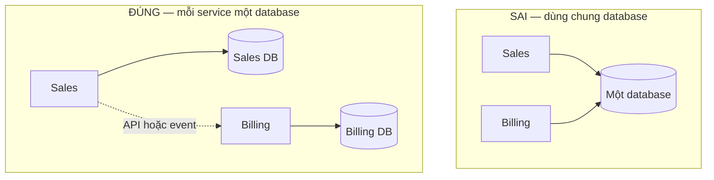
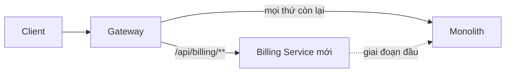

# 18.3 — 2. Service decomposition

> Nguồn: https://tiennhm.io.vn/docs/dotnet-backend-zero-to-senior/stage-05-senior-engineering/module-18-microservices/18.3-service-decomposition
> Tách theo subdomain chứ không theo tầng, database-per-service, Strangler Fig, và cách xử lý dữ liệu dùng chung khi không được JOIN nữa.

> Tách sai chỗ còn tệ hơn không tách. Hai nguyên tắc quyết định: tách theo **subdomain nghiệp vụ** (Sales, Billing, Inventory) chứ **không** theo tầng kỹ thuật (Auth Service, Validation Service, Database Service), và **mỗi service sở hữu dữ liệu của nó** — không service nào được đọc trực tiếp bảng của service khác. Vi phạm nguyên tắc thứ hai là sai lầm phổ biến nhất: hai service dùng chung một database trông có vẻ tiện, nhưng nó tạo ra thứ tệ nhất của cả hai thế giới — bạn chịu độ phức tạp vận hành của microservices mà **không** có được triển khai độc lập, vì mỗi lần đổi schema là một lần phối hợp triển khai. Và cách tách an toàn duy nhất trên hệ đang chạy là **Strangler Fig**: mọc dần thứ mới quanh thứ cũ, không bao giờ viết lại một lần.

## Mục tiêu bài học

Sau bài này bạn có thể:

- Tách service theo subdomain thay vì theo tầng kỹ thuật.
- Giải thích vì sao dùng chung database phá hỏng toàn bộ lợi ích.
- Áp dụng Strangler Fig để tách dần mà không dừng hệ thống.
- Xử lý dữ liệu dùng chung khi không còn `JOIN`.
- Nhận ra ranh giới tách sai và sửa lại.

## Nội dung bài học

### 18.3.1 — Tách theo subdomain, không theo tầng

```
SAI — tach theo tang ky thuat
  Auth Service
  Validation Service
  Database Service
  Notification Service
```

Vì sao sai: mọi tính năng đều phải đi qua **tất cả** các service. Thêm một trường vào form khách hàng chạm Validation Service, Database Service và Auth Service. Bạn đã tạo ra một hệ thống mà **mỗi thay đổi đều cần phối hợp triển khai** — chính là thứ microservices cố tránh.

```
DUNG — tach theo subdomain nghiep vu
  Sales Service       (lead, opportunity, quote)
  Billing Service     (invoice, payment, subscription)
  Inventory Service   (product, stock, warehouse)
```

Mỗi service **tự làm trọn** một loại nhu cầu nghiệp vụ. Thêm trường vào lead chỉ chạm Sales Service.

Cách nhận biết ranh giới đúng: **từ ngữ có nghĩa khác nhau ở hai bên**. Với Sales, "customer" là người có thể mua hàng — quan tâm ngân sách, nhu cầu, người ra quyết định. Với Billing, "customer" là một đơn vị thanh toán — quan tâm mã số thuế, hạn mức tín dụng, chu kỳ hoá đơn.

```csharp
// Sales Service — customer theo goc nhin ban hang
public sealed class Customer
{
    public CustomerId Id { get; private set; }
    public string CompanyName { get; private set; }
    public Money EstimatedBudget { get; private set; }
    public ContactPerson DecisionMaker { get; private set; }
}

// Billing Service — CUNG mot khach hang, MO HINH khac han
public sealed class Customer
{
    public CustomerId Id { get; private set; }
    public string LegalName { get; private set; }
    public TaxCode TaxCode { get; private set; }
    public Money CreditLimit { get; private set; }
    public BillingCycle Cycle { get; private set; }
}
```

Hai lớp cùng tên, khác nội dung, **và đó là đúng** — mỗi service mô hình hoá theo nhu cầu của mình. Cố ép chúng thành một model dùng chung sẽ tạo ra một lớp khổng lồ mà không service nào dùng hết, và mọi thay đổi ở một bên đều ảnh hưởng bên kia.

### 18.3.2 — Database per service



Dùng chung database gây ra bốn vấn đề, và cái thứ nhất phá hỏng lý do tồn tại của microservices:

| Vấn đề | Hậu quả |
|---|---|
| **Không triển khai độc lập được** | Đổi schema phải phối hợp triển khai cả hai service |
| Không đổi công nghệ được | Cả hai bị khoá vào cùng một engine |
| Coupling ngầm | Sales `JOIN` bảng Billing → Billing không dám đổi cột |
| Tranh chấp tài nguyên | Truy vấn báo cáo nặng của Billing làm chậm Sales |

Kết quả là **distributed monolith** ([bài 18.8](18.8-anti-pattern-distributed-monolith.mdx)): chi phí của microservices, lợi ích của monolith.

Nguyên tắc: **một service, một schema, không ai khác đọc trực tiếp**.

### 18.3.3 — Không còn JOIN thì làm sao?

Đây là câu hỏi thực tế nhất khi tách, và có ba cách giải, mỗi cách đánh đổi khác nhau.

**Cách 1 — Gọi API đồng bộ.** Đơn giản nhất, dùng khi dữ liệu phải mới tuyệt đối.

```csharp
var invoices = await _billingClient.GetInvoicesAsync(customerId, ct);
```

Cái giá: coupling thời gian. Billing chết thì màn hình này chết. Bắt buộc có timeout và circuit breaker ([bài 17.7](../module-17-distributed-systems/17.7-retry-and-backoff.mdx)).

**Cách 2 — Nhân bản dữ liệu qua event.** Phù hợp khi dữ liệu ít đổi và chấp nhận trễ vài giây.

```csharp
// Sales giu mot BAN SAO toi thieu cua du lieu Billing
public sealed class CustomerBillingInfo
{
    public CustomerId CustomerId { get; set; }
    public bool HasOverdueInvoice { get; set; }      // chi giu thu Sales CAN
    public DateTime LastUpdatedUtc { get; set; }
}

public sealed class InvoiceOverdueConsumer(SalesDbContext db) : IConsumer<InvoiceOverdueEvent>
{
    public async Task Consume(ConsumeContext<InvoiceOverdueEvent> context)
    {
        var info = await db.CustomerBillingInfo
            .FirstOrDefaultAsync(c => c.CustomerId == context.Message.CustomerId);

        info!.HasOverdueInvoice = true;
        info.LastUpdatedUtc = DateTime.UtcNow;
        await db.SaveChangesAsync();
    }
}
```

Giờ Sales truy vấn được "khách nào đang nợ quá hạn" **không cần gọi Billing**. Cái giá: dữ liệu trễ vài giây, và bạn phải giữ bản sao đồng bộ.

Điểm quan trọng: **chỉ nhân bản đúng thứ bạn cần**, không sao chép cả bảng. `HasOverdueInvoice` là một `bool`, không phải toàn bộ danh sách hoá đơn.

**Cách 3 — API composition.** Gateway hoặc BFF gọi nhiều service rồi ghép kết quả ([bài 18.4](18.4-api-gateway-yarp-dotnet.mdx)). Phù hợp cho màn hình tổng hợp, nhưng độ trễ bằng service chậm nhất.

| Cách | Khi dùng | Đánh đổi |
|---|---|---|
| Gọi API | Dữ liệu phải mới tuyệt đối | Coupling thời gian |
| Nhân bản qua event | Dữ liệu ít đổi, chịu trễ được | Phải giữ đồng bộ |
| API composition | Màn hình tổng hợp | Trễ bằng service chậm nhất |

### 18.3.4 — Strangler Fig: tách dần

Viết lại một lần ("big bang rewrite") là cách thất bại đã được ghi nhận nhiều lần. [Strangler Fig](https://martinfowler.com/bliki/StranglerFigApplication.html) là cách an toàn: mọc thứ mới quanh thứ cũ cho tới khi thứ cũ không còn gì.



Năm bước:

1. **Đặt gateway trước monolith.** Chưa tách gì cả, mọi request vẫn về monolith. Bước này tự nó đã an toàn và có thể triển khai ngay.
2. **Chọn module ít phụ thuộc nhất** để tách đầu tiên — thường là notification hoặc reporting, không phải core domain.
3. **Dựng service mới, đồng bộ dữ liệu hai chiều** trong giai đoạn chuyển tiếp.
4. **Chuyển route ở gateway** sang service mới, giữ khả năng chuyển ngược lại trong một câu lệnh.
5. **Xoá code cũ khỏi monolith** sau khi ổn định vài tuần.

Ba nguyên tắc để không hỏng giữa chừng:

- **Luôn quay lại được.** Mỗi bước phải đảo ngược được bằng đổi cấu hình, không phải bằng triển khai khẩn cấp.
- **Một module một lần.** Tách song song ba module là ba nguồn rủi ro cộng dồn.
- **Xoá code cũ.** Để lại "phòng khi cần" nghĩa là duy trì hai bản của cùng một logic, và chúng sẽ lệch nhau.

### 18.3.5 — Khi tách sai

Dấu hiệu ranh giới sai, theo mức độ nghiêm trọng tăng dần:

| Dấu hiệu | Ý nghĩa |
|---|---|
| Hai service luôn deploy cùng nhau | Chúng là **một** service bị cắt đôi |
| Một tính năng chạm 5 repo | Ranh giới cắt ngang luồng nghiệp vụ |
| Service A gọi B gọi C gọi A | Ranh giới sai hẳn — có vòng phụ thuộc |
| Service chỉ có CRUD, không quy tắc | Đó là một bảng, không phải service |

**Gộp lại là quyết định hợp lệ.** Nếu hai service luôn đi cùng nhau, gộp chúng làm hệ thống **đơn giản hơn thật sự**. Đây không phải thừa nhận thất bại — đó là sửa một giả định sai bằng thông tin mới. Chi phí giữ một ranh giới sai cao hơn nhiều so với chi phí gộp lại.

### 18.3.6 — Rà lại code của bạn

**Danh sách rà soát khi tách service**

- [ ] Service tách theo subdomain nghiệp vụ, không theo tầng kỹ thuật.
- [ ] Mỗi service có database hoặc schema riêng, không ai đọc trực tiếp của ai.
- [ ] Không có JOIN xuyên ranh giới service.
- [ ] Model cùng tên ở hai service được phép khác nhau, không ép dùng chung.
- [ ] Dữ liệu nhân bản chỉ giữ đúng phần cần, không sao chép cả bảng.
- [ ] Việc tách đi theo Strangler Fig, mỗi bước đảo ngược được bằng cấu hình.
- [ ] Tách một module một lần, không song song nhiều module.
- [ ] Code cũ được xoá sau khi service mới ổn định.
- [ ] Không có service nào chỉ làm CRUD mà không có quy tắc nghiệp vụ.

## Bài tập áp dụng

1. **Vẽ bản đồ subdomain.** Liệt kê các subdomain trong hệ thống của bạn và tìm một từ có nghĩa khác nhau ở hai subdomain. Viết hai model tương ứng.

2. **Tìm coupling dữ liệu.** Tìm mọi truy vấn `JOIN` giữa bảng của hai module. Với mỗi cái, chọn một trong ba cách ở mục 18.3.3 và giải thích lý do.

3. **Lập kế hoạch Strangler Fig.** Chọn module ít phụ thuộc nhất, viết 5 bước tách cụ thể kèm cách quay lại ở từng bước.

## Tự kiểm tra

### Vì sao tách theo tầng kỹ thuật là sai?

Vì mọi tính năng đều phải đi qua tất cả các service, nên mỗi thay đổi nhỏ đều cần phối hợp triển khai nhiều service. Đó chính là thứ microservices muốn tránh. Tách theo subdomain thì mỗi service tự làm trọn một loại nhu cầu nghiệp vụ.

### Làm sao nhận biết ranh giới subdomain đúng?

Khi cùng một từ có nghĩa khác nhau ở hai bên. Với Sales, customer là người có thể mua hàng nên quan tâm ngân sách và người ra quyết định. Với Billing, customer là đơn vị thanh toán nên quan tâm mã số thuế và hạn mức tín dụng.

### Vì sao hai service dùng chung database lại nguy hiểm?

Vì nó phá hỏng lý do tồn tại của microservices: đổi schema phải phối hợp triển khai cả hai service nên không còn triển khai độc lập. Ngoài ra còn khoá công nghệ, tạo coupling ngầm qua JOIN, và gây tranh chấp tài nguyên. Kết quả là distributed monolith.

### Ba cách thay thế JOIN sau khi tách là gì?

Gọi API đồng bộ khi dữ liệu phải mới tuyệt đối, đánh đổi là coupling thời gian. Nhân bản dữ liệu qua event khi dữ liệu ít đổi và chịu trễ được, đánh đổi là phải giữ đồng bộ. API composition ở gateway cho màn hình tổng hợp, đánh đổi là trễ bằng service chậm nhất.

### Nguyên tắc quan trọng nhất khi nhân bản dữ liệu là gì?

Chỉ nhân bản đúng thứ bạn cần chứ không sao chép cả bảng. Nếu Sales chỉ cần biết khách có nợ quá hạn hay không thì giữ một trường bool, không giữ toàn bộ danh sách hoá đơn.

### Vì sao gộp hai service lại là quyết định hợp lệ?

Vì nếu chúng luôn deploy cùng nhau thì thực chất chúng là một service bị cắt đôi, và gộp lại làm hệ thống đơn giản hơn thật sự. Chi phí duy trì một ranh giới sai cao hơn nhiều so với chi phí gộp lại.

## Kết luận

Ba điều đáng nhớ nhất:

1. **Tách theo subdomain, không theo tầng.** Ranh giới đúng là nơi ngôn ngữ nghiệp vụ đổi nghĩa.
2. **Dùng chung database xoá sạch lợi ích** và giữ nguyên chi phí.
3. **Strangler Fig, không bao giờ viết lại một lần** — và mỗi bước phải quay lại được.

## Tham khảo

- [Decompose by subdomain](https://microservices.io/patterns/decomposition/decompose-by-subdomain.html)
- [Database per service](https://microservices.io/patterns/data/database-per-service.html)
- [Strangler Fig Application (Martin Fowler)](https://martinfowler.com/bliki/StranglerFigApplication.html)
- [Identify microservice domain model boundaries](https://learn.microsoft.com/en-us/dotnet/architecture/microservices/architect-microservice-container-applications/identify-microservice-domain-model-boundaries)

## Điều hướng

- **Bài trước:** [18.2 — 1. Khi nào *không* nên microservices?](18.2-khi-nao-khong-nen-microservices.mdx)
- **Bài tiếp theo:** [18.4 — 3. API Gateway — YARP (ưu tiên .NET)](18.4-api-gateway-yarp-dotnet.mdx)
- **Về module:** [Trang mục lục](./)
