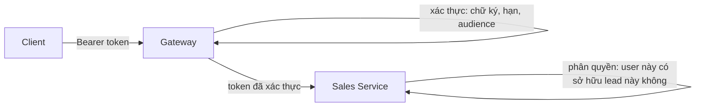

# 18.6 — 6. Identity trong hệ phân tán

> Nguồn: https://tiennhm.io.vn/docs/dotnet-backend-zero-to-senior/stage-05-senior-engineering/module-18-microservices/18.6-distributed-identity-overview
> Ai xác thực và ai phân quyền, vấn đề thu hồi token, token exchange thay vì chuyển tiếp token, và cách chia sẻ thông tin người dùng giữa service.

> Nguyên tắc phân chia trách nhiệm: **gateway xác thực** (token này có hợp lệ không), **service phân quyền** (người này có được làm việc này trên tài nguyên này không). Gộp cả hai vào gateway là sai, vì phân quyền theo tài nguyên cần dữ liệu mà chỉ service mới có. Ba vấn đề thực tế sẽ gặp. **Thu hồi token**: JWT tự chứa nên không huỷ được trước khi hết hạn — khoá tài khoản một nhân viên vừa nghỉ việc mà họ vẫn dùng được hệ thống 15 phút. **Claim phình to**: nhồi hết quyền vào token làm header vượt giới hạn của reverse proxy. **Chuyển tiếp token giữa service**: một service bị xâm nhập có thể dùng token của người dùng gọi **mọi** service khác — đây là lý do [token exchange](https://datatracker.ietf.org/doc/html/rfc8693) tồn tại.

## Mục tiêu bài học

Sau bài này bạn có thể:

- Phân định xác thực ở gateway và phân quyền ở service.
- Xử lý vấn đề thu hồi token bằng thời hạn ngắn và danh sách chặn.
- Giữ token gọn thay vì nhồi mọi quyền vào claim.
- Chọn giữa chuyển tiếp token và token exchange.
- Chia sẻ thông tin người dùng giữa các service an toàn.

## Nội dung bài học

### 18.7.1 — Ai làm gì



**Gateway xác thực:** chữ ký hợp lệ, chưa hết hạn, đúng issuer và audience. Request sai bị chặn **trước khi** vào hệ thống.

**Service phân quyền:** quyết định dựa trên dữ liệu chỉ nó có.

```csharp
// Phân quyền theo tài nguyên — CHỈ Sales Service biết ai sở hữu lead nào
public sealed class LeadOwnerHandler(SalesDbContext db)
    : AuthorizationHandler<LeadOwnerRequirement, Lead>
{
    protected override async Task HandleRequirementAsync(
        AuthorizationHandlerContext context, LeadOwnerRequirement requirement, Lead lead)
    {
        var userId = context.User.GetUserId();

        if (lead.OwnerId == userId || context.User.IsInRole("SalesManager"))
            context.Succeed(requirement);
    }
}
```

Gateway **không thể** làm việc này — nó không có bảng `Leads`, và nếu ta cho nó truy cập thì đã vi phạm database-per-service ([bài 18.3](18.2-service-decomposition.mdx)).

**Sai lầm cần tránh:** service tin tưởng hoàn toàn vì "request đến từ gateway". Nếu ai đó vào được mạng nội bộ, họ gọi thẳng service và bỏ qua mọi kiểm tra. Service **vẫn phải** xác thực token, chỉ là nó có thể tin rằng gateway đã lọc bớt phần lớn request xấu.

```csharp
// Mọi service VẪN validate token — phòng thủ nhiều lớp
builder.Services.AddAuthentication(JwtBearerDefaults.AuthenticationScheme)
    .AddJwtBearer(options =>
    {
        options.Authority = builder.Configuration["Auth:Authority"];
        options.TokenValidationParameters = new TokenValidationParameters
        {
            ValidateIssuer = true,
            ValidateAudience = true,
            ValidAudience = "crm-api",
            ValidateLifetime = true,
            ClockSkew = TimeSpan.FromSeconds(30)      // mặc định 5 PHÚT — quá dài
        };
    });
```

`ClockSkew` mặc định là **5 phút**, nghĩa là token đã hết hạn vẫn được chấp nhận thêm 5 phút nữa ([bài 10.3](../../stage-03-aspnet-core-backend/module-10-authentication-authorization/10.2-jwt-authentication.mdx)). Với hệ thống có đồng bộ thời gian qua NTP, 30 giây là quá đủ.

### 18.7.2 — Vấn đề thu hồi token

JWT **tự chứa**: service kiểm tra chữ ký mà không hỏi ai cả. Đó là điểm mạnh về hiệu năng, và cũng là điểm yếu:

```
10:00  Nhân viên nghỉ việc, admin vô hiệu hoá tài khoản
10:00  Token cũ VẪN HỢP LỆ — không ai huỷ được
10:15  Token het han
       => 15 PHÚT truy cập sau khi bị vô hiệu hoá
```

Ba cách xử lý, chọn theo mức độ nhạy cảm:

| Cách | Cơ chế | Đánh đổi |
|---|---|---|
| **Thời hạn ngắn** | Access token 5–15 phút + refresh token | Đơn giản, cửa sổ rủi ro vẫn còn |
| **Danh sách chặn** | Lưu jti của token bị thu hồi vào Redis | Mỗi request thêm một lần đọc cache |
| **Reference token** | Token là mã tra cứu, mọi lần đều hỏi server | Huỷ tức thì, nhưng mất lợi thế tự chứa |

```csharp
// Danh sách chặn — kiểm tra jti trong Redis
options.Events = new JwtBearerEvents
{
    OnTokenValidated = async context =>
    {
        var jti = context.Principal?.FindFirst(JwtRegisteredClaimNames.Jti)?.Value;
        if (jti is null) return;

        var cache = context.HttpContext.RequestServices.GetRequiredService<IDistributedCache>();
        if (await cache.GetStringAsync($"revoked:{jti}") is not null)
            context.Fail("Token đã bị thu hồi");
    }
};
```

Chỉ cần lưu bản ghi **tới lúc token hết hạn tự nhiên** — sau đó nó vô hại, nên TTL của cache bằng thời gian còn lại của token.

**Khuyến nghị thực dụng:** access token 15 phút + refresh token là đủ cho phần lớn hệ thống nội bộ. Chỉ thêm danh sách chặn khi nghiệp vụ thật sự yêu cầu thu hồi tức thì.

### 18.7.3 — Token gọn, không nhồi quyền

```csharp
// SAI — token phinh to
{
  "sub": "user-123",
  "permissions": [
    "leads.read", "leads.write", "leads.delete",
    "customers.read", /* ...200 quyen nua... */
  ],
  "accessible_customer_ids": [ /* 5000 id */ ]
}
```

Ba hậu quả: token vượt giới hạn header của reverse proxy (thường 8 KB) gây lỗi 431; mọi request phải truyền cả khối đó; và quyền chỉ cập nhật khi cấp token mới.

```csharp
// DUNG — token gon, quyen tra cuu tai service
{
  "sub": "user-123",
  "tenant_id": "acme",
  "roles": ["SalesManager"],
  "exp": 1727164800
}
```

Quyền chi tiết được service tra cứu và cache ngắn hạn:

```csharp
public async Task<bool> CanAccessAsync(Guid userId, string permission, CancellationToken ct)
{
    var permissions = await _cache.GetOrCreateAsync(
        $"perms:{userId}",
        async _ => await _db.GetUserPermissionsAsync(userId, ct),
        TimeSpan.FromMinutes(5));

    return permissions.Contains(permission);
}
```

Cache 5 phút giữ hiệu năng gần như token tự chứa, nhưng thay đổi quyền có hiệu lực trong vòng 5 phút thay vì phải chờ cấp token mới ([bài 14.4](../../stage-04-database-production/module-14-caching-background-jobs/14.3-idistributedcache-and-redis.mdx)).

### 18.7.4 — Truyền danh tính giữa service

**Cách 1 — chuyển tiếp token người dùng.** Đơn giản nhất và phổ biến nhất:

```csharp
public sealed class TokenForwardingHandler(IHttpContextAccessor accessor) : DelegatingHandler
{
    protected override async Task<HttpResponseMessage> SendAsync(
        HttpRequestMessage request, CancellationToken ct)
    {
        var token = await accessor.HttpContext!.GetTokenAsync("access_token");
        if (token is not null)
            request.Headers.Authorization = new AuthenticationHeaderValue("Bearer", token);

        return await base.SendAsync(request, ct);
    }
}
```

**Rủi ro cụ thể:** nếu Sales Service bị xâm nhập, kẻ tấn công có token của **mọi người dùng đang truy cập**, và dùng được chúng để gọi **mọi** service khác — kể cả những service Sales không bao giờ cần gọi. Phạm vi thiệt hại rộng hơn nhiều so với chỉ mất quyền của Sales.

**Cách 2 — token exchange (RFC 8693).** Sales đổi token người dùng lấy một token **hẹp hơn**, chỉ dùng được cho Billing và chỉ với phạm vi cần thiết:

```csharp
var exchanged = await _identityClient.ExchangeTokenAsync(new TokenExchangeRequest
{
    SubjectToken = userToken,
    Audience = "billing-api",              // chỉ dùng được cho Billing
    Scope = "invoices.read"                // chi doc hoa don
});
```

Token bị lộ giờ chỉ đọc được hoá đơn, không làm được gì khác. Cái giá: thêm một lời gọi tới identity provider và hạ tầng phức tạp hơn.

**Cách 3 — service-to-service credential.** Khi hành động không nhân danh người dùng nào (job nền, đồng bộ dữ liệu), dùng client credentials flow với danh tính riêng của service.

| Cách | Khi dùng | Rủi ro |
|---|---|---|
| Chuyển tiếp token | Hệ thống nội bộ, tin cậy lẫn nhau | Lộ một service là lộ token mọi người dùng |
| Token exchange | Hệ nhạy cảm, nhiều đội | Phức tạp hơn, thêm một round-trip |
| Client credentials | Job nền, không nhân danh ai | Cần quản lý secret |

### 18.7.5 — Tenant trong hệ phân tán

Với hệ multi-tenant, `tenant_id` phải đi **cùng danh tính**, không bao giờ lấy từ tham số do client gửi:

```csharp
// SAI — client tự khai tenant, đổi số là đọc dữ liệu tenant khác
var tenantId = Request.Query["tenantId"];

// ĐÚNG — lấy từ claim đã được ký
var tenantId = User.FindFirst("tenant_id")?.Value
    ?? throw new UnauthorizedAccessException("Thiếu tenant_id");
```

Mỗi service tự áp dụng lọc theo tenant qua global query filter ([bài 13.11](../../stage-04-database-production/module-13-entity-framework-core/13.10-global-query-filters.mdx)). **Đừng tin** rằng gateway đã lọc — phòng thủ nhiều lớp, và rò rỉ dữ liệu giữa các tenant là loại sự cố khó khắc phục nhất về mặt uy tín.

### 18.7.6 — Rà lại code của bạn

**Danh sách rà soát identity trong hệ phân tán**

- [ ] Gateway xác thực token, service phân quyền theo tài nguyên.
- [ ] Mỗi service vẫn tự xác thực token, không tin mạng nội bộ.
- [ ] ClockSkew đặt ngắn, không để mặc định 5 phút.
- [ ] Access token có thời hạn ngắn kèm refresh token.
- [ ] Đã quyết định có cần thu hồi tức thì hay không, và cài đặt tương ứng.
- [ ] Token không chứa danh sách quyền chi tiết.
- [ ] Quyền chi tiết tra cứu tại service và cache ngắn hạn.
- [ ] Đã đánh giá rủi ro của việc chuyển tiếp token giữa service.
- [ ] Job nền dùng danh tính riêng của service, không mượn token người dùng.
- [ ] tenant_id lấy từ claim đã ký, không lấy từ tham số client gửi.

## Bài tập áp dụng

#### Bài 1 — Đo cửa sổ thu hồi token

Vô hiệu hoá một tài khoản và đo chính xác bao lâu token cũ còn dùng được. So sánh với yêu cầu nghiệp vụ.

**Tiêu chí hoàn thành:** bạn đo được con số, và biết **ba** cách rút ngắn cửa sổ cùng chi phí của từng cách.

Gợi ý và lời giải — Bài 1

**Gợi ý.** JWT được xác minh bằng chữ ký, không bằng tra cứu. Service có biết tài khoản vừa bị khoá không?

**Lời giải — đo:**

```csharp
// Đăng nhập, lấy token
var token = await DangNhapAsync("an@company.com", matKhau);
var payload = JwtPayload.Base64UrlDeserialize(token.Split('.')[1]);

Console.WriteLine($"iat: {DateTimeOffset.FromUnixTimeSeconds(payload.Iat!.Value)}");
Console.WriteLine($"exp: {DateTimeOffset.FromUnixTimeSeconds(payload.Exp!.Value)}");
```

```text
iat: 2026-09-25 08:00:00 +00:00
exp: 2026-09-25 08:15:00 +00:00      <- sống 15 phút
```

```bash
# Vô hiệu hoá tài khoản lúc 08:02
curl -X POST http://identity:8080/admin/users/an/disable -H "Authorization: Bearer $ADMIN"

# Dùng token cũ
while true; do
  echo -n "$(date +%H:%M:%S) "
  curl -s -o /dev/null -w "%{http_code}\n" \
    http://gateway:8080/api/leads -H "Authorization: Bearer $TOKEN"
  sleep 10
done
```

```text
08:02:10 200      <- tài khoản ĐÃ bị vô hiệu hoá
08:02:20 200
08:02:30 200
...
08:14:50 200
08:15:00 401      <- chỉ dừng khi token HẾT HẠN
```

**13 phút truy cập sau khi bị vô hiệu hoá.**

```text
Cửa sổ thu hồi = thời gian còn lại của token
               = tối đa bằng thời gian sống của token (15 phút)
               = trung bình 7,5 phút
```

**Vì sao — và đây là bản chất của JWT:**

```text
JWT là token TỰ CHỨA:
    service xác minh CHỮ KÝ -> biết token hợp lệ và do ai phát hành
    service KHÔNG hỏi Identity Service -> không biết trạng thái hiện tại

Đây là ĐIỂM MẠNH: không cần tra cứu, scale tốt, service độc lập
Và cũng là ĐIỂM YẾU: không thu hồi được trước khi hết hạn
```

**So với yêu cầu nghiệp vụ:**

```markdown
| Tình huống | Cửa sổ chấp nhận được | Hiện tại |
|---|---|---|
| Nhân viên nghỉ việc | Dưới 1 phút | **13 phút** |
| Phát hiện tài khoản bị chiếm | **Tức thì** | **13 phút** |
| Đổi mật khẩu | Dưới 1 phút | 13 phút |
| Đổi vai trò (thăng chức) | 15 phút OK | 13 phút — đạt |
| Khách hàng huỷ hợp đồng | 1 giờ OK | 13 phút — đạt |
```

Hai dòng đầu **không đạt**, và chúng là hai dòng quan trọng nhất về mặt bảo mật.

**Ba cách rút ngắn cửa sổ:**

**Cách 1 — giảm thời gian sống của token:**

```csharp
options.TokenValidationParameters = new TokenValidationParameters
{
    ClockSkew = TimeSpan.Zero,       // mặc định là 5 PHÚT — nhớ đặt về 0
};
```

```csharp
var token = new JwtSecurityToken(
    expires: DateTime.UtcNow.AddMinutes(5),     // từ 15 xuống 5
    ...);
```

```text
Cửa sổ: 13 phút -> tối đa 5 phút

Chi phí:
    + Refresh token gọi Identity Service thường xuyên hơn 3 lần
    + Với 10.000 người dùng: từ 40.000 lên 120.000 lời gọi/giờ
    - Không đổi kiến trúc, triển khai trong một ngày
```

`ClockSkew = TimeSpan.Zero` là chi tiết hay bị bỏ sót: mặc định .NET cho phép lệch 5 phút, nên token "hết hạn" vẫn dùng được thêm 5 phút nữa. Với token sống 5 phút, đó là gấp đôi cửa sổ.

**Cách 2 — danh sách thu hồi (revocation list):**

```csharp
public class KiemTraThuHoiMiddleware(RequestDelegate next, HybridCache cache)
{
    public async Task InvokeAsync(HttpContext ctx)
    {
        var jti = ctx.User.FindFirst("jti")?.Value;
        var sub = ctx.User.FindFirst("sub")?.Value;

        if (jti is not null)
        {
            // Kiểm tra token cụ thể có bị thu hồi không
            var daThuHoi = await cache.GetOrCreateAsync(
                $"revoked:{jti}",
                async ct => await _identityClient.KiemTraThuHoiAsync(jti, ct),
                new HybridCacheEntryOptions { Expiration = TimeSpan.FromSeconds(30) });

            if (daThuHoi)
            {
                ctx.Response.StatusCode = StatusCodes.Status401Unauthorized;
                await ctx.Response.WriteAsJsonAsync(new { error = "token_revoked" });
                return;
            }
        }

        await next(ctx);
    }
}
```

```text
Cửa sổ: bằng TTL của cache (30 giây)

Chi phí:
    + Một lần tra cứu cho mỗi request (nhưng có cache, nên phần lớn là cache hit)
    + Identity Service trở thành phụ thuộc của MỌI service
    + Identity chết -> phải quyết định: chặn hết hay cho qua hết
    - Cửa sổ giảm từ phút xuống giây
```

Câu hỏi "Identity chết thì sao" là câu quyết định:

```csharp
catch (BrokenCircuitException)
{
    // Chọn A — cho qua (ưu tiên khả dụng)
    _logger.LogWarning("Không kiểm tra được thu hồi — cho qua");
    await next(ctx);

    // Chọn B — chặn (ưu tiên bảo mật)
    ctx.Response.StatusCode = 503;
}
```

Với hệ thống tài chính hoặc y tế, chọn B. Với CRM nội bộ, chọn A và ghi log — nhưng phải là một **quyết định có ý thức**, không phải hành vi mặc định.

**Cách 3 — mốc thời gian thu hồi theo người dùng (rẻ nhất trong ba cách):**

```csharp
public class KiemTraMocThuHoiMiddleware(RequestDelegate next, HybridCache cache)
{
    public async Task InvokeAsync(HttpContext ctx)
    {
        var sub = ctx.User.FindFirst("sub")?.Value;
        var iat = ctx.User.FindFirst("iat")?.Value;

        if (sub is not null && iat is not null)
        {
            // MỘT mốc cho mỗi người dùng, không phải một dòng cho mỗi token
            var mocThuHoi = await cache.GetOrCreateAsync(
                $"revoke-after:{sub}",
                async ct => await _identityClient.LayMocThuHoiAsync(sub, ct),
                new HybridCacheEntryOptions { Expiration = TimeSpan.FromSeconds(60) });

            var phatHanhLuc = DateTimeOffset.FromUnixTimeSeconds(long.Parse(iat));

            if (mocThuHoi is not null && phatHanhLuc < mocThuHoi)
            {
                ctx.Response.StatusCode = StatusCodes.Status401Unauthorized;
                return;
            }
        }

        await next(ctx);
    }
}
```

```csharp
// Khi vô hiệu hoá, đổi mật khẩu, hay đổi vai trò
public async Task VoHieuHoaAsync(UserId id, CancellationToken ct)
{
    var user = await _db.Users.FirstAsync(u => u.Id == id, ct);
    user.VoHieuHoa();
    user.DatMocThuHoi(_clock.GetUtcNow().UtcDateTime);      // MỌI token cũ hơn mốc này đều vô hiệu
    await _db.SaveChangesAsync(ct);

    await _cache.RemoveAsync($"revoke-after:{id}", ct);     // xoá cache ngay
    await _publisher.PublishAsync(new NguoiDungBiVoHieuHoaV1(id.Value), ct);
}
```

```text
Ưu điểm so với cách 2:
    - Chỉ MỘT dòng dữ liệu cho mỗi người dùng, không phải một dòng cho mỗi token
    - Vô hiệu MỌI token của người đó cùng lúc (kể cả token trên máy khác)
    - Dữ liệu nhỏ, cache được lâu hơn

Cửa sổ: bằng TTL cache (60 giây), hoặc GẦN 0 nếu nhân bản mốc qua event
```

**Kết hợp cách 3 với event để cửa sổ gần bằng 0:**

```csharp
public class CapNhatMocThuHoiConsumer : IConsumer<NguoiDungBiVoHieuHoaV1>
{
    public async Task Consume(ConsumeContext<NguoiDungBiVoHieuHoaV1> ctx)
    {
        // Mỗi service giữ bản sao cục bộ của mốc thu hồi
        await _cache.SetAsync($"revoke-after:{ctx.Message.UserId}",
            ctx.Message.ThoiDiemUtc,
            new HybridCacheEntryOptions { Expiration = TimeSpan.FromHours(24) },
            ctx.CancellationToken);
    }
}
```

```text
Cửa sổ: vài trăm mili giây (độ trễ message)
Chi phí: KHÔNG có lời gọi mạng nào khi xác thực — chỉ tra cache cục bộ
```

**So sánh ba cách:**

| Cách | Cửa sổ | Chi phí mỗi request | Phụ thuộc mới |
|---|---|---|---|
| 1. Token ngắn | 5 phút | Không | Không |
| 2. Danh sách thu hồi | 30 giây | Tra cache | Identity Service |
| 3. Mốc thu hồi + event | **Vài trăm ms** | **Tra cache cục bộ** | Message broker |

**Cách 3 là lựa chọn tốt nhất cho phần lớn hệ thống** — nó cho cửa sổ ngắn nhất với chi phí thấp nhất.

**Và một chi tiết quan trọng về refresh token:**

```text
Access token sống 5 phút
Refresh token sống 30 ngày

Vô hiệu hoá tài khoản mà KHÔNG vô hiệu refresh token
-> người dùng dùng refresh token lấy access token MỚI
-> vẫn truy cập được, mãi mãi
```

```csharp
public async Task<Result<TokenPair>> LamMoiAsync(string refreshToken, CancellationToken ct)
{
    var luu = await _db.RefreshTokens.FirstOrDefaultAsync(r => r.Token == refreshToken, ct);
    if (luu is null || luu.DaThuHoi || luu.HetHanLuc < _clock.GetUtcNow())
        return Result<TokenPair>.Loi("Refresh token không hợp lệ");

    var user = await _db.Users.FirstAsync(u => u.Id == luu.UserId, ct);
    if (!user.DangHoatDong)                                     // KIỂM TRA LẠI trạng thái
        return Result<TokenPair>.Loi("Tài khoản đã bị vô hiệu hoá");

    luu.ThuHoi();                                               // xoay token — dùng một lần
    var moi = TaoTokenPair(user);
    _db.RefreshTokens.Add(moi.RefreshTokenEntity);
    await _db.SaveChangesAsync(ct);

    return Result<TokenPair>.ThanhCong(moi);
}
```

Hai chi tiết: **kiểm tra lại trạng thái tài khoản** ở mỗi lần refresh, và **xoay refresh token** (dùng một lần) để phát hiện token bị đánh cắp.

---

#### Bài 2 — Giảm kích thước token

Đo kích thước JWT hiện tại của bạn, chuyển danh sách quyền sang tra cứu có cache, và đo lại.

**Tiêu chí hoàn thành:** bạn đo được cả hai, và nêu được **ba** hậu quả của token lớn ngoài băng thông.

Gợi ý và lời giải — Bài 2

**Gợi ý.** Token được gửi trong header của **mỗi** request. Header có giới hạn kích thước không?

**Lời giải — đo hiện tại:**

```csharp
var token = await DangNhapAsync("an@company.com", matKhau);
Console.WriteLine($"Kích thước token: {Encoding.UTF8.GetByteCount(token)} byte");

var payload = token.Split('.')[1];
var json = Encoding.UTF8.GetString(Base64UrlDecode(payload));
Console.WriteLine(JsonSerializer.Serialize(
    JsonSerializer.Deserialize<JsonElement>(json),
    new JsonSerializerOptions { WriteIndented = true }));
```

```text
Kích thước token: 4.218 byte

{
  "sub": "0192f8a3-...",
  "email": "an@company.com",
  "name": "Nguyễn Văn An",
  "tenant_id": "acme",
  "roles": ["Sales", "Manager"],
  "permissions": [
    "leads.read", "leads.write", "leads.delete", "leads.assign",
    "customers.read", "customers.write",
    "orders.read", "orders.write", "orders.approve",
    "reports.read", "reports.export",
    ... (87 quyền)
  ],
  "iat": 1758787200,
  "exp": 1758788100
}
```

**87 quyền chiếm khoảng 3.400 byte — 80% kích thước token.**

**Sau khi chuyển quyền sang tra cứu:**

```csharp
// Token chỉ giữ thứ ỔN ĐỊNH và cần cho MỌI service
{
  "sub": "0192f8a3-...",
  "tenant_id": "acme",
  "roles": ["Sales", "Manager"],
  "iat": 1758787200,
  "exp": 1758788100
}
```

```text
Kích thước token: 412 byte      <- giảm 10 lần
```

```csharp
public class KiemTraQuyenService(IIdentityClient client, HybridCache cache)
{
    public async Task<bool> CoQuyenAsync(string userId, string quyen, CancellationToken ct)
    {
        var danhSach = await cache.GetOrCreateAsync(
            $"quyen:{userId}",
            async token => await client.LayQuyenAsync(userId, token),
            new HybridCacheEntryOptions
            {
                LocalCacheExpiration = TimeSpan.FromMinutes(2),    // L1
                Expiration = TimeSpan.FromMinutes(10),             // L2 (Redis)
            },
            cancellationToken: ct);

        return danhSach.Contains(quyen);
    }
}
```

```csharp
// Xoá cache khi quyền đổi
public class XoaCacheQuyenConsumer : IConsumer<QuyenNguoiDungDaDoiV1>
{
    public async Task Consume(ConsumeContext<QuyenNguoiDungDaDoiV1> ctx)
        => await _cache.RemoveAsync($"quyen:{ctx.Message.UserId}", ctx.CancellationToken);
}
```

```text
Cache hit (L1):  ~0,05 ms
Cache hit (L2):  ~1,4 ms
Cache miss:      ~18 ms (gọi Identity Service)

Với TTL L1 2 phút và người dùng gọi vài request/phút:
    tỷ lệ L1 hit ≈ 95%
    -> chi phí trung bình ≈ 0,15 ms
```

**Ba hậu quả của token lớn ngoài băng thông:**

**Hậu quả 1 — vượt giới hạn header, và lỗi rất khó hiểu.**

```text
Giới hạn header mặc định:
    Kestrel:  32 KB tổng header, 8 KB mỗi header
    Nginx:    8 KB (large_client_header_buffers 4 8k)
    IIS:      16 KB
    Cloudflare: 16 KB
    AWS ALB:  16 KB tổng
```

```text
Token 4.218 byte -> chưa vượt
Nhưng người dùng có 300 quyền -> token ~12 KB -> VƯỢT giới hạn Nginx
```

```text
HTTP/1.1 431 Request Header Fields Too Large
```

Hoặc, tệ hơn, Nginx trả `400 Bad Request` không có thông điệp — và lỗi chỉ xảy ra với **một số** người dùng (những người có nhiều quyền nhất, thường là admin).

Đây là loại lỗi tốn nhiều giờ để chẩn đoán, vì nó không tái hiện được với tài khoản test thông thường.

**Hậu quả 2 — quyền trong token không thu hồi được.**

```text
Admin gỡ quyền "orders.approve" của một nhân viên lúc 08:02
-> token cũ VẪN chứa quyền đó
-> nhân viên vẫn duyệt đơn hàng được trong 13 phút
```

Đây chính là vấn đề ở bài 1, nhưng nghiêm trọng hơn: thu hồi **tài khoản** còn có cách chặn ở tầng xác thực; thu hồi **một quyền cụ thể** thì không, vì service đọc quyền từ chính token.

Với quyền tra cứu có cache, cửa sổ bằng TTL cache (2 phút) và giảm về gần 0 khi có event xoá cache.

**Hậu quả 3 — token lớn làm chậm mọi request.**

```text
Token 4.218 byte × mỗi request

1.000 req/s:  4,2 MB/s chỉ cho header
              -> với HTTP/1.1 không nén header: băng thông thật

Và mỗi request phải:
    - base64 decode payload
    - deserialize JSON 3.400 byte
    - dựng ClaimsPrincipal với 87 claim
    -> khoảng 0,3–0,8 ms mỗi request, chỉ để đọc token
```

```text
Token 412 byte -> khoảng 0,05 ms
```

Với HTTP/2 và HPACK, header lặp lại được nén tốt — nhưng chi phí parse ở phía server thì không giảm.

**Nguyên tắc: đưa gì vào token?**

```text
ĐƯA VÀO — thứ ỔN ĐỊNH và MỌI service cần:
    sub (id người dùng)
    tenant_id
    roles (vài vai trò, không phải hàng trăm quyền)
    iat, exp, iss, aud

KHÔNG ĐƯA VÀO:
    danh sách quyền chi tiết      -> tra cứu, có cache
    thông tin hồ sơ (tên, ảnh)    -> service riêng lấy khi cần
    dữ liệu nghiệp vụ             -> không thuộc về token
    thứ hay thay đổi              -> không thu hồi được
```

**Phân biệt vai trò và quyền:**

```text
Vai trò (role):  ít, ổn định, thô
                 "Sales", "Manager", "Admin"
                 -> đưa vào token được

Quyền (permission): nhiều, chi tiết, hay đổi
                    "leads.approve.over-500m"
                    -> tra cứu
```

Phần lớn kiểm tra phân quyền dùng được vai trò:

```csharp
[Authorize(Roles = "Manager")]
app.MapPost("/leads/{id}/duyet", ...);
```

Và chỉ những chỗ cần chi tiết mới tra cứu:

```csharp
app.MapPost("/leads/{id}/chot", async (
    Guid id, IKiemTraQuyen quyen, ClaimsPrincipal user, CancellationToken ct) =>
{
    var userId = user.FindFirst("sub")!.Value;

    if (!await quyen.CoQuyenAsync(userId, "leads.close", ct))
        return Results.Forbid();

    // ...
});
```

**Và một điểm quan trọng: phân quyền theo TÀI NGUYÊN không thể nằm trong token.**

```text
"An được xem lead nào?"
    -> phụ thuộc vào ai sở hữu lead đó
    -> CHỈ Lead Service biết
    -> không token nào chứa được thông tin này
```

```csharp
// Kiểm tra ở chính service sở hữu dữ liệu
public async Task<Result<LeadDto>> LayAsync(LeadId id, NguoiDung nguoiDung, CancellationToken ct)
{
    var lead = await _db.Leads.FirstOrDefaultAsync(l => l.Id == id, ct);
    if (lead is null) return Result<LeadDto>.KhongTimThay();

    // Phân quyền theo TÀI NGUYÊN
    if (!nguoiDung.LaQuanTri && lead.AssignedTo != nguoiDung.Id)
        return Result<LeadDto>.KhongCoQuyen();

    return Result<LeadDto>.ThanhCong(lead.ToDto());
}
```

**Phân chia trách nhiệm:**

```text
Identity Service:  XÁC THỰC (ai đang gọi) + vai trò thô
Gateway:           xác minh chữ ký token, từ chối token không hợp lệ
Mỗi service:       PHÂN QUYỀN theo tài nguyên của chính nó
```

Gateway **không nên** phân quyền chi tiết — nó không biết ai sở hữu lead nào, và nếu nó biết thì nó đã trở thành một service nghiệp vụ.

**Đo lại sau khi sửa:**

```markdown
| Chỉ số | Trước | Sau |
|---|---:|---:|
| Kích thước token | 4.218 byte | **412 byte** |
| Thời gian parse token | 0,62 ms | **0,04 ms** |
| Băng thông header (1.000 req/s) | 4,2 MB/s | **0,4 MB/s** |
| Cửa sổ thu hồi quyền | 13 phút | **~2 phút** (TTL cache) |
| Lời gọi Identity thêm | 0 | 0,15 ms trung bình (95% cache hit) |
```

Dòng cuối là cái giá — và nó nhỏ hơn nhiều so với lợi ích ở bốn dòng trên.

---

#### Bài 3 — Kiểm tra cách ly tenant

Viết test gọi API với token của tenant A và tham số `tenantId` của tenant B, xác nhận không rò rỉ dữ liệu.

**Tiêu chí hoàn thành:** test của bạn bao phủ **bốn** đường tấn công, và bạn biết cách chặn ở tầng thấp nhất.

Gợi ý và lời giải — Bài 3

**Gợi ý.** Nếu `tenantId` đến từ tham số của request, ai kiểm soát nó?

**Lời giải — bốn đường tấn công:**

**Đường 1 — `tenantId` trong query string hoặc route:**

```csharp
// LỖ HỔNG
app.MapGet("/api/leads", async (string tenantId, CrmDbContext db, CancellationToken ct)
    => await db.Leads.Where(l => l.TenantId == tenantId).ToListAsync(ct));
```

```bash
curl "http://gateway:8080/api/leads?tenantId=globex" -H "Authorization: Bearer $TOKEN_ACME"
```

```text
200 OK — trả về dữ liệu của globex
```

```csharp
[Fact]
public async Task Khong_lay_duoc_du_lieu_tenant_khac_qua_query_string()
{
    var client = TaoClientVoiToken(tenant: "acme");

    var res = await client.GetAsync("/api/leads?tenantId=globex");

    res.StatusCode.Should().BeOneOf(HttpStatusCode.Forbidden, HttpStatusCode.BadRequest);

    if (res.IsSuccessStatusCode)
    {
        var leads = await res.Content.ReadFromJsonAsync<List<LeadDto>>();
        leads.Should().OnlyContain(l => l.TenantId == "acme");
    }
}
```

**Đường 2 — `tenantId` trong body:**

```csharp
[Fact]
public async Task Khong_tao_duoc_ban_ghi_cho_tenant_khac()
{
    var client = TaoClientVoiToken(tenant: "acme");

    var res = await client.PostAsJsonAsync("/api/leads", new
    {
        name = "Lead giả mạo",
        value = 1_000_000,
        tenantId = "globex",              // cố ghi vào tenant khác
    });

    if (res.IsSuccessStatusCode)
    {
        var lead = await res.Content.ReadFromJsonAsync<LeadDto>();
        lead!.TenantId.Should().Be("acme", "tenantId phải lấy từ token, bỏ qua body");
    }
}
```

**Đường 3 — truy cập trực tiếp bằng id:**

```csharp
[Fact]
public async Task Khong_lay_duoc_ban_ghi_cua_tenant_khac_bang_id()
{
    var leadGlobex = await TaoLeadAsync(tenant: "globex");
    var client = TaoClientVoiToken(tenant: "acme");

    var res = await client.GetAsync($"/api/leads/{leadGlobex.Id}");

    res.StatusCode.Should().BeOneOf(HttpStatusCode.NotFound, HttpStatusCode.Forbidden);
}
```

Trả `404` thay vì `403` là lựa chọn tốt hơn: `403` xác nhận bản ghi **tồn tại**, và đó là rò rỉ thông tin.

**Đường 4 — endpoint admin dùng `IgnoreQueryFilters`:**

```csharp
[Fact]
public async Task Endpoint_admin_khong_tra_ve_du_lieu_tenant_khac()
{
    await TaoLeadDaXoaAsync(tenant: "acme");
    await TaoLeadDaXoaAsync(tenant: "globex");

    var client = TaoClientVoiToken(tenant: "acme", role: "Admin");

    var res = await client.GetAsync("/api/admin/leads/da-xoa");
    var leads = await res.Content.ReadFromJsonAsync<List<LeadDto>>();

    leads.Should().OnlyContain(l => l.TenantId == "acme");
    leads.Should().NotBeEmpty("nếu rỗng thì test không chứng minh được gì");
}
```

Khẳng định cuối quan trọng hơn vẻ ngoài: `OnlyContain` trên danh sách rỗng luôn **đúng**, nên nếu không có nó, một endpoint hỏng hoàn toàn cũng cho test xanh. Đây là điểm ở [bài 13.10](../../stage-04-database-production/module-13-entity-framework-core/13.10-global-query-filters.mdx).

**Chặn ở tầng thấp nhất — ba lớp:**

**Lớp 1 — `tenantId` LUÔN lấy từ token, không bao giờ từ request:**

```csharp
public sealed class TenantProvider(IHttpContextAccessor http) : ITenantProvider
{
    public string Id => http.HttpContext?.User.FindFirst("tenant_id")?.Value
        ?? throw new UnauthorizedAccessException("Không xác định được tenant");
}
```

```csharp
// Không nhận tenantId từ bất kỳ đâu ngoài token
app.MapGet("/api/leads", async (CrmDbContext db, CancellationToken ct)
    => await db.Leads.ToListAsync(ct));     // global query filter tự lọc
```

**Chặn ở tầng binding — không cho DTO có trường `TenantId`:**

```csharp
[Fact]
public void DTO_dau_vao_khong_duoc_co_truong_TenantId()
{
    var viPham = typeof(Program).Assembly.GetTypes()
        .Where(t => t.Name.EndsWith("Request") || t.Name.EndsWith("Command"))
        .Where(t => t.GetProperties().Any(p =>
            p.Name.Equals("TenantId", StringComparison.OrdinalIgnoreCase)))
        .Select(t => t.Name)
        .ToList();

    viPham.Should().BeEmpty(
        "tenantId phải lấy từ token; có trường này trong DTO là mở đường cho giả mạo");
}
```

**Lớp 2 — global query filter, áp tự động cho mọi truy vấn:**

```csharp
public class CrmDbContext : DbContext
{
    private readonly string _tenantId;      // FIELD, không phải thuộc tính của dịch vụ khác

    public CrmDbContext(DbContextOptions<CrmDbContext> options, ITenantProvider tenant)
        : base(options) => _tenantId = tenant.Id;

    protected override void OnModelCreating(ModelBuilder builder)
    {
        builder.Entity<Lead>().HasQueryFilter(l => l.TenantId == _tenantId);
        builder.Entity<Order>().HasQueryFilter(o => o.TenantId == _tenantId);
    }
}
```

Dùng **field** `_tenantId`, không dùng `_tenant.Id` — nếu không, giá trị bị đóng băng vào mô hình đã cache và mọi tenant thấy dữ liệu của tenant đầu tiên ([bài 13.10](../../stage-04-database-production/module-13-entity-framework-core/13.10-global-query-filters.mdx)).

```csharp
[Fact]
public void Moi_entity_multi_tenant_phai_co_query_filter()
{
    using var db = TaoContext("acme");

    var thieu = db.Model.GetEntityTypes()
        .Where(e => e.ClrType.GetInterfaces().Contains(typeof(IHasTenant)))
        .Where(e => e.GetQueryFilter() is null)
        .Select(e => e.ClrType.Name)
        .ToList();

    thieu.Should().BeEmpty("entity multi-tenant thiếu query filter sẽ rò rỉ dữ liệu");
}
```

**Lớp 3 — ràng buộc ở tầng database (lớp không đi vòng qua được):**

```sql
-- Row-Level Security của SQL Server
CREATE FUNCTION dbo.fn_TenantAccess(@TenantId nvarchar(50))
RETURNS TABLE WITH SCHEMABINDING
AS RETURN SELECT 1 AS Ket WHERE @TenantId = CAST(SESSION_CONTEXT(N'TenantId') AS nvarchar(50));

CREATE SECURITY POLICY dbo.TenantFilter
    ADD FILTER PREDICATE dbo.fn_TenantAccess(TenantId) ON dbo.Leads,
    ADD BLOCK PREDICATE dbo.fn_TenantAccess(TenantId) ON dbo.Leads AFTER INSERT
    WITH (STATE = ON);
```

```csharp
public class DatSessionContextInterceptor(ITenantProvider tenant) : DbConnectionInterceptor
{
    public override async Task<DbConnection> ConnectionOpenedAsync(
        DbConnection conn, ConnectionEndEventData e, CancellationToken ct = default)
    {
        await using var cmd = conn.CreateCommand();
        cmd.CommandText = "EXEC sp_set_session_context @key = N'TenantId', @value = @tenant";
        cmd.Parameters.Add(new SqlParameter("@tenant", tenant.Id));
        await cmd.ExecuteNonQueryAsync(ct);
        return conn;
    }
}
```

```text
Row-Level Security lọc ở tầng DATABASE
-> đúng cho MỌI truy vấn, kể cả SQL thô, ExecuteUpdate, bulk, và script chạy tay
-> đây là lớp mà không đường ghi nào đi vòng qua được
```

`BLOCK PREDICATE ... AFTER INSERT` là phần thứ hai, hay bị quên: nó ngăn **ghi** vào tenant khác, không chỉ ngăn đọc.

**Và một phương án triệt để hơn cho dữ liệu rất nhạy cảm: database riêng cho mỗi tenant.**

```csharp
options.UseSqlServer(_tenantProvider.ChuoiKetNoi);
```

```text
Ưu:   cách ly TUYỆT ĐỐI — không có cách nào truy vấn nhầm tenant
      khôi phục dữ liệu cho một tenant không ảnh hưởng ai
Nhược: chi phí vận hành tăng theo số tenant
      migration phải chạy trên MỌI database
      truy vấn tổng hợp qua các tenant rất khó
```

Đây là lựa chọn đúng cho hệ thống ít tenant nhưng yêu cầu tuân thủ cao (y tế, tài chính). Với hàng nghìn tenant, nó không khả thi.

**Đưa test cách ly vào CI và chạy cho MỌI endpoint:**

```csharp
public static IEnumerable<object[]> MoiEndpointDoc()
{
    yield return ["/api/leads"];
    yield return ["/api/khach-hang"];
    yield return ["/api/don-hang"];
    yield return ["/api/bao-cao/tong-hop"];
    yield return ["/api/admin/leads/da-xoa"];
}

[Theory]
[MemberData(nameof(MoiEndpointDoc))]
public async Task Endpoint_khong_ro_ri_du_lieu_giua_tenant(string duongDan)
{
    await TaoDuLieuAsync(tenant: "acme", soLuong: 5);
    await TaoDuLieuAsync(tenant: "globex", soLuong: 5);

    var client = TaoClientVoiToken(tenant: "acme");
    var res = await client.GetAsync(duongDan);

    if (!res.IsSuccessStatusCode) return;

    var noiDung = await res.Content.ReadAsStringAsync();
    noiDung.Should().NotContain("globex",
        "endpoint {0} rò rỉ dữ liệu của tenant khác", duongDan);
}
```

Phép kiểm tra "chuỗi phản hồi không chứa tên tenant khác" thô sơ nhưng hiệu quả: nó bắt được rò rỉ ở **bất kỳ** trường nào, kể cả trường bạn không nghĩ tới.

**Và một lưu ý: dùng chung một `WebApplicationFactory` cho cả hai tenant trong test.** Tạo factory mới cho request thứ hai sẽ cho test xanh ngay cả khi `tenantId` bị đóng băng trong mô hình.

## Tự kiểm tra

### Vì sao gateway xác thực còn service phân quyền?

Vì xác thực chỉ cần kiểm tra chữ ký, hạn và audience nên làm một lần ở biên là hợp lý. Phân quyền theo tài nguyên cần dữ liệu mà chỉ service mới có, ví dụ ai sở hữu lead nào, và gateway không được phép truy cập database của service.

### Vì sao service vẫn phải xác thực token dù đã có gateway?

Vì nếu ai đó vào được mạng nội bộ, họ có thể gọi thẳng service và bỏ qua gateway. Service tin tưởng hoàn toàn vào vị trí mạng là một lớp phòng thủ duy nhất, và nó thất bại hoàn toàn khi bị xuyên qua.

### Vấn đề thu hồi JWT là gì và xử lý thế nào?

JWT tự chứa nên không huỷ được trước khi hết hạn, khiến một tài khoản vừa bị vô hiệu hoá vẫn truy cập được cho tới lúc token hết hạn. Xử lý bằng thời hạn ngắn kèm refresh token, thêm danh sách chặn jti trong Redis nếu cần thu hồi tức thì, hoặc dùng reference token.

### Vì sao không nên nhồi mọi quyền vào claim?

Vì token phình to có thể vượt giới hạn header của reverse proxy và gây lỗi 431, mọi request phải truyền cả khối đó, và quyền chỉ cập nhật khi cấp token mới. Giữ token gọn và tra cứu quyền chi tiết tại service với cache ngắn hạn.

### Rủi ro của việc chuyển tiếp token người dùng giữa các service là gì?

Nếu một service bị xâm nhập, kẻ tấn công có token của mọi người dùng đang truy cập và dùng được chúng để gọi mọi service khác, kể cả những service mà service bị xâm nhập không bao giờ cần gọi. Token exchange thu hẹp phạm vi đó.

### Vì sao tenant_id không được lấy từ tham số client gửi?

Vì client có thể đổi tham số đó để đọc dữ liệu của tenant khác. Nó phải lấy từ claim đã được ký, và mỗi service vẫn tự áp lọc theo tenant thay vì tin rằng gateway đã lọc.

## Kết luận

Ba điều đáng nhớ nhất:

1. **Xác thực ở gateway, phân quyền ở service.** Chỉ service mới biết ai sở hữu cái gì.
2. **JWT không thu hồi được** — thiết kế cho điều đó bằng thời hạn ngắn.
3. **Chuyển tiếp token mở rộng phạm vi thiệt hại.** Token exchange thu hẹp nó lại.

## Tham khảo

- [Cấu hình JWT bearer authentication](https://learn.microsoft.com/en-us/aspnet/core/security/authentication/configure-jwt-bearer-authentication)
- [RFC 8693 — OAuth 2.0 Token Exchange](https://datatracker.ietf.org/doc/html/rfc8693)
- [Backends for Frontends pattern](https://learn.microsoft.com/en-us/azure/architecture/patterns/backends-for-frontends)
- [API design cho microservices](https://learn.microsoft.com/en-us/azure/architecture/microservices/design/api-design)

## Điều hướng

- **Bài trước:** [18.5 — 5. Observability — bộ ba](18.5-observability-three-pillars.mdx)
- **Bài tiếp theo:** [18.7 — 7. Anti-pattern: distributed monolith](18.7-anti-pattern-distributed-monolith.mdx)
- **Về module:** [Trang mục lục](./)
