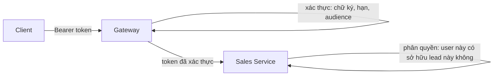

# 18.6 — 6. Identity trong hệ phân tán

> Nguồn: https://tiennhm.io.vn/docs/dotnet-backend-zero-to-senior/stage-05-senior-engineering/module-18-microservices/18.6-distributed-identity-overview
> Ai xác thực và ai phân quyền, vấn đề thu hồi token, token exchange thay vì chuyển tiếp token, và cách chia sẻ thông tin người dùng giữa service.

> Nguyên tắc phân chia trách nhiệm: **gateway xác thực** (token này có hợp lệ không), **service phân quyền** (người này có được làm việc này trên tài nguyên này không). Gộp cả hai vào gateway là sai, vì phân quyền theo tài nguyên cần dữ liệu mà chỉ service mới có. Ba vấn đề thực tế sẽ gặp. **Thu hồi token**: JWT tự chứa nên không huỷ được trước khi hết hạn — khoá tài khoản một nhân viên vừa nghỉ việc mà họ vẫn dùng được hệ thống 15 phút. **Claim phình to**: nhồi hết quyền vào token làm header vượt giới hạn của reverse proxy. **Chuyển tiếp token giữa service**: một service bị xâm nhập có thể dùng token của người dùng gọi **mọi** service khác — đây là lý do [token exchange](https://datatracker.ietf.org/doc/html/rfc8693) tồn tại.

## Mục tiêu bài học

Sau bài này bạn có thể:

- Phân định xác thực ở gateway và phân quyền ở service.
- Xử lý vấn đề thu hồi token bằng thời hạn ngắn và danh sách chặn.
- Giữ token gọn thay vì nhồi mọi quyền vào claim.
- Chọn giữa chuyển tiếp token và token exchange.
- Chia sẻ thông tin người dùng giữa các service an toàn.

## Nội dung bài học

### 18.7.1 — Ai làm gì



**Gateway xác thực:** chữ ký hợp lệ, chưa hết hạn, đúng issuer và audience. Request sai bị chặn **trước khi** vào hệ thống.

**Service phân quyền:** quyết định dựa trên dữ liệu chỉ nó có.

```csharp
// Phan quyen theo tai nguyen — CHI Sales Service biet ai so huu lead nao
public sealed class LeadOwnerHandler(SalesDbContext db)
    : AuthorizationHandler<LeadOwnerRequirement, Lead>
{
    protected override async Task HandleRequirementAsync(
        AuthorizationHandlerContext context, LeadOwnerRequirement requirement, Lead lead)
    {
        var userId = context.User.GetUserId();

        if (lead.OwnerId == userId || context.User.IsInRole("SalesManager"))
            context.Succeed(requirement);
    }
}
```

Gateway **không thể** làm việc này — nó không có bảng `Leads`, và nếu ta cho nó truy cập thì đã vi phạm database-per-service ([bài 18.3](18.2-service-decomposition.mdx)).

**Sai lầm cần tránh:** service tin tưởng hoàn toàn vì "request đến từ gateway". Nếu ai đó vào được mạng nội bộ, họ gọi thẳng service và bỏ qua mọi kiểm tra. Service **vẫn phải** xác thực token, chỉ là nó có thể tin rằng gateway đã lọc bớt phần lớn request xấu.

```csharp
// Mọi service VẪN validate token — phòng thủ nhiều lớp
builder.Services.AddAuthentication(JwtBearerDefaults.AuthenticationScheme)
    .AddJwtBearer(options =>
    {
        options.Authority = builder.Configuration["Auth:Authority"];
        options.TokenValidationParameters = new TokenValidationParameters
        {
            ValidateIssuer = true,
            ValidateAudience = true,
            ValidAudience = "crm-api",
            ValidateLifetime = true,
            ClockSkew = TimeSpan.FromSeconds(30)      // mặc định 5 PHÚT — quá dài
        };
    });
```

`ClockSkew` mặc định là **5 phút**, nghĩa là token đã hết hạn vẫn được chấp nhận thêm 5 phút nữa ([bài 10.3](../../stage-03-aspnet-core-backend/module-10-authentication-authorization/10.2-jwt-authentication.mdx)). Với hệ thống có đồng bộ thời gian qua NTP, 30 giây là quá đủ.

### 18.7.2 — Vấn đề thu hồi token

JWT **tự chứa**: service kiểm tra chữ ký mà không hỏi ai cả. Đó là điểm mạnh về hiệu năng, và cũng là điểm yếu:

```
10:00  Nhân viên nghỉ việc, admin vô hiệu hoá tài khoản
10:00  Token cũ VẪN HỢP LỆ — không ai huỷ được
10:15  Token het han
       => 15 PHUT truy cap sau khi bi vo hieu hoa
```

Ba cách xử lý, chọn theo mức độ nhạy cảm:

| Cách | Cơ chế | Đánh đổi |
|---|---|---|
| **Thời hạn ngắn** | Access token 5–15 phút + refresh token | Đơn giản, cửa sổ rủi ro vẫn còn |
| **Danh sách chặn** | Lưu jti của token bị thu hồi vào Redis | Mỗi request thêm một lần đọc cache |
| **Reference token** | Token là mã tra cứu, mọi lần đều hỏi server | Huỷ tức thì, nhưng mất lợi thế tự chứa |

```csharp
// Danh sách chặn — kiểm tra jti trong Redis
options.Events = new JwtBearerEvents
{
    OnTokenValidated = async context =>
    {
        var jti = context.Principal?.FindFirst(JwtRegisteredClaimNames.Jti)?.Value;
        if (jti is null) return;

        var cache = context.HttpContext.RequestServices.GetRequiredService<IDistributedCache>();
        if (await cache.GetStringAsync($"revoked:{jti}") is not null)
            context.Fail("Token đã bị thu hồi");
    }
};
```

Chỉ cần lưu bản ghi **tới lúc token hết hạn tự nhiên** — sau đó nó vô hại, nên TTL của cache bằng thời gian còn lại của token.

**Khuyến nghị thực dụng:** access token 15 phút + refresh token là đủ cho phần lớn hệ thống nội bộ. Chỉ thêm danh sách chặn khi nghiệp vụ thật sự yêu cầu thu hồi tức thì.

### 18.7.3 — Token gọn, không nhồi quyền

```csharp
// SAI — token phinh to
{
  "sub": "user-123",
  "permissions": [
    "leads.read", "leads.write", "leads.delete",
    "customers.read", /* ...200 quyen nua... */
  ],
  "accessible_customer_ids": [ /* 5000 id */ ]
}
```

Ba hậu quả: token vượt giới hạn header của reverse proxy (thường 8 KB) gây lỗi 431; mọi request phải truyền cả khối đó; và quyền chỉ cập nhật khi cấp token mới.

```csharp
// DUNG — token gon, quyen tra cuu tai service
{
  "sub": "user-123",
  "tenant_id": "acme",
  "roles": ["SalesManager"],
  "exp": 1727164800
}
```

Quyền chi tiết được service tra cứu và cache ngắn hạn:

```csharp
public async Task<bool> CanAccessAsync(Guid userId, string permission, CancellationToken ct)
{
    var permissions = await _cache.GetOrCreateAsync(
        $"perms:{userId}",
        async _ => await _db.GetUserPermissionsAsync(userId, ct),
        TimeSpan.FromMinutes(5));

    return permissions.Contains(permission);
}
```

Cache 5 phút giữ hiệu năng gần như token tự chứa, nhưng thay đổi quyền có hiệu lực trong vòng 5 phút thay vì phải chờ cấp token mới ([bài 14.4](../../stage-04-database-production/module-14-caching-background-jobs/14.3-idistributedcache-and-redis.mdx)).

### 18.7.4 — Truyền danh tính giữa service

**Cách 1 — chuyển tiếp token người dùng.** Đơn giản nhất và phổ biến nhất:

```csharp
public sealed class TokenForwardingHandler(IHttpContextAccessor accessor) : DelegatingHandler
{
    protected override async Task<HttpResponseMessage> SendAsync(
        HttpRequestMessage request, CancellationToken ct)
    {
        var token = await accessor.HttpContext!.GetTokenAsync("access_token");
        if (token is not null)
            request.Headers.Authorization = new AuthenticationHeaderValue("Bearer", token);

        return await base.SendAsync(request, ct);
    }
}
```

**Rủi ro cụ thể:** nếu Sales Service bị xâm nhập, kẻ tấn công có token của **mọi người dùng đang truy cập**, và dùng được chúng để gọi **mọi** service khác — kể cả những service Sales không bao giờ cần gọi. Phạm vi thiệt hại rộng hơn nhiều so với chỉ mất quyền của Sales.

**Cách 2 — token exchange (RFC 8693).** Sales đổi token người dùng lấy một token **hẹp hơn**, chỉ dùng được cho Billing và chỉ với phạm vi cần thiết:

```csharp
var exchanged = await _identityClient.ExchangeTokenAsync(new TokenExchangeRequest
{
    SubjectToken = userToken,
    Audience = "billing-api",              // chỉ dùng được cho Billing
    Scope = "invoices.read"                // chi doc hoa don
});
```

Token bị lộ giờ chỉ đọc được hoá đơn, không làm được gì khác. Cái giá: thêm một lời gọi tới identity provider và hạ tầng phức tạp hơn.

**Cách 3 — service-to-service credential.** Khi hành động không nhân danh người dùng nào (job nền, đồng bộ dữ liệu), dùng client credentials flow với danh tính riêng của service.

| Cách | Khi dùng | Rủi ro |
|---|---|---|
| Chuyển tiếp token | Hệ thống nội bộ, tin cậy lẫn nhau | Lộ một service là lộ token mọi người dùng |
| Token exchange | Hệ nhạy cảm, nhiều đội | Phức tạp hơn, thêm một round-trip |
| Client credentials | Job nền, không nhân danh ai | Cần quản lý secret |

### 18.7.5 — Tenant trong hệ phân tán

Với hệ multi-tenant, `tenant_id` phải đi **cùng danh tính**, không bao giờ lấy từ tham số do client gửi:

```csharp
// SAI — client tự khai tenant, đổi số là đọc dữ liệu tenant khác
var tenantId = Request.Query["tenantId"];

// ĐÚNG — lấy từ claim đã được ký
var tenantId = User.FindFirst("tenant_id")?.Value
    ?? throw new UnauthorizedAccessException("Thiếu tenant_id");
```

Mỗi service tự áp dụng lọc theo tenant qua global query filter ([bài 13.11](../../stage-04-database-production/module-13-entity-framework-core/13.10-global-query-filters.mdx)). **Đừng tin** rằng gateway đã lọc — phòng thủ nhiều lớp, và rò rỉ dữ liệu giữa các tenant là loại sự cố khó khắc phục nhất về mặt uy tín.

### 18.7.6 — Rà lại code của bạn

**Danh sách rà soát identity trong hệ phân tán**

- [ ] Gateway xác thực token, service phân quyền theo tài nguyên.
- [ ] Mỗi service vẫn tự xác thực token, không tin mạng nội bộ.
- [ ] ClockSkew đặt ngắn, không để mặc định 5 phút.
- [ ] Access token có thời hạn ngắn kèm refresh token.
- [ ] Đã quyết định có cần thu hồi tức thì hay không, và cài đặt tương ứng.
- [ ] Token không chứa danh sách quyền chi tiết.
- [ ] Quyền chi tiết tra cứu tại service và cache ngắn hạn.
- [ ] Đã đánh giá rủi ro của việc chuyển tiếp token giữa service.
- [ ] Job nền dùng danh tính riêng của service, không mượn token người dùng.
- [ ] tenant_id lấy từ claim đã ký, không lấy từ tham số client gửi.

## Bài tập áp dụng

1. **Đo cửa sổ thu hồi.** Vô hiệu hoá một tài khoản và đo chính xác bao lâu token cũ còn dùng được. So sánh với yêu cầu nghiệp vụ.

2. **Giảm kích thước token.** Đo kích thước JWT hiện tại của bạn, chuyển danh sách quyền sang tra cứu có cache, và đo lại.

3. **Kiểm tra cách ly tenant.** Viết test gọi API với token của tenant A và tham số `tenantId` của tenant B, xác nhận không rò rỉ dữ liệu.

## Tự kiểm tra

### Vì sao gateway xác thực còn service phân quyền?

Vì xác thực chỉ cần kiểm tra chữ ký, hạn và audience nên làm một lần ở biên là hợp lý. Phân quyền theo tài nguyên cần dữ liệu mà chỉ service mới có, ví dụ ai sở hữu lead nào, và gateway không được phép truy cập database của service.

### Vì sao service vẫn phải xác thực token dù đã có gateway?

Vì nếu ai đó vào được mạng nội bộ, họ có thể gọi thẳng service và bỏ qua gateway. Service tin tưởng hoàn toàn vào vị trí mạng là một lớp phòng thủ duy nhất, và nó thất bại hoàn toàn khi bị xuyên qua.

### Vấn đề thu hồi JWT là gì và xử lý thế nào?

JWT tự chứa nên không huỷ được trước khi hết hạn, khiến một tài khoản vừa bị vô hiệu hoá vẫn truy cập được cho tới lúc token hết hạn. Xử lý bằng thời hạn ngắn kèm refresh token, thêm danh sách chặn jti trong Redis nếu cần thu hồi tức thì, hoặc dùng reference token.

### Vì sao không nên nhồi mọi quyền vào claim?

Vì token phình to có thể vượt giới hạn header của reverse proxy và gây lỗi 431, mọi request phải truyền cả khối đó, và quyền chỉ cập nhật khi cấp token mới. Giữ token gọn và tra cứu quyền chi tiết tại service với cache ngắn hạn.

### Rủi ro của việc chuyển tiếp token người dùng giữa các service là gì?

Nếu một service bị xâm nhập, kẻ tấn công có token của mọi người dùng đang truy cập và dùng được chúng để gọi mọi service khác, kể cả những service mà service bị xâm nhập không bao giờ cần gọi. Token exchange thu hẹp phạm vi đó.

### Vì sao tenant_id không được lấy từ tham số client gửi?

Vì client có thể đổi tham số đó để đọc dữ liệu của tenant khác. Nó phải lấy từ claim đã được ký, và mỗi service vẫn tự áp lọc theo tenant thay vì tin rằng gateway đã lọc.

## Kết luận

Ba điều đáng nhớ nhất:

1. **Xác thực ở gateway, phân quyền ở service.** Chỉ service mới biết ai sở hữu cái gì.
2. **JWT không thu hồi được** — thiết kế cho điều đó bằng thời hạn ngắn.
3. **Chuyển tiếp token mở rộng phạm vi thiệt hại.** Token exchange thu hẹp nó lại.

## Tham khảo

- [Cấu hình JWT bearer authentication](https://learn.microsoft.com/en-us/aspnet/core/security/authentication/configure-jwt-bearer-authentication)
- [RFC 8693 — OAuth 2.0 Token Exchange](https://datatracker.ietf.org/doc/html/rfc8693)
- [Backends for Frontends pattern](https://learn.microsoft.com/en-us/azure/architecture/patterns/backends-for-frontends)
- [API design cho microservices](https://learn.microsoft.com/en-us/azure/architecture/microservices/design/api-design)

## Điều hướng

- **Bài trước:** [18.5 — 5. Observability — bộ ba](18.5-observability-three-pillars.mdx)
- **Bài tiếp theo:** [18.7 — 7. Anti-pattern: distributed monolith](18.7-anti-pattern-distributed-monolith.mdx)
- **Về module:** [Trang mục lục](./)
