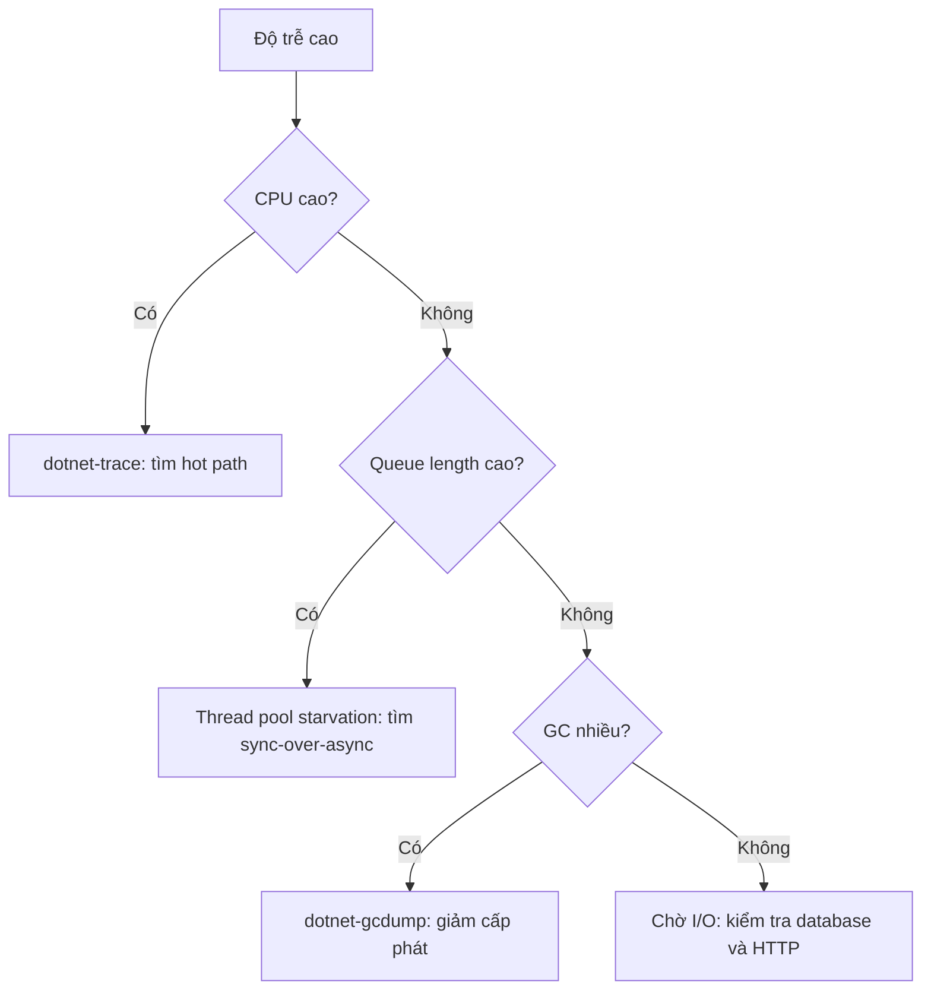

# 19.3 — 3. Profiling trên .NET server

> Nguồn: https://tiennhm.io.vn/docs/dotnet-backend-zero-to-senior/stage-05-senior-engineering/module-19-performance-engineering/19.3-dotnet-server-profiling
> dotnet-counters, dotnet-trace và dotnet-gcdump, cách đọc thread pool starvation, và bốn dấu hiệu nhận diện loại vấn đề từ số liệu.

> Profiling trên production khác hẳn trên máy phát triển: bạn **không thể** gắn debugger, không thể dừng tiến trình, và công cụ phải đủ nhẹ để không làm hệ thống tệ hơn. Bộ ba `dotnet-counters`, `dotnet-trace`, `dotnet-gcdump` giải quyết đúng việc đó — chúng gắn vào tiến trình đang chạy mà **không dừng** nó. Điểm quan trọng nhất của bài này là **cách đọc số liệu để nhận ra loại vấn đề**: CPU cao mà độ trễ thấp là chuyện bình thường; CPU **thấp** mà độ trễ **cao** là đang chờ I/O hoặc khoá. Và có một vấn đề đặc trưng của .NET mà mọi backend engineer phải nhận ra được: **thread pool starvation** — triệu chứng là độ trễ vọt lên hàng giây trong khi CPU nhàn rỗi, và nguyên nhân gần như luôn là `sync-over-async`.

## Mục tiêu bài học

Sau bài này bạn có thể:

- Dùng `dotnet-counters` để chẩn đoán nhanh trên production.
- Thu và đọc trace CPU bằng `dotnet-trace`.
- Nhận ra thread pool starvation từ số liệu.
- Phân biệt bốn loại vấn đề qua tổ hợp chỉ số.
- Tìm rò rỉ bộ nhớ bằng `dotnet-gcdump`.

## Nội dung bài học

### 19.4.1 — dotnet-counters: bước đầu tiên

```bash
dotnet tool install -g dotnet-counters

dotnet-counters monitor -p 1 \
  --counters System.Runtime,Microsoft.AspNetCore.Hosting
```

```
[System.Runtime]
    CPU Usage (%)                            78
    GC Heap Size (MB)                       412
    Gen 0 GC Count / 1 sec                   18
    Gen 2 GC Count / 1 sec                    3      <-- CAO BAT THUONG
    Allocation Rate (B / 1 sec)     1,240,000,000    <-- 1,2 GB/giay!
    ThreadPool Thread Count                  47
    ThreadPool Queue Length                 312      <-- DANG DOI
    Exception Count / 1 sec                  84      <-- exception lam chi phi an

[Microsoft.AspNetCore.Hosting]
    Current Requests                        289
    Requests / 1 sec                         94
    Failed Requests                           2
```

Bốn con số đáng chú ý trong ví dụ này:

- **Gen 2 GC 3 lần/giây** là rất cao. Gen 2 collection dừng toàn bộ tiến trình (với một số chế độ GC) và tốn hàng chục tới hàng trăm mili giây.
- **Allocation rate 1,2 GB/s** là nguyên nhân của Gen 2 ở trên — cấp phát nhiều đẩy object lên gen cao.
- **ThreadPool Queue Length 312** nghĩa là 312 việc đang **xếp hàng chờ** thread rảnh. Đây là dấu hiệu starvation.
- **84 exception/giây** thường bị bỏ qua: ném và bắt exception tốn kém hơn nhiều so với trả về mã lỗi, và 84 lần/giây là chi phí ẩn đáng kể.

`dotnet-counters` gần như không tốn tài nguyên, nên chạy được trên production an toàn. Đây luôn là công cụ đầu tiên.

### 19.4.2 — Bốn loại vấn đề qua tổ hợp chỉ số

| CPU | Độ trễ | Queue length | Chẩn đoán |
|---|---|---|---|
| Cao | Cao | Thấp | **Nghẽn CPU thật** — tìm hot path |
| **Thấp** | **Cao** | **Cao** | **Thread pool starvation** — tìm sync-over-async |
| Thấp | Cao | Thấp | **Chờ I/O** — database, HTTP, disk |
| Cao | Thấp | Thấp | **Bình thường** — hệ thống đang làm việc hiệu quả |

Hàng cuối đáng nhấn mạnh: **CPU cao không phải vấn đề** nếu độ trễ vẫn đạt SLO. CPU 80% với p99 trong ngưỡng là dấu hiệu bạn đang **dùng hết** tài nguyên đã trả tiền. Mục tiêu là độ trễ, không phải CPU thấp.

Hàng thứ hai là loại vấn đề gây nhầm lẫn nhất: CPU nhàn rỗi nên mọi biểu đồ hạ tầng trông bình thường, trong khi người dùng đang đợi hàng giây.

### 19.4.3 — Thread pool starvation

```csharp
// NGUYÊN NHÂN SỐ MỘT — sync-over-async
public IActionResult GetLeads()
{
    var leads = _service.GetLeadsAsync().Result;      // CHIEM mot thread pool thread
    return Ok(leads);                                  // trong suốt thời gian chờ I/O
}
```

Cơ chế của sự sụp đổ, theo từng bước:

```
1. Thread pool có N thread (mặc định ~ số core)
2. Mỗi request .Result CHIẾM một thread và KHÔNG trả lại khi chờ I/O
3. Request thứ N+1 phải CHỜ thread rảnh
4. Thread pool tăng thread — nhưng chậm, khoảng 1-2 thread mỗi giây
5. Request đổ về nhanh hơn tốc độ tăng thread
6. Queue length tăng không giới hạn, độ trễ vọt lên hàng giây
7. CPU vẫn THẤP, vì mọi thread đều đang chờ I/O chứ không tính toán
```

Bước 4 là chìa khoá: thread pool **có** tự tăng, nhưng với tốc độ cố ý chậm để tránh tạo quá nhiều thread. Dưới đợt tải đột ngột, tốc độ đó không theo kịp.

```csharp
// SỬA — async suốt chuỗi, thread được trả lại khi chờ I/O
public async Task<IActionResult> GetLeads(CancellationToken ct)
{
    var leads = await _service.GetLeadsAsync(ct);
    return Ok(leads);
}
```

Các dạng sync-over-async cần tìm và loại bỏ ([bài 6.8](../../stage-02-csharp-professional/module-06-async-programming/6.7-common-pitfalls.mdx)):

```csharp
task.Result                    // chiem thread
task.Wait()                    // chiem thread
task.GetAwaiter().GetResult()  // chiem thread
Task.Run(() => ...).Result     // chiem HAI thread
```

Tìm chúng bằng phân tích tĩnh thay vì đọc thủ công:

```xml
<!-- .editorconfig -->
<!-- CA2007, VSTHRD002: cảnh báo sync-over-async -->
dotnet_diagnostic.VSTHRD002.severity = error
```

**Giảm nhẹ tạm thời** khi chưa sửa kịp:

```csharp
// KHÔNG phải cách sửa — chỉ mua thêm thời gian
ThreadPool.SetMinThreads(workerThreads: 200, completionPortThreads: 200);
```

Tăng số thread tối thiểu khiến pool tạo thread ngay thay vì tăng dần. Nó **che** triệu chứng, và mỗi thread tốn 1 MB stack — 200 thread là 200 MB. Dùng để sống sót qua sự cố, không phải để kết thúc vấn đề.

### 19.4.4 — dotnet-trace: tìm hot path

```bash
dotnet tool install -g dotnet-trace

# Thu 30 giay CPU sample
dotnet-trace collect -p 1 --duration 00:00:30 \
  --profile cpu-sampling -o trace.nettrace
```

Mở bằng PerfView (Windows), Visual Studio, hoặc chuyển sang định dạng speedscope:

```bash
dotnet-trace convert trace.nettrace --format Speedscope
```

Đọc call tree theo hai cột:

| Cột | Ý nghĩa | Dùng để |
|---|---|---|
| **Inclusive** | Thời gian của hàm **và** mọi hàm nó gọi | Tìm nhánh tốn kém |
| **Exclusive** | Thời gian **chỉ** trong thân hàm | Tìm hàm tự nó chậm |

Bắt đầu từ `Inclusive` cao nhất rồi đi xuống, tới khi gặp `Exclusive` cao — đó là nơi thời gian thật sự bị tiêu.

Trace cũng ghi **GC event** và **exception**, nên nó trả lời được "vì sao Gen 2 GC nhiều" mà `dotnet-counters` chỉ báo là có.

**Lưu ý trên production:** CPU sampling thêm khoảng 1–3% tải, chấp nhận được. Nhưng file trace lớn nhanh — 30 giây thường đủ, và giới hạn thời gian tránh làm đầy ổ đĩa.

### 19.4.5 — dotnet-gcdump: tìm rò rỉ bộ nhớ

```bash
dotnet tool install -g dotnet-gcdump

# Chụp hai lần cách nhau, so sánh
dotnet-gcdump collect -p 1 -o before.gcdump
# ... để hệ thống chạy thêm 30 phút ...
dotnet-gcdump collect -p 1 -o after.gcdump
```

So sánh hai ảnh chụp trong Visual Studio để xem loại object nào **tăng liên tục**. Ba nguyên nhân phổ biến trong .NET backend:

```csharp
// 1. Static collection không bao giờ dọn
private static readonly List<AuditEntry> _auditLog = [];    // tang mai mai

// 2. Event handler không huỷ đăng ký — giữ sống cả object chủ
_someService.DataChanged += OnDataChanged;                   // thieu -= khi dispose

// 3. IMemoryCache không có giới hạn kích thước
_cache.Set(key, value);                                      // thieu SizeLimit
```

Nguyên nhân thứ hai đặc biệt khó thấy: event handler giữ tham chiếu tới đối tượng đăng ký, nên cả đối tượng đó và mọi thứ nó tham chiếu đều không được thu gom, dù bạn nghĩ nó đã hết vòng đời.

`gcdump` nhẹ hơn full memory dump nhiều và **an toàn trên production**, nhưng nó gây một lần Gen 2 GC nên sẽ có một khoảng dừng ngắn.

### 19.4.6 — Quy trình chẩn đoán



Đi theo thứ tự này tránh được việc đoán mò. Mỗi nhánh dẫn tới một công cụ cụ thể và một loại nguyên nhân cụ thể.

### 19.4.7 — Rà lại code của bạn

**Danh sách rà soát profiling**

- [ ] Không có .Result, .Wait hay GetAwaiter().GetResult() trong đường xử lý request.
- [ ] Có phân tích tĩnh chặn sync-over-async ở mức lỗi.
- [ ] Giám sát ThreadPool Queue Length, không chỉ CPU.
- [ ] Có cảnh báo khi Gen 2 GC vượt ngưỡng.
- [ ] Theo dõi allocation rate, không chỉ heap size.
- [ ] Exception rate được giám sát vì đó là chi phí ẩn.
- [ ] Công cụ chẩn đoán đã cài sẵn trong image production.
- [ ] Có quy trình thu trace khi sự cố, không phải nghĩ ra lúc đang cháy.
- [ ] Hiểu rằng CPU cao với độ trễ đạt SLO là bình thường.

## Bài tập áp dụng

1. **Tái hiện starvation.** Viết endpoint dùng `.Result` gọi một API chậm, tạo tải 100 request đồng thời, và quan sát `ThreadPool Queue Length` cùng CPU.

2. **Đọc trace.** Thu trace 30 giây dưới tải, mở bằng speedscope, và tìm hàm có `Exclusive` cao nhất.

3. **Tìm rò rỉ.** Tạo một static collection tăng dần, chụp hai `gcdump` cách nhau 10 phút và so sánh.

## Tự kiểm tra

### Vì sao dotnet-counters luôn là công cụ đầu tiên?

Vì nó gần như không tốn tài nguyên nên chạy an toàn trên production, gắn vào tiến trình đang chạy mà không dừng nó, và cho ngay tổ hợp chỉ số đủ để phân loại vấn đề trước khi dùng công cụ nặng hơn.

### Tổ hợp chỉ số nào cho thấy thread pool starvation?

CPU thấp, độ trễ cao và ThreadPool Queue Length cao. Đây là loại vấn đề gây nhầm lẫn nhất vì mọi biểu đồ hạ tầng trông bình thường do CPU nhàn rỗi, trong khi người dùng đang đợi hàng giây.

### Thread pool starvation xảy ra theo cơ chế nào?

Sync-over-async chiếm một thread và không trả lại trong lúc chờ I/O. Khi số request vượt số thread, các request sau phải chờ. Thread pool có tự tăng nhưng chỉ khoảng một hai thread mỗi giây, nên dưới tải đột ngột nó không theo kịp và queue tăng không giới hạn.

### Tăng ThreadPool.SetMinThreads có phải cách sửa không?

Không, nó chỉ che triệu chứng và mua thêm thời gian, vì mỗi thread tốn khoảng 1 MB stack nên 200 thread là 200 MB. Cách sửa thật là loại bỏ sync-over-async và dùng async suốt chuỗi.

### Inclusive và Exclusive trong call tree khác nhau thế nào?

Inclusive là thời gian của hàm và mọi hàm nó gọi, dùng để tìm nhánh tốn kém. Exclusive là thời gian chỉ trong thân hàm, dùng để tìm hàm tự nó chậm. Cách đọc là đi từ Inclusive cao nhất xuống tới khi gặp Exclusive cao.

### Vì sao CPU cao không nhất thiết là vấn đề?

Vì mục tiêu là độ trễ chứ không phải CPU thấp. CPU 80% với p99 vẫn đạt SLO nghĩa là bạn đang dùng hết tài nguyên đã trả tiền, đó là dấu hiệu tốt chứ không phải dấu hiệu xấu.

## Kết luận

Ba điều đáng nhớ nhất:

1. **Tổ hợp CPU, độ trễ và queue length phân loại được vấn đề** trước khi dùng công cụ nặng.
2. **CPU thấp + độ trễ cao = đang chờ**, và trên .NET nguyên nhân thường là sync-over-async.
3. **Mục tiêu là độ trễ, không phải CPU thấp.**

## Tham khảo

- [dotnet-counters](https://learn.microsoft.com/en-us/dotnet/core/diagnostics/dotnet-counters)
- [dotnet-trace](https://learn.microsoft.com/en-us/dotnet/core/diagnostics/dotnet-trace)
- [Chẩn đoán thread pool starvation](https://learn.microsoft.com/en-us/dotnet/core/diagnostics/debug-threadpool-starvation)
- [dotnet-gcdump](https://learn.microsoft.com/en-us/dotnet/core/diagnostics/dotnet-gcdump)

## Điều hướng

- **Bài trước:** [19.2 — 2. BenchmarkDotNet](19.2-benchmarkdotnet.mdx)
- **Bài tiếp theo:** [19.4 — 4. Database thường là nghẽn đầu tiên](19.4-database-first-bottleneck.mdx)
- **Về module:** [Trang mục lục](./)
