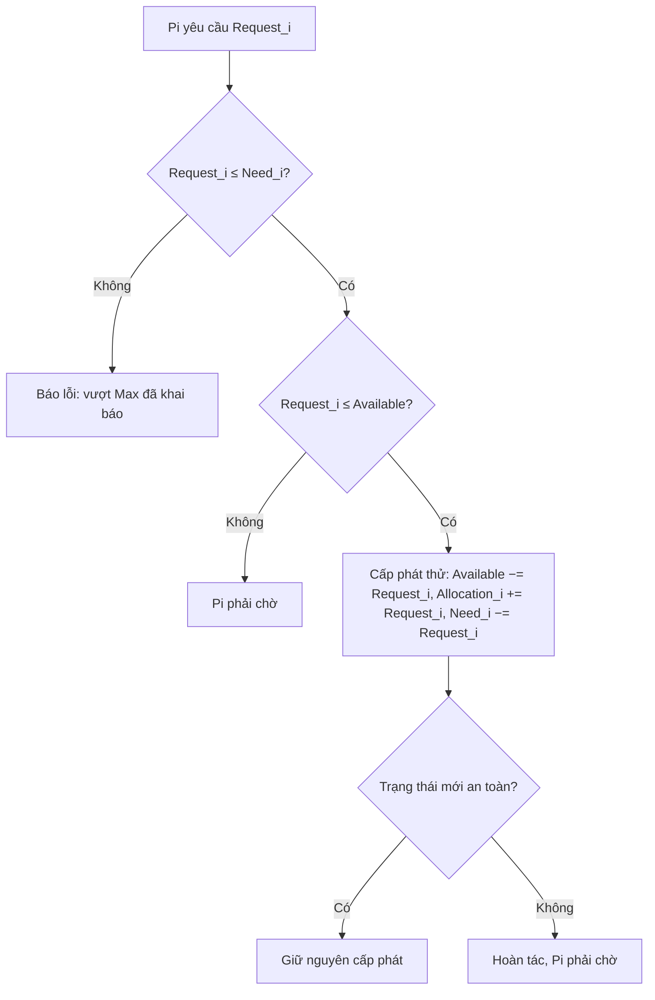

# Giải thuật Banker

> Nguồn: https://tiennhm.io.vn/docs/operating-system/bankers-algorithm
> Giới thiệu về giải thuật Banker (Banker's Algorithm) được sử dụng để phân bổ tài nguyên cho các tiến trình (process) trong hệ điều hành.

## Giới thiệu

Trong bài viết này, mình sẽ giới thiệu về giải thuật Banker (Banker's Algorithm) trong hệ điều hành. Giải thuật này được sử dụng để phân bổ tài nguyên cho các tiến trình (process) trong hệ điều hành.

## Giải thuật Banker

Phần cốt lõi của giải thuật là kiểm tra một trạng thái có an toàn hay không:

![Thuật toán kiểm tra an toàn của Banker: khởi tạo Work = Available và Finish[i] = false cho mọi tiến trình. Lặp lại: tìm tiến trình Pi chưa xong mà Need_i ≤ Work (so từng loại tài nguyên, với Need_i = Max_i − Allocation_i); nếu có thì giả sử Pi chạy xong, cộng Allocation_i vào Work, đặt Finish[i] = true và nối Pi vào chuỗi an toàn. Khi không còn Pi nào thoả, nếu mọi Finish[i] đều true thì trạng thái an toàn, ngược lại không an toàn và có thể dẫn tới deadlock.](./img/banker-safety.png#gh-light-mode-only)
![Thuật toán kiểm tra an toàn của Banker: khởi tạo Work = Available và Finish[i] = false cho mọi tiến trình. Lặp lại: tìm tiến trình Pi chưa xong mà Need_i ≤ Work (so từng loại tài nguyên, với Need_i = Max_i − Allocation_i); nếu có thì giả sử Pi chạy xong, cộng Allocation_i vào Work, đặt Finish[i] = true và nối Pi vào chuỗi an toàn. Khi không còn Pi nào thoả, nếu mọi Finish[i] đều true thì trạng thái an toàn, ngược lại không an toàn và có thể dẫn tới deadlock.](./img/banker-safety-dark.png#gh-dark-mode-only)

File gốc: [nền sáng](pathname:///files/diagrams/operating-system-os-bankers-algorithm/vi/banker-safety.html) · [nền tối](pathname:///files/diagrams/operating-system-os-bankers-algorithm/vi/banker-safety-dark.html)

Khi một tiến trình xin thêm tài nguyên, hệ điều hành chỉ cấp nếu trạng thái sau khi cấp vẫn an toàn:

## Tổng kết

Trong bài viết này, mình đã giới thiệu về giải thuật Banker (Banker's Algorithm) trong hệ điều hành. Hy vọng bài viết này sẽ giúp ích cho các bạn.

> **Tip: Luyện tập**
>
> Giải thuật Banker xuất hiện dày đặc trong [trắc nghiệm deadlock](./05-quiz/04.deadlock.mdx): tìm chuỗi an toàn, tính tổng tài nguyên của hệ thống, đọc đồ thị cấp phát tài nguyên và phân biệt bốn điều kiện Coffman.
>
> Muốn làm nguyên đề thì vào [đề thi thử Hệ điều hành](./05-quiz/99.mock-exam.mdx) — 30 câu trộn ngẫu nhiên, có đếm giờ.
> **Tip: Để xem thêm các video khác, các bạn có thể truy cập vào [kênh Youtube](https://www.youtube.com/TienNguyen09) của mình.**
>
>
